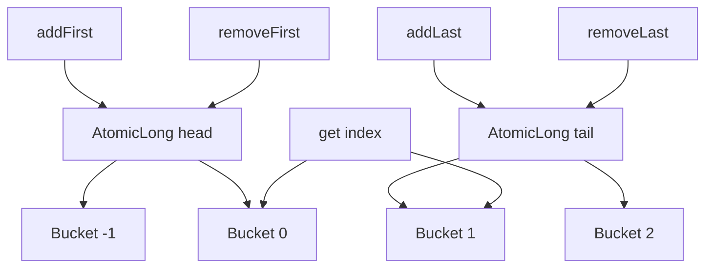

# User Guide for java-util

## CompactSet

[View Source](/src/main/java/com/cedarsoftware/util/CompactSet.java)

A memory-efficient `Set` implementation that internally uses `CompactMap`. This implementation provides the same memory benefits as `CompactMap` while maintaining proper Set semantics.

### Key Features

- Configurable case sensitivity for String elements
- Flexible element ordering options:
    - Sorted order
    - Reverse order
    - Insertion order
    - No order
- Customizable compact size threshold
- Memory-efficient internal storage

Most applications simply instantiate one of the provided subclasses
such as `CompactCIHashSet`, `CompactCILinkedSet`, or
`CompactLinkedSet`. You may also subclass `CompactSet` yourself to
hard-code your preferred options. The builder API is available for
advanced use cases when running on a full JDK.

### Usage Examples

```java
// Most common usage: instantiate a provided subclass
CompactLinkedSet<String> linked = new CompactLinkedSet<>();
linked.add("hello");

// Advanced: build a custom CompactSet (requires JDK)
CompactSet<String> set = CompactSet.<String>builder()
    .caseSensitive(false)
    .sortedOrder()
    .compactSize(50)
    .build();
```

> **JDK Requirement**
>
> The `build()` and `withConfig()` APIs dynamically generate a
> specialized subclass using the JDK compiler. These methods will throw an
> `IllegalStateException` when the compiler tools are unavailable (for example
> in JRE-only container environments). In those cases, either use the default
> constructor, one of the pre-built classes such as `CompactLinkedSet`,
> `CompactCIHashSet`, or `CompactCILinkedSet`, or create your own subclass and 
> override the configuration options (compact-size, ordering, case-sensitivity, etc.)

### Configuration Options

#### Case Sensitivity
- Control case sensitivity for String elements using `.caseSensitive(boolean)`
- Useful for scenarios where case-insensitive string comparison is needed

#### Element Ordering
Choose from four ordering strategies:
- `sortedOrder()`: Elements maintained in natural sorted order
- `reverseOrder()`: Elements maintained in reverse sorted order
- `insertionOrder()`: Elements maintained in the order they were added
- `noOrder()`: Elements maintained in an arbitrary order

#### Compact Size
- Set custom threshold for compact storage using `.compactSize(int)`
- Allows fine-tuning of memory usage vs performance tradeoff

### Implementation Notes
- Built on top of `CompactMap` for memory efficiency
- Maintains proper `Set` semantics while optimizing storage

### Thread Safety and Concurrent Backing Maps

> **⚠️ Important: CompactSet is NOT thread-safe**
>
> `CompactSet` is **not inherently thread-safe** and should not be used in concurrent scenarios without external synchronization. While the builder API allows specifying concurrent backing maps like `ConcurrentHashMap` via `.mapType()`, this does **NOT** make `CompactSet` thread-safe.
>
> **Why concurrent backing maps don't provide thread safety:**
> - During the compact array phase (first `compactSize` elements), `CompactSet` uses internal array storage that has race conditions
> - The transition from compact array to backing map is not atomic
> - Iterator and bulk operations may span both storage phases
>
> **For thread safety:** Use `Collections.synchronizedSet()` or external synchronization around all `CompactSet` operations.
>
> ```java
> // ❌ This is NOT thread-safe despite ConcurrentHashMap backing
> CompactSet<String> set = CompactSet.<String>builder()
>     .mapType(ConcurrentHashMap.class)
>     .build();
>
> // ✅ This is thread-safe
> Set<String> safeSet = Collections.synchronizedSet(new CompactLinkedSet<>());
> ```

### Pre-built Classes
We provide several pre-built classes for common use cases:
- `CompactCIHashSet`
- `CompactCILinkedSet`
- `CompactLinkedSet`

### Serialization
`CompactSet` and its subclasses serialize in JSON with the same format as a standard Set. `CompactSets` constructed with the "builder" pattern have a different JSON format with `json-io.` If you want a standard format, subclass `CompactSet` (see `CompactLinkedSet`) to set your configuration options.

---
## CaseInsensitiveSet

[View Source](/src/main/java/com/cedarsoftware/util/CaseInsensitiveSet.java)

A specialized `Set` implementation that performs case-insensitive comparisons for String elements while preserving their original case. This collection can contain both String and non-String elements, making it versatile for mixed-type usage.

### Key Features

- **Case-Insensitive String Handling**
    - Performs case-insensitive comparisons for String elements
    - Preserves original case when iterating or retrieving elements
    - Treats non-String elements as a normal Set would

- **Flexible Collection Types**
    - Supports both homogeneous (all Strings) and heterogeneous (mixed types) collections
    - Maintains proper Set semantics for all element types

- **Customizable Backing Storage**
    - Supports various backing map implementations for different use cases
    - Automatically selects appropriate backing store based on input collection type

### Usage Examples

```java
// Create a basic case-insensitive set
CaseInsensitiveSet<String> set = new CaseInsensitiveSet<>();
set.add("Hello");
set.add("HELLO");  // No effect, as "Hello" already exists
System.out.println(set);  // Outputs: [Hello]

// Mixed-type usage
CaseInsensitiveSet<Object> mixedSet = new CaseInsensitiveSet<>();
mixedSet.add("Apple");
mixedSet.add(123);
mixedSet.add("apple");  // No effect, as "Apple" already exists
System.out.println(mixedSet);  // Outputs: [Apple, 123]
```

### Construction Options

1. **Default Constructor**
   ```java
   CaseInsensitiveSet<String> set = new CaseInsensitiveSet<>();
   ```
   Creates an empty set with default initial capacity and load factor.

2. **Initial Capacity**
   ```java
   CaseInsensitiveSet<String> set = new CaseInsensitiveSet<>(100);
   ```
   Creates an empty set with specified initial capacity.

3. **From Existing Collection**
   ```java
   Collection<String> source = List.of("A", "B", "C");
   CaseInsensitiveSet<String> set = new CaseInsensitiveSet<>(source);
   ```
   The backing map is automatically selected based on the source collection type:
    - `ConcurrentNavigableSetNullSafe` → `ConcurrentNavigableMapNullSafe`
    - `ConcurrentSkipListSet` → `ConcurrentSkipListMap`
    - `ConcurrentSet` → `ConcurrentHashMapNullSafe`
    - `SortedSet` → `TreeMap`
    - Others → `LinkedHashMap`

### Thread Safety and Concurrent Usage

> **✅ CaseInsensitiveSet is thread-safe when using concurrent backing maps**
>
> Unlike `CompactSet`, `CaseInsensitiveSet` can be made fully thread-safe by using concurrent backing map implementations. Thread safety depends entirely on the backing map implementation you choose.

**Thread-safe usage examples:**
```java
// ✅ Thread-safe with ConcurrentHashMap backing
CaseInsensitiveSet<String> concurrentSet = new CaseInsensitiveSet<>(
    Arrays.asList("example"), 
    new ConcurrentHashMap<>()
);

// ✅ Thread-safe with ConcurrentSkipListMap backing (sorted + concurrent)
CaseInsensitiveSet<String> sortedConcurrentSet = new CaseInsensitiveSet<>(
    Arrays.asList("example"), 
    new ConcurrentSkipListMap<>()
);

// ❌ Not thread-safe with default LinkedHashMap backing
CaseInsensitiveSet<String> notThreadSafe = new CaseInsensitiveSet<>();
```

### Implementation Notes

- **Thread safety**: Fully thread-safe when using concurrent backing maps (`ConcurrentHashMap`, `ConcurrentSkipListMap`, etc.)
- **String handling**: Case-insensitive comparisons while preserving original case
- **Set operations**: Uses underlying `CaseInsensitiveMap` for consistent behavior
- **Set contract**: Maintains proper `Set` contract while providing case-insensitive functionality for strings

### Concurrent Interface Compatibility

When using concurrent backing maps, `CaseInsensitiveSet` retains the concurrent semantics of the underlying map implementation:

```java
// ConcurrentMap backing provides concurrent semantics
CaseInsensitiveSet<String> concurrentSet = new CaseInsensitiveSet<>(
    Arrays.asList("example"), 
    new ConcurrentHashMap<>()
);

// All concurrent operations work with case-insensitive comparisons
concurrentSet.add("Apple");
concurrentSet.add("APPLE");  // No effect - same element
concurrentSet.remove("apple");  // Case-insensitive removal

// ConcurrentNavigableMap backing provides sorted + concurrent semantics  
CaseInsensitiveSet<String> navSet = new CaseInsensitiveSet<>(
    Arrays.asList("example"), 
    new ConcurrentSkipListMap<>()
);

// Maintains sorted order with concurrent access
navSet.add("banana");
navSet.add("BANANA");  // No effect - same element
navSet.add("apple");   // Maintains sorted order
```

The case-insensitive behavior applies to all set operations - `add`, `remove`, `contains`, and iteration all use case-insensitive comparison for String elements while maintaining the thread-safety and ordering guarantees of the backing concurrent map.

---
## ConcurrentSet
[Source](/src/main/java/com/cedarsoftware/util/ConcurrentSet.java)

A thread-safe Set implementation that supports null elements while maintaining full concurrent operation safety.

### Key Features
- Full thread-safety for all operations
- Supports null elements (unlike ConcurrentHashMap's keySet)
- Implements complete Set interface
- Efficient concurrent operations
- Consistent iteration behavior
- No external synchronization needed

### Implementation Details
- Built on top of ConcurrentHashMap's keySet
- Uses a sentinel object (NULL_ITEM) to represent null values internally
- Maintains proper Set contract even with null elements
- Thread-safe iterator that reflects real-time state of the set

### Usage Examples

**Basic Usage:**
```java
// Create empty set
ConcurrentSet<String> set = new ConcurrentSet<>();

// Add elements (including null)
set.add("first");
set.add(null);
set.add("second");

// Check contents
boolean hasNull = set.contains(null);      // true
boolean hasFirst = set.contains("first");  // true
```

**Create from Existing Collection:**
```java
List<String> list = Arrays.asList("one", null, "two");
ConcurrentSet<String> set = new ConcurrentSet<>(list);
```

**Concurrent Operations:**
```java
ConcurrentSet<String> set = new ConcurrentSet<>();

// Safe for concurrent access
CompletableFuture.runAsync(() -> set.add("async1"));
CompletableFuture.runAsync(() -> set.add("async2"));

// Iterator is thread-safe
for (String item : set) {
    // Safe to modify set while iterating
    set.remove("async1");
}
```

**Bulk Operations:**
```java
ConcurrentSet<String> set = new ConcurrentSet<>();
set.addAll(Arrays.asList("one", "two", "three"));

// Remove multiple items
set.removeAll(Arrays.asList("one", "three"));

// Retain only specific items
set.retainAll(Collections.singleton("two"));
```

### Performance Characteristics
- Read operations: O(1)
- Write operations: O(1)
- Space complexity: O(n)
- Thread-safe without blocking
- Optimized for concurrent access

### Use Cases
- High-concurrency environments
- Multi-threaded data structures
- Thread-safe caching
- Concurrent set operations requiring null support
- Real-time data collection

### Thread Safety Notes
- All operations are thread-safe
- Iterator reflects real-time state of the set
- No external synchronization needed
- Safe to modify while iterating
- Atomic operation guarantees maintained

---
## ConcurrentNavigableSetNullSafe
[Source](/src/main/java/com/cedarsoftware/util/ConcurrentNavigableSetNullSafe.java)

A thread-safe NavigableSet implementation that supports null elements while maintaining sorted order. This class provides all the functionality of ConcurrentSkipListSet with added null element support.

### Key Features
- Full thread-safety for all operations
- Supports null elements (unlike ConcurrentSkipListSet)
- Maintains sorted order
- Supports custom comparators
- Provides navigational operations (lower, higher, floor, ceiling)
- Range-view operations (subSet, headSet, tailSet)
- Bidirectional iteration

### Usage Examples

**Basic Usage:**
```java
// Create with natural ordering
NavigableSet<String> set = new ConcurrentNavigableSetNullSafe<>();
set.add("B");
set.add(null);
set.add("A");
set.add("C");

// Iteration order will be: A, B, C, null
for (String s : set) {
    System.out.println(s);
}
```

**Custom Comparator:**
```java
// Create with custom comparator (reverse order)
NavigableSet<String> set = new ConcurrentNavigableSetNullSafe<>(
    Comparator.reverseOrder()
);
set.add("B");
set.add(null);
set.add("A");

// Iteration order will be: null, C, B, A
```

**Navigation Operations:**
```java
NavigableSet<Integer> set = new ConcurrentNavigableSetNullSafe<>();
set.add(1);
set.add(3);
set.add(5);
set.add(null);

Integer lower = set.lower(3);     // Returns 1
Integer higher = set.higher(3);    // Returns 5
Integer ceiling = set.ceiling(2);  // Returns 3
Integer floor = set.floor(4);      // Returns 3
```

**Range Views:**
```java
NavigableSet<Integer> set = new ConcurrentNavigableSetNullSafe<>();
set.addAll(Arrays.asList(1, 3, 5, 7, null));

// Get subset (exclusive end)
SortedSet<Integer> subset = set.subSet(2, 6);  // Contains 3, 5

// Get headSet (elements less than value)
SortedSet<Integer> head = set.headSet(4);      // Contains 1, 3

// Get tailSet (elements greater than or equal)
SortedSet<Integer> tail = set.tailSet(5);      // Contains 5, 7, null
```

The `subSet`, `headSet`, and `tailSet` methods return live views backed by the
original set. Changes made through these views immediately affect the backing
set and vice versa.

**Descending Views:**
```java
NavigableSet<String> set = new ConcurrentNavigableSetNullSafe<>();
set.addAll(Arrays.asList("A", "B", "C", null));

// Get descending set
NavigableSet<String> reversed = set.descendingSet();
// Iteration order will be: null, C, B, A

// Use descending iterator
Iterator<String> it = set.descendingIterator();
```

### Implementation Details
- Built on ConcurrentSkipListSet
- Uses UUID-based sentinel value for null elements
- Maintains proper ordering with null elements
- Thread-safe iterator reflecting real-time state
- Supports both natural ordering and custom comparators

### Performance Characteristics
- Contains/Add/Remove: O(log n)
- Size: O(1)
- Iteration: O(n)
- Memory: O(n)
- Thread-safe without blocking

### Use Cases
- Concurrent ordered collections requiring null support
- Range-based queries in multi-threaded environment
- Priority queues with null values
- Sorted concurrent data structures
- Real-time data processing with ordering requirements

### Thread Safety Notes
- All operations are thread-safe
- Iterator reflects real-time state
- No external synchronization needed
- Safe for concurrent modifications
- Maintains consistency during range-view operations

---
## ClassValueSet

[View Source](/src/main/java/com/cedarsoftware/util/ClassValueSet.java)

A high-performance `Set` implementation for `Class` objects that leverages Java's built-in `ClassValue` mechanism for extremely fast membership tests.

### Key Features

- **Ultra-fast membership tests**: 2-10x faster than `HashSet` and 3-15x faster than `ConcurrentHashMap.keySet()` for `contains()` operations
- **Thread-safe**: Fully concurrent support for all operations
- **Complete Set interface**: Implements the full `Set` contract
- **Null support**: Null elements are properly supported
- **Optimized for Class elements**: Specially designed for sets of `Class` objects

### Usage Examples

```java
// Create a set of security-sensitive classes
ClassValueSet blockedClasses = ClassValueSet.of(
    ClassLoader.class,
    Runtime.class,
    ProcessBuilder.class,
    System.class
);

// Fast membership check in security-sensitive code
public void verifyClass(Class<?> clazz) {
    if (blockedClasses.contains(clazz)) {
        throw new SecurityException("Access to " + clazz.getName() + " is not allowed");
    }
}

// Factory methods for convenient creation
ClassValueSet typeSet = ClassValueSet.of(String.class, Integer.class, List.class);
ClassValueSet fromCollection = ClassValueSet.from(existingCollection);
```

### Performance Characteristics

The `ClassValueSet` provides dramatically improved membership testing performance:

- **contains()**: 2-10x faster than standard sets due to JVM-optimized `ClassValue` caching
- **add() / remove()**: Comparable to ConcurrentHashMap-backed sets (standard performance)
- **Best for**: Read-heavy workloads where membership tests vastly outnumber modifications

### Implementation Notes

- Internally uses `ClassValue` for optimized lookups
- Thread-local caching eliminates contention for membership tests
- All standard `Set` operations are supported
- Thread-safe - no external synchronization required

### Important Performance Warning

Wrapping this class with standard collection wrappers will destroy the performance benefits:

```java
// DO NOT DO THIS - destroys performance benefits!
Set<Class<?>> slowSet = Collections.unmodifiableSet(blockedClasses);

// Instead, use the built-in unmodifiable view method
Set<Class<?>> fastSet = blockedClasses.unmodifiableView();
```

### Ideal Use Cases

- Security blocklists for checking forbidden classes
- Feature flags based on class membership
- Type filtering in reflection operations
- Capability checking systems
- Any system with frequent `Class` membership tests

### Thread Safety

This implementation is fully thread-safe for all operations:
- Concurrent reads are lock-free
- Mutating operations use atomic operations where possible
- Thread-local caching eliminates contention for membership tests
---
## CompactMap
[Source](/src/main/java/com/cedarsoftware/util/CompactMap.java)

A memory-efficient Map implementation that dynamically adapts its internal storage structure to minimize memory usage while maintaining excellent performance.

### Key Features
- Dynamic storage optimization based on size
- Optional builder API for advanced configuration (requires JDK)
- Support for case-sensitive/insensitive String keys
- Configurable ordering (sorted, reverse, insertion, unordered)
- Custom backing map implementations
- Thread-safe when wrapped with Collections.synchronizedMap()
- Full Map interface implementation

Most developers will instantiate one of the pre-built subclasses such
as `CompactLinkedMap`, `CompactCIHashMap`, or `CompactCILinkedMap`. You
can also extend `CompactMap` and override its configuration methods to
create your own variant. The builder API should generally be reserved
for situations where you know you are running on a full JDK.

### Usage Examples

**Basic Usage:**
```java
// Using a predefined subclass
CompactLinkedMap<String, Object> linked = new CompactLinkedMap<>();
linked.put("key", "value");

// Create from existing map
Map<String, Object> source = new HashMap<>();
CompactLinkedMap<String, Object> copy = new CompactLinkedMap<>(source);
```

**Builder Pattern (requires execution on JDK):**
```java
// Case-insensitive, sorted map
CompactMap<String, Object> map = CompactMap.<String, Object>builder()
    .caseSensitive(false)
    .sortedOrder()
    .compactSize(65)
    .build();

// Insertion-ordered map
CompactMap<String, Object> ordered = CompactMap.<String, Object>builder()
    .insertionOrder()
    .mapType(LinkedHashMap.class)
    .build();
```

> **JDK Requirement**
> 
> The `build()`, `newMap()`, and `withConfig()` APIs dynamically generate a
> specialized subclass using the JDK compiler. These methods will throw an
> `IllegalStateException` when the compiler tools are unavailable (for example
> in JRE-only container environments). In those cases, either use the default
> constructor, one of the pre-built classes such as `CompactLinkedMap`,
> `CompactCIHashMap`, or `CompactCILinkedMap`, or create your own subclass and
> override the configuration options (compact-size, ordering, case-sensitivity, etc.)

**Configuration Options:**
```java
// Comprehensive configuration
CompactMap<String, Object> configured = CompactMap.<String, Object>builder()
    .caseSensitive(false)          // Case-insensitive keys
    .compactSize(60)               // Custom transition threshold
    .mapType(TreeMap.class)        // Custom backing map
    .singleValueKey("uuid")        // Optimize single-entry storage
    .sourceMap(existingMap)        // Initialize with data
    .sortedOrder()                 // Or: .reverseOrder(), .insertionOrder()
    .build();
```

### Storage States
1. Empty: Minimal memory footprint
2. Single Entry: Optimized single key-value storage
3. Compact Array: Efficient storage for 2 to N entries
4. Backing Map: Full map implementation for larger sizes

### Configuration Options
- **Case Sensitivity:** Controls String key comparison
- **Compact Size:** Threshold for switching to backing map (default: 50)
- **Map Type:** Backing map implementation (HashMap, TreeMap, etc.)
- **Single Value Key:** Key for optimized single-entry storage
- **Ordering:** Unordered, sorted, reverse, or insertion order

### Performance Characteristics
- Get/Put/Remove: O(n) for maps < `compactSize()`. Lookups are `O(1)` when no ordering is enforced. For `SORTED` or `REVERSE` orderings, lookups are `O(log n)` because the compact array is maintained in sorted order.
- `compactSize()` still controls when the structure transitions to the backing map – insertion and removal costs grow quickly on large arrays. Empirical testing shows a value around 50 provides strong memory savings with good performance.
- Memory Usage: Optimized based on size (Maps < compactSize() use minimal memory)
- Iteration: Maintains configured ordering
- Thread Safety: Safe when wrapped with Collections.synchronizedMap()

### Use Cases
- Applications with many small maps
- Memory-constrained environments
- Configuration storage
- Cache implementations
- Data structures requiring different ordering strategies
- Systems with varying map sizes

### Thread Safety and Concurrent Backing Maps

> **⚠️ Important: CompactMap is NOT thread-safe**
>
> `CompactMap` is **not inherently thread-safe** and should not be used in concurrent scenarios without external synchronization. While the builder API allows specifying concurrent backing maps like `ConcurrentHashMap` via `.mapType()`, this does **NOT** make `CompactMap` thread-safe.
>
> **Why concurrent backing maps don't provide thread safety:**
> - During the compact array phase (first `compactSize` elements), `CompactMap` uses internal array storage that has race conditions  
> - The transition from compact array to backing map is not atomic
> - Iterator and bulk operations may span both storage phases
> - Size calculations and modification detection are not synchronized
>
> **For thread safety:** Use `Collections.synchronizedMap()` or external synchronization around all `CompactMap` operations.
>
> ```java
> // ❌ This is NOT thread-safe despite ConcurrentHashMap backing
> CompactMap<String, Object> map = CompactMap.<String, Object>builder()
>     .mapType(ConcurrentHashMap.class)
>     .build();
>
> // ✅ This is thread-safe
> Map<String, Object> safeMap = Collections.synchronizedMap(new CompactLinkedMap<>());
> ```
>
> **Additional thread safety considerations:**
> - Iterator operations require external synchronization even with `Collections.synchronizedMap()`
> - Atomic operations are not guaranteed without proper synchronization
> - Race conditions can cause data corruption during the compact array phase

### Pre-built Classes
We provide several pre-built classes for common use cases:
- `CompactCIHashMap`
- `CompactCILinkedMap`
- `CompactLinkedMap`

### Serialization
`CompactMap` and its subclasses serialize in JSON with the same format as a standard `Map.` `CompactMaps` constructed with the "builder" pattern have a different JSON format with `json-io.` If you want a standard format, subclass `CompactMap` (see `CompactLinkedMap`) to set your configuration options.

---
## CaseInsensitiveMap
[Source](/src/main/java/com/cedarsoftware/util/CaseInsensitiveMap.java)

A Map implementation that provides case-insensitive key comparison for String keys while preserving their original case. Non-String keys are handled normally.

> **🔒 ConcurrentMap Implementation**
>
> CaseInsensitiveMap implements the `ConcurrentMap` interface, providing all concurrent operations (`putIfAbsent`, `replace`, `remove(key, value)`, bulk operations, etc.) with case-insensitive semantics. Thread safety depends entirely on the backing map implementation.

### Key Features
- Case-insensitive String key comparison
- Original String case preservation
- **Implements ConcurrentMap interface** for maximum API compatibility
- Full Map interface implementation including Java 8+ methods
- Efficient caching of case-insensitive String representations
- Support for various backing map implementations
- Compatible with all standard Map operations
- **Fully thread-safe when using concurrent backing maps**
- Works with `MultiKeyMap` - which allows multiple keys (Keys are Collections or Arrays - sub-array and sub-collections not supported)

### Usage Examples

**Basic Usage:**
```java
// Create empty map
CaseInsensitiveMap<String, Object> map = new CaseInsensitiveMap<>();
map.put("Key", "Value");
map.get("key");   // Returns "Value"
map.get("KEY");   // Returns "Value"

// Create from existing map
Map<String, Object> source = Map.of("Name", "John", "AGE", 30);
CaseInsensitiveMap<String, Object> copy = new CaseInsensitiveMap<>(source);
```

**Mixed Key Types:**
```java
CaseInsensitiveMap<Object, String> mixed = new CaseInsensitiveMap<>();
mixed.put("Name", "John");        // String key - case insensitive
mixed.put(123, "Number");         // Integer key - normal comparison
mixed.put("name", "Jane");        // Overwrites "Name" entry
```

**With Different Backing Maps:**
```java
// With TreeMap for sorted keys
Map<String, Object> treeMap = new TreeMap<>();
CaseInsensitiveMap<String, Object> sorted = 
    new CaseInsensitiveMap<>(treeMap);

// Easy way: Use factory methods for concurrent maps
ConcurrentMap<String, Object> threadSafe = CaseInsensitiveMap.concurrent();
CaseInsensitiveMap<String, Object> sortedThreadSafe = CaseInsensitiveMap.concurrentSorted();

// Explicit constructor approach also works
ConcurrentMap<String, Object> explicitConcurrent = 
    new CaseInsensitiveMap<>(Collections.emptyMap(), new ConcurrentHashMap<>());
```

**Java 8+ Operations:**
```java
CaseInsensitiveMap<String, Integer> scores = new CaseInsensitiveMap<>();

// computeIfAbsent
scores.computeIfAbsent("Player", k -> 0);

// merge
scores.merge("PLAYER", 10, Integer::sum);

// forEach
scores.forEach((key, value) -> 
    System.out.println(key + ": " + value));
```

### Performance Characteristics
- Get/Put/Remove: O(1) with HashMap backing
- Memory Usage: Efficient caching of case-insensitive strings
- String Key Cache: Internal String key cache (≤ 100 characters by default) with API to change it

### Thread Safety and ConcurrentMap Interface

> **✅ CaseInsensitiveMap implements ConcurrentMap and is fully thread-safe with concurrent backing maps**
>
> Unlike `CompactMap`, `CaseInsensitiveMap` delegates all operations to its backing map, making it fully thread-safe when using concurrent map implementations. The ConcurrentMap interface provides all concurrent operations with case-insensitive semantics.

**Thread-safe usage examples:**
```java
// ✅ Easy way: Use factory methods for thread-safe maps
ConcurrentMap<String, Object> concurrentMap = CaseInsensitiveMap.concurrent();
CaseInsensitiveMap<String, Object> sortedConcurrentMap = CaseInsensitiveMap.concurrentSorted();

// ✅ Explicit constructor approach also works
ConcurrentMap<String, Object> explicitConcurrent = 
    new CaseInsensitiveMap<>(Collections.emptyMap(), new ConcurrentHashMap<>());

// ❌ Not thread-safe with default LinkedHashMap backing
CaseInsensitiveMap<String, Object> notThreadSafe = new CaseInsensitiveMap<>();

// ✅ All ConcurrentMap operations work correctly with case-insensitive keys
concurrentMap.putIfAbsent("key", "value");
concurrentMap.putIfAbsent("KEY", "ignored");  // No effect - same key
concurrentMap.replace("Key", "value", "newValue");  // Case-insensitive replace
```

**Why it works:**
- Simple wrapper around backing map - no complex internal state
- All operations delegate directly to the backing map, preserving concurrent semantics

**ConcurrentMap Interface Implementation:**
CaseInsensitiveMap implements `ConcurrentMap` interface directly, allowing it to be used anywhere a ConcurrentMap is expected. When using concurrent backing implementations, it retains the full concurrent semantics:

```java
// Can be assigned to ConcurrentMap interface
ConcurrentMap<String, String> concurrentMap = 
    new CaseInsensitiveMap<>(Collections.emptyMap(), new ConcurrentHashMap<>());

// All ConcurrentMap methods work with case-insensitive keys
concurrentMap.putIfAbsent("Key", "Value1");
concurrentMap.putIfAbsent("KEY", "Value2");  // No effect - same key
concurrentMap.replace("key", "Value1", "NewValue");  // Case-insensitive replace

// Can be passed to methods expecting ConcurrentMap
public void processMap(ConcurrentMap<String, String> map) {
    map.putIfAbsent("status", "active");
}
processMap(concurrentMap);  // Works perfectly!

// ConcurrentNavigableMap semantics are preserved when using appropriate backing
CaseInsensitiveMap<String, String> navMap = 
    new CaseInsensitiveMap<>(Collections.emptyMap(), new ConcurrentSkipListMap<>());
navMap.putIfAbsent("apple", "fruit");
navMap.putIfAbsent("APPLE", "ignored");  // No effect - same key
```

The case-insensitive behavior applies to all concurrent operations - `putIfAbsent`, `replace`, `remove`, `compute*`, and `merge` operations all use case-insensitive key comparison for String keys while maintaining the thread-safety guarantees of the backing concurrent map.
- All operations delegate directly to the backing map
- Case-insensitive key transformation happens before delegation
- No race conditions or multi-phase storage like `CompactMap`

### Use Cases
- HTTP headers storage
- Configuration management
- Case-insensitive lookups
- Property maps
- Database column mapping
- XML/JSON attribute mapping
- File system operations

### Implementation Notes
- String keys are wrapped in CaseInsensitiveString internally
- Non-String keys are handled without modification
- Original String case is preserved
- Backing map type is preserved when copying from source
- Cache limit configurable via setMaxCacheLengthString()

### Thread Safety Notes
> **🔑 Key Point: Thread safety depends entirely on the backing map implementation**
>
> CaseInsensitiveMap implements `ConcurrentMap` interface but thread safety is determined by the backing map you choose:

- **✅ Thread-Safe:** When backed by `ConcurrentHashMap`, `ConcurrentSkipListMap`, or other concurrent implementations
- **❌ Not Thread-Safe:** When backed by `LinkedHashMap` (default), `HashMap`, `TreeMap`, or other non-concurrent implementations
- **🔧 Alternative:** Use `Collections.synchronizedMap()` wrapper for thread safety with non-concurrent backing maps
- **💡 Cache:** The case-insensitive string cache is always thread-safe regardless of backing map

**Choosing the Right Backing Map:**
```java
// For thread safety (easy way)
ConcurrentMap<String, Object> threadSafe = CaseInsensitiveMap.concurrent();

// For sorted + thread safety (easy way)
CaseInsensitiveMap<String, Object> sortedThreadSafe = CaseInsensitiveMap.concurrentSorted();

// For single-threaded use (default)
CaseInsensitiveMap<String, Object> singleThreaded = new CaseInsensitiveMap<>();

// For explicit backing map control
ConcurrentMap<String, Object> explicitBacking =
    new CaseInsensitiveMap<>(Collections.emptyMap(), new ConcurrentHashMap<>());
```

---
## LRUCache
[Source](/src/main/java/com/cedarsoftware/util/LRUCache.java)

A thread-safe Least Recently Used (LRU) cache implementation that offers two distinct strategies for managing cache entries: Locking and Threaded.

### Key Features
- Two implementation strategies (Locking and Threaded)
- Thread-safe operations
- Configurable maximum capacity
- Supports null keys and values
- Full Map interface implementation
- Automatic cleanup of expired entries

### Implementation Strategies

#### Locking Strategy
- Perfect size maintenance (never exceeds capacity)
- Non-blocking get() operations using try-lock
- O(1) access for get(), put(), and remove()
- Stringent LRU ordering (maintains strict LRU order in typical operations, with possible deviations under heavy concurrent access)
- Suitable for scenarios requiring exact capacity control

#### Threaded Strategy
- Near-perfect capacity maintenance
- No blocking operations
- O(1) access for all operations
- Background thread for cleanup
- May temporarily exceed capacity
- Excellent performance under high load (like ConcurrentHashMap)
- Suitable for scenarios prioritizing throughput

### Usage Examples

**Basic Usage (Locking Strategy):**
```java
// Create cache with capacity of 100
LRUCache<String, User> cache = new LRUCache<>(100);

// Add entries
cache.put("user1", new User("John"));
cache.put("user2", new User("Jane"));

// Retrieve entries
User user = cache.get("user1");
```

**Threaded Strategy with Custom Cleanup:**
```java
// Create cache with threaded strategy
LRUCache<String, User> cache = new LRUCache<>(
    1000,                          // capacity
    LRUCache.StrategyType.THREADED // strategy
);

// Or with custom cleanup delay
LRUCache<String, User> cache = new LRUCache<>(
    1000,    // capacity
    50       // cleanup delay in milliseconds
);
```

### Performance Characteristics

**Locking Strategy:**
- get(): O(1), non-blocking
- put(): O(1), requires lock
- remove(): O(1), requires lock
- Memory: Proportional to capacity
- Exact capacity maintenance

**Threaded Strategy:**
- get(): O(1), never blocks
- put(): O(1), never blocks
- remove(): O(1), never blocks
- Memory: May temporarily exceed capacity
- Background cleanup thread

### Use Cases

**Locking Strategy Ideal For:**
- Strict memory constraints
- Exact capacity requirements
- Lower throughput scenarios
- When temporary oversizing is unacceptable

**Threaded Strategy Ideal For:**
- High-throughput requirements
- When temporary oversizing is acceptable
- Reduced contention priority
- Better CPU utilization

### Implementation Notes
- Both strategies maintain approximate LRU ordering
- Threaded strategy uses shared cleanup thread
- Cleanup thread is daemon (won't prevent JVM shutdown)
- Supports proper shutdown in container environments
- Thread-safe null key/value handling

### Thread Safety Notes
- All operations are thread-safe
- Locking strategy uses ReentrantLock
- Threaded strategy uses ConcurrentHashMap
- Safe for concurrent access
- No external synchronization needed

---
## TTLCache
[Source](/src/main/java/com/cedarsoftware/util/TTLCache.java)

A thread-safe cache implementation that automatically expires entries after a specified Time-To-Live (TTL) duration. Optionally supports Least Recently Used (LRU) eviction when a maximum size is specified.

### Key Features
- Automatic entry expiration based on TTL
- Optional maximum size limit with LRU eviction
- Thread-safe operations
- Supports null keys and values
- Background cleanup of expired entries
- Full Map interface implementation
- Efficient memory usage

### Usage Examples

**Basic TTL Cache:**
```java
// Create cache with 1-hour TTL
TTLCache<String, UserSession> cache = new TTLCache<>(
    TimeUnit.HOURS.toMillis(1)  // TTL of 1 hour
);

// Add entries
cache.put("session1", userSession);
```

**TTL Cache with Size Limit:**
```java
// Create cache with TTL and max size
TTLCache<String, UserSession> cache = new TTLCache<>(
    TimeUnit.MINUTES.toMillis(30),  // TTL of 30 minutes
    1000                            // Maximum 1000 entries
);
```

**Custom Cleanup Interval:**
```java
TTLCache<String, Document> cache = new TTLCache<>(
    TimeUnit.HOURS.toMillis(2),    // TTL of 2 hours
    500,                           // Maximum 500 entries
    TimeUnit.MINUTES.toMillis(5)   // Cleanup every 5 minutes
);
```

### Performance Characteristics
- get(): O(1)
- put(): O(1)
- remove(): O(1)
- containsKey(): O(1)
- containsValue(): O(n)
- Memory: Proportional to number of entries
- Background cleanup thread shared across instances

### Configuration Options
- Time-To-Live (TTL) duration
- Maximum cache size (optional)
- Cleanup interval (optional)
- Default cleanup interval: 60 seconds
- Minimum cleanup interval: 10 milliseconds

### Use Cases
- Session management
- Temporary data caching
- Rate limiting
- Token caching
- Resource pooling
- Temporary credential storage
- API response caching

### Implementation Notes
- Uses ConcurrentHashMapNullSafe for thread-safe storage
- Single background thread for all cache instances
- LRU tracking via doubly-linked list
- Weak references prevent memory leaks
- Automatic cleanup of expired entries
- Try-lock approach for LRU updates

### Thread Safety Notes
- All operations are thread-safe
- Background cleanup is non-blocking
- Safe for concurrent access
- No external synchronization needed
- Lock-free reads for better performance

### Cleanup Behavior
- Automatic removal of expired entries
- Background thread handles cleanup
- Cleanup interval is configurable
- Expired entries removed on access
- Size limit enforced on insertion

### Shutdown Considerations
```java
// Proper shutdown in container environments
try {
    TTLCache.shutdown();  // Stops background cleanup thread
} catch (Exception e) {
    // Handle shutdown failure
}
```
Calling `TTLCache.shutdown()` stops the shared scheduler. Creating a new
`TTLCache` instance afterwards will automatically restart the scheduler.
---
## TrackingMap
[Source](/src/main/java/com/cedarsoftware/util/TrackingMap.java)

A Map wrapper that tracks key access patterns, enabling monitoring and optimization of map usage. Tracks which keys have been accessed via `get()` or `containsKey()` methods, allowing for identification and removal of unused entries.

### Key Features
- Tracks key access patterns
- Supports removal of unused entries
- Wraps any Map implementation
- Full Map interface implementation
- Access pattern merging capability
- Maintains original map behavior
- Memory usage optimization support

### Usage Examples

**Basic Usage:**
```java
// Create a tracking map
Map<String, User> userMap = new HashMap<>();
TrackingMap<String, User> tracker = new TrackingMap<>(userMap);

// Access some entries
tracker.get("user1");
tracker.containsKey("user2");

// Remove unused entries
tracker.expungeUnused();  // Removes entries never accessed
```

**Usage Pattern Analysis:**
```java
TrackingMap<String, Config> configMap = new TrackingMap<>(sourceMap);

// After some time...
Set<Object> usedKeys = configMap.keysUsed();
System.out.println("Accessed configs: " + usedKeys);
```

**Merging Usage Patterns:**
```java
// Multiple tracking maps
TrackingMap<String, Data> map1 = new TrackingMap<>(source1);
TrackingMap<String, Data> map2 = new TrackingMap<>(source2);

// Merge access patterns
map1.informAdditionalUsage(map2);
```

**Memory Optimization:**
```java
TrackingMap<String, Resource> resourceMap =
    new TrackingMap<>(resources);

// Periodically clean unused resources
scheduler.scheduleAtFixedRate(() -> {
    resourceMap.expungeUnused();
}, 1, 1, TimeUnit.HOURS);
```

### Performance Characteristics
- get(): O(1) + tracking overhead
- put(): O(1)
- containsKey(): O(1) + tracking overhead
- expungeUnused(): O(n)
- Memory: Additional Set for tracking

### Use Cases
- Memory optimization
- Usage pattern analysis
- Resource cleanup
- Access monitoring
- Configuration optimization
- Cache efficiency improvement
- Dead code detection

### Implementation Notes
- Not thread-safe
- Wraps any Map implementation
- Maintains wrapped map's characteristics
- Tracks only get() and containsKey() calls
- put() operations are not tracked
- Supports null keys and values

### Access Tracking Details
- Tracks calls to get()
- Tracks calls to containsKey()
- Does not track put() operations
- Does not track containsValue()
- Access history survives remove operations
- Clear operation resets tracking

### Available Operations
```java
// Core tracking operations
Set<Object> keysUsed()         // Get accessed keys
void expungeUnused()           // Remove unused entries

// Usage pattern merging
void informAdditionalUsage(Collection<K>)    // Merge from collection
void informAdditionalUsage(TrackingMap<K,V>) // Merge from another tracker

// Map access
Map<K,V> getWrappedMap()       // Get underlying map
void replaceContents(Map<K,V>) // Replace map contents
```

### Thread Safety Notes
- Not thread-safe by default
- External synchronization required
- Wrap with Collections.synchronizedMap() if needed
- Consider concurrent access patterns
- Protect during expungeUnused()

---
## ConcurrentHashMapNullSafe
[Source](/src/main/java/com/cedarsoftware/util/ConcurrentHashMapNullSafe.java)

A thread-safe Map implementation that extends ConcurrentHashMap's capabilities by supporting null keys and values. Provides all the concurrency benefits of ConcurrentHashMap while allowing null entries.

### Key Features
- Full thread-safety and concurrent operation support
- Allows null keys and values
- High-performance concurrent operations
- Full Map and ConcurrentMap interface implementation
- Maintains ConcurrentHashMap's performance characteristics
- Configurable initial capacity, load factor, and concurrency level
- Atomic operations support

### Usage Examples

**Basic Usage:**
```java
// Create a new map
ConcurrentMap<String, User> map =
    new ConcurrentHashMapNullSafe<>();

// Support for null keys and values
map.put(null, new User("John"));
map.put("key", null);

// Regular operations
map.put("user1", new User("Alice"));
User user = map.get("user1");
```

**With Initial Capacity:**
```java
// Create with known size for better performance
ConcurrentMap<Integer, String> map =
    new ConcurrentHashMapNullSafe<>(1000);

// Create with capacity and load factor
ConcurrentMap<Integer, String> map =
    new ConcurrentHashMapNullSafe<>(1000, 0.75f);

// Create with capacity, load factor, and concurrency level
ConcurrentMap<Integer, String> tunedMap =
    new ConcurrentHashMapNullSafe<>(1000, 0.75f, 16);
```

**Atomic Operations:**
```java
ConcurrentMap<String, Integer> scores =
    new ConcurrentHashMapNullSafe<>();

// Atomic operations with null support
scores.putIfAbsent("player1", null);
scores.replace("player1", null, 100);

// Compute operations
scores.computeIfAbsent("player2", k -> 0);
scores.compute("player1", (k, v) -> (v == null) ? 1 : v + 1);
```

**Bulk Operations:**
```java
// Create from existing map
Map<String, Integer> source = Map.of("A", 1, "B", 2);
ConcurrentMap<String, Integer> map =
    new ConcurrentHashMapNullSafe<>(source);

// Merge operations
map.merge("A", 10, Integer::sum);
```

### Performance Characteristics
- get(): O(1) average case
- put(): O(1) average case
- remove(): O(1) average case
- containsKey(): O(1)
- size(): O(1)
- Concurrent read operations: Lock-free
- Write operations: Segmented locking
- Memory overhead: Minimal for null handling

### Thread Safety Features
- Atomic operations support
- Lock-free reads
- Segmented locking for writes
- Full happens-before guarantees
- Safe publication of changes
- Consistent iteration behavior

### Use Cases
- Concurrent caching
- Shared resource management
- Thread-safe data structures
- High-concurrency applications
- Null-tolerant collections
- Distributed systems
- Session management

### Implementation Notes
- Based on ConcurrentHashMap
- Uses sentinel objects for null handling
- Maintains thread-safety guarantees
- Preserves map contract
- Consistent serialization behavior
- Safe iterator implementation
- `computeIfAbsent` uses a single atomic `compute` call when
  the mapping function returns `null`, preventing accidental
  removal of concurrently inserted values

### Atomic Operation Support
```java
// Atomic operations examples
map.putIfAbsent(key, value);     // Add if not present
map.replace(key, oldVal, newVal); // Atomic replace
map.remove(key, value);           // Conditional remove

// Compute operations
map.computeIfAbsent(key, k -> generator.get());
map.computeIfPresent(key, (k, v) -> processor.apply(v));
map.compute(key, (k, v) -> calculator.calculate(k, v));
```

---
## ConcurrentNavigableMapNullSafe
[Source](/src/main/java/com/cedarsoftware/util/ConcurrentNavigableMapNullSafe.java)

A thread-safe NavigableMap implementation that extends ConcurrentSkipListMap's capabilities by supporting null keys and values while maintaining sorted order. Provides all the navigation and concurrent benefits while allowing null entries.

### Key Features
- Full thread-safety and concurrent operation support
- Allows null keys and values
- Maintains sorted order with null handling
- Complete NavigableMap interface implementation
- Bidirectional navigation capabilities
- Range-view operations
- Customizable comparator support

### Usage Examples

**Basic Usage:**
```java
// Create with natural ordering
ConcurrentNavigableMap<String, Integer> map =
    new ConcurrentNavigableMapNullSafe<>();

// Support for null keys and values
map.put(null, 100);    // Null keys are supported
map.put("B", null);    // Null values are supported
map.put("A", 1);

// Navigation operations
Integer first = map.firstEntry().getValue();  // Returns 1
Integer last = map.lastEntry().getValue();    // Returns 100 (null key)
```

**Custom Comparator:**
```java
// Create with custom ordering
Comparator<String> comparator = String.CASE_INSENSITIVE_ORDER;
ConcurrentNavigableMap<String, Integer> map =
    new ConcurrentNavigableMapNullSafe<>(comparator);

// Custom ordering is maintained
map.put("a", 1);
map.put("B", 2);
map.put(null, 3);
```

**Navigation Operations:**
```java
ConcurrentNavigableMap<Integer, String> map =
    new ConcurrentNavigableMapNullSafe<>();

// Navigation methods
Map.Entry<Integer, String> lower = map.lowerEntry(5);
Map.Entry<Integer, String> floor = map.floorEntry(5);
Map.Entry<Integer, String> ceiling = map.ceilingEntry(5);
Map.Entry<Integer, String> higher = map.higherEntry(5);
```

**Range Views:**
```java
// Submap views
ConcurrentNavigableMap<String, Integer> subMap =
    map.subMap("A", true, "C", false);

// Head/Tail views
ConcurrentNavigableMap<String, Integer> headMap =
    map.headMap("B", true);
ConcurrentNavigableMap<String, Integer> tailMap =
    map.tailMap("B", true);
```

### Performance Characteristics
- get(): O(log n)
- put(): O(log n)
- remove(): O(log n)
- containsKey(): O(log n)
- firstKey()/lastKey(): O(1)
- subMap operations: O(1)
- Memory overhead: Logarithmic

### Thread Safety Features
- Lock-free reads
- Lock-free writes
- Full concurrent operation support
- Consistent range view behavior
- Safe iteration guarantees
- Atomic navigation operations

### Use Cases
- Priority queues
- Sorted caches
- Range-based data structures
- Time-series data
- Event scheduling
- Version control
- Hierarchical data management

### Implementation Notes
- Based on `ConcurrentSkipListMap`
- Uses a lightweight object sentinel for `null` keys
- Maintains total ordering
- Thread-safe navigation
- Consistent range views
- Preserves NavigableMap contract

### Navigation Operation Support
```java
// Navigation examples
K firstKey = map.firstKey();           // Smallest key
K lastKey = map.lastKey();             // Largest key
K lowerKey = map.lowerKey(key);        // Greatest less than
K floorKey = map.floorKey(key);        // Greatest less or equal
K ceilingKey = map.ceilingKey(key);    // Least greater or equal
K higherKey = map.higherKey(key);      // Least greater than

// Descending operations
NavigableSet<K> descKeys = map.descendingKeySet();
ConcurrentNavigableMap<K,V> descMap = map.descendingMap();
```

### Range View Operations
```java
// Range view examples
map.subMap(fromKey, fromInclusive, toKey, toInclusive);
map.headMap(toKey, inclusive);
map.tailMap(fromKey, inclusive);

// Polling operations
Map.Entry<K,V> first = map.pollFirstEntry();
Map.Entry<K,V> last = map.pollLastEntry();
```
---
## ClassValueMap

[View Source](/src/main/java/com/cedarsoftware/util/ClassValueMap.java)

A high-performance `Map` implementation keyed on `Class` objects that leverages Java's built-in `ClassValue` mechanism for extremely fast lookups.

### Key Features

- **Ultra-fast lookups**: 2-10x faster than `HashMap` and 3-15x faster than `ConcurrentHashMap` for `get()` operations
- **Thread-safe**: Fully concurrent support for all operations
- **Drop-in replacement**: Completely implements `ConcurrentMap` interface
- **Null support**: Both null keys and null values are supported
- **Optimized for Class keys**: Specially designed for maps where `Class` objects are keys

### Usage Examples

```java
// Create a map of handlers for different types
ClassValueMap<Handler> handlerRegistry = new ClassValueMap<>();

// Register handlers for various types
handlerRegistry.put(String.class, new StringHandler());
handlerRegistry.put(Integer.class, new IntegerHandler());
handlerRegistry.put(List.class, new ListHandler());

// Ultra-fast lookup in performance-critical code
public void process(Object object) {
    Handler handler = handlerRegistry.get(object.getClass());
    if (handler != null) {
        handler.handle(object);
    }
}
```

### Performance Characteristics

The `ClassValueMap` provides dramatically improved lookup performance:

- **get() / containsKey()**: 2-10x faster than standard maps due to JVM-optimized `ClassValue` caching
- **put() / remove()**: Comparable to `ConcurrentHashMap` (standard performance)
- **Best for**: Read-heavy workloads where lookups vastly outnumber modifications

### Implementation Notes

- Internally uses a combination of `ClassValue` and `ConcurrentHashMap`
- `ClassValue` provides thread-local caching and identity-based lookup optimization
- All standard Map operations are supported, including bulk operations
- Thread-safe - no external synchronization required

### Important Performance Warning

Wrapping this class with standard collection wrappers will destroy the performance benefits:

```java
// DO NOT DO THIS - destroys performance benefits!
Map<Class<?>, Handler> slowMap = Collections.unmodifiableMap(handlerRegistry);

// Instead, use the built-in unmodifiable view method
Map<Class<?>, Handler> fastMap = handlerRegistry.unmodifiableView();
```

### Ideal Use Cases

- Type registries in frameworks (serializers, converters, validators)
- Class-keyed caches where lookup performance is critical
- Dispatching systems based on object types
- Service locators keyed by interface or class
- Any system with frequent Class→value lookups

### Thread Safety

This implementation is fully thread-safe for all operations and implements `ConcurrentMap`:
- Concurrent reads are lock-free
- Mutating operations use atomic operations where possible
- Thread-local caching eliminates contention for read operations
---
## ConcurrentList
[Source](/src/main/java/com/cedarsoftware/util/ConcurrentList.java)

A revolutionary high-performance thread-safe implementation of `List`, `Deque`, and `RandomAccess` interfaces, designed for highly concurrent environments with exceptional performance characteristics. This implementation uses a bucket-based architecture with chunked `AtomicReferenceArray` storage and atomic head/tail counters, delivering lock-free performance for the most common operations.

### Architecture Overview
The list is structured as a series of fixed-size buckets (1024 elements each), managed through a `ConcurrentHashMap`. Each bucket is an `AtomicReferenceArray` that never moves once allocated, ensuring stable memory layout and eliminating costly array copying operations.



**Internal Architecture Example:**
```java
ConcurrentList<String> list = new ConcurrentList<>();
list.add("B");        // Internal: head=0, tail=1
list.add("C");        // Internal: head=0, tail=2
list.addFirst("A");   // Internal: head=-1, tail=2

// Public API always uses 0-based indexing:
list.get(0);  // Returns "A" (maps internally to position -1)
list.get(1);  // Returns "B" (maps internally to position 0)
list.get(2);  // Returns "C" (maps internally to position 1)
```

**Bucket Mapping (Internal Implementation):**
- **Public Index 0** → Internal Position (head + 0) → Appropriate Bucket
- **Public Index 1** → Internal Position (head + 1) → Appropriate Bucket
- **Negative indices not supported in public API** - only used internally for efficiency

### Performance Characteristics

| Operation | ArrayList + External Sync | CopyOnWriteArrayList | Vector | ConcurrentList |
|-----------|----------------------------|----------------------|---------|----------------|
| `get(index)` | 🔴 O(1) but serialized | 🟡 O(1) no locks | 🔴 O(1) but synchronized | 🟢 O(1) lock-free |
| `set(index, val)` | 🔴 O(1) but serialized | 🔴 O(n) copy array | 🔴 O(1) but synchronized | 🟢 O(1) lock-free |
| `add(element)` | 🔴 O(1)* but serialized | 🔴 O(n) copy array | 🔴 O(1)* but synchronized | 🟢 O(1) lock-free |
| `addFirst(element)` | 🔴 O(n) + serialized | 🔴 O(n) copy array | 🔴 O(n) + synchronized | 🟢 O(1) lock-free |
| `removeFirst()` | 🔴 O(n) + serialized | 🔴 O(n) copy array | 🔴 O(n) + synchronized | 🟢 O(1) lock-free |
| `removeLast()` | 🔴 O(1) but serialized | 🔴 O(n) copy array | 🔴 O(1) but synchronized | 🟢 O(1) lock-free |
| Concurrent reads | ❌ Serialized | 🟢 Fully parallel | ❌ Serialized | 🟢 Fully parallel |
| Concurrent writes | ❌ Serialized | ❌ Serialized (copy) | ❌ Serialized | 🟢 Parallel head/tail ops |

*O(1) amortized, may trigger O(n) array resize

### Key Advantages
- **Lock-free deque operations:** `addFirst`, `addLast`, `removeFirst`, `removeLast` use atomic CAS operations
- **Lock-free random access:** `get()` and `set()` operations require no synchronization
- **Optimal memory usage:** No wasted capacity from exponential growth strategies
- **Stable memory layout:** Buckets never move, reducing GC pressure and improving cache locality
- **Scalable concurrency:** Read operations scale linearly with CPU cores
- **Minimal contention:** Only middle insertion/removal requires write locking

### Basic Usage
```java
// Create a high-performance concurrent list
ConcurrentList<String> list = new ConcurrentList<>();
list.add("item1");
list.add("item2");

// Create with initial capacity hint (for API compatibility)
ConcurrentList<String> list = new ConcurrentList<>(1000);

// Create from existing collection (copies elements)
List<String> existing = Arrays.asList("a", "b", "c");
ConcurrentList<String> concurrent = new ConcurrentList<>(existing);
```

### High-Performance Queue Operations
```java
ConcurrentList<Task> taskQueue = new ConcurrentList<>();

// Producer threads - O(1) lock-free
taskQueue.addLast(new Task("work1"));
taskQueue.addLast(new Task("work2"));

// Consumer threads - O(1) lock-free
Task task1 = taskQueue.pollFirst(); // Returns null if empty
Task task2 = taskQueue.removeFirst(); // Throws exception if empty

// Check queue state - O(1) lock-free
int size = taskQueue.size();
boolean empty = taskQueue.isEmpty();
Task peek = taskQueue.peekFirst(); // Look without removing
```

### High-Performance Stack Operations
```java
ConcurrentList<String> stack = new ConcurrentList<>();

// Stack operations - all O(1) lock-free
stack.addFirst("item1");            // Push
stack.addFirst("item2");            // Push
stack.push("item3");                // Alternative push

String top = stack.removeFirst();   // Pop
String peek = stack.peekFirst();    // Peek without removing
String alt = stack.pop();           // Alternative pop
```

### Lock-Free Random Access
```java
ConcurrentList<Integer> numbers = new ConcurrentList<>();
numbers.addAll(Arrays.asList(1, 2, 3, 4, 5));

// All O(1) lock-free operations
int value = numbers.get(2);         // Read at index
numbers.set(2, 99);                 // Write at index
int size = numbers.size();          // Get current size

// Safe concurrent access from multiple threads
// No synchronization needed for reads!
```

### Deque Interface Support
```java
ConcurrentList<String> deque = new ConcurrentList<>();

// Double-ended queue operations - all O(1) lock-free
deque.addFirst("front");
deque.addLast("back");
deque.offerFirst("new-front");      // Same as addFirst
deque.offerLast("new-back");        // Same as addLast

String front = deque.pollFirst();   // Remove from front (null if empty)
String back = deque.pollLast();     // Remove from back (null if empty)

// Peek operations
String peekFront = deque.peekFirst();
String peekBack = deque.peekLast();
```

### Thread-Safe Iteration
```java
ConcurrentList<String> list = new ConcurrentList<>();
list.addAll(Arrays.asList("A", "B", "C", "D"));

// Snapshot-based iteration - completely thread-safe
for (String item : list) {
    System.out.println(item); // Safe even with concurrent modifications
}

// Descending iteration
Iterator<String> descIter = list.descendingIterator();
while (descIter.hasNext()) {
    System.out.println(descIter.next());
}

// ListIterator support
ListIterator<String> listIter = list.listIterator(2); // Start at index 2
while (listIter.hasNext()) {
    String item = listIter.next();
    // Process item
}
```

### Producer-Consumer Pattern
```java
ConcurrentList<WorkItem> workQueue = new ConcurrentList<>();

// Producer thread
Runnable producer = () -> {
    for (int i = 0; i < 1000; i++) {
        workQueue.addLast(new WorkItem(i)); // O(1) lock-free
    }
};

// Consumer thread
Runnable consumer = () -> {
    while (true) {
        WorkItem item = workQueue.pollFirst(); // O(1) lock-free
        if (item == null) {
            Thread.sleep(10); // Brief pause if queue empty
            continue;
        }
        processWorkItem(item);
    }
};

// Start multiple producers and consumers
ExecutorService executor = Executors.newFixedThreadPool(8);
for (int i = 0; i < 4; i++) {
    executor.submit(producer);
    executor.submit(consumer);
}
```

### Use Cases - Excellent For
- **Queue/stack patterns:** Producer-consumer scenarios, work-stealing algorithms
- **Append-heavy workloads:** Log aggregation, event collection, streaming data
- **High-concurrency read access:** Shared configuration, reference data, caching
- **Random access patterns:** Index-based data structures, arrays replacement
- **Deque operations:** Undo/redo systems, sliding window algorithms

### Use Cases - Consider Alternatives For
- **Frequent middle insertion/deletion:** If you need heavy middle operations with single-threaded access, consider ArrayList
- **Memory-constrained environments:** The bucket architecture has some overhead per bucket

### Thread Safety Features
- **Lock-free reads:** All get operations and iterations are completely lock-free
- **Lock-free head/tail operations:** Deque operations use atomic CAS for maximum throughput
- **Minimal locking:** Only middle insertion/removal requires a write lock
- **Consistent iteration:** Iterators provide a consistent snapshot view
- **ABA-safe:** Atomic operations prevent ABA problems in concurrent scenarios

### Implementation Details
- **Bucket size:** 1024 elements per bucket for optimal cache line usage
- **Storage:** `ConcurrentHashMap` of `AtomicReferenceArray` buckets
- **Indexing:** Atomic head/tail counters with negative indexing support
- **Memory management:** Lazy bucket allocation, automatic garbage collection of unused buckets
- **Supported interfaces:** `List`, `Deque`, `RandomAccess`, `Serializable`
- **Null support:** Fully supports null elements

---
## ArrayUtilities
[Source](/src/main/java/com/cedarsoftware/util/ArrayUtilities.java)

A utility class providing static methods for array operations, offering null-safe and type-safe array manipulations with support for common array operations and conversions.

### Key Features
- Immutable common array constants
- Null-safe array operations
- Generic array manipulation
- Collection to array conversion
- Array combining utilities
- Subset creation
- Shallow copy support

### Usage Examples

**Basic Operations:**
```java
// Check for empty arrays
boolean empty = ArrayUtilities.isEmpty(array);
int size = ArrayUtilities.size(array);
boolean hasValues = ArrayUtilities.isNotEmpty(array);

// Use common empty arrays
Object[] emptyObj = ArrayUtilities.EMPTY_OBJECT_ARRAY;
byte[] emptyBytes = ArrayUtilities.EMPTY_BYTE_ARRAY;
```

**Array Creation and Manipulation:**
```java
// Create typed arrays
String[] strings = ArrayUtilities.createArray("a", "b", "c");
Integer[] numbers = ArrayUtilities.createArray(1, 2, 3);

// Combine arrays
String[] array1 = {"a", "b"};
String[] array2 = {"c", "d"};
String[] combined = ArrayUtilities.addAll(array1, array2);
// Result: ["a", "b", "c", "d"]

// Remove items
Integer[] array = {1, 2, 3, 4};
Integer[] modified = ArrayUtilities.removeItem(array, 1);
// Result: [1, 3, 4]

// Append and search
String[] more = ArrayUtilities.addItem(String.class, strings, "d");
int first = ArrayUtilities.indexOf(more, "b");
int last = ArrayUtilities.lastIndexOf(more, "d");
boolean contains = ArrayUtilities.contains(more, "c");

// Null-safe handling
String[] safe = ArrayUtilities.nullToEmpty(String.class, null);
```

**Array Subsetting:**
```java
// Create array subset
String[] full = {"a", "b", "c", "d", "e"};
String[] sub = ArrayUtilities.getArraySubset(full, 1, 4);
// Result: ["b", "c", "d"]
```

**Collection Conversion:**
```java
// Convert Collection to typed array
List<String> list = Arrays.asList("x", "y", "z");
String[] array = ArrayUtilities.toArray(String.class, list);

// Shallow copy
String[] original = {"a", "b", "c"};
String[] copy = ArrayUtilities.shallowCopy(original);
```

### Common Constants
```java
ArrayUtilities.EMPTY_OBJECT_ARRAY   // Empty Object[]
ArrayUtilities.EMPTY_BYTE_ARRAY     // Empty byte[]
ArrayUtilities.EMPTY_CHAR_ARRAY     // Empty char[]
ArrayUtilities.EMPTY_CHARACTER_ARRAY // Empty Character[]
ArrayUtilities.EMPTY_CLASS_ARRAY    // Empty Class<?>[]
```

### Performance Characteristics
- isEmpty(): O(1)
- size(): O(1)
- shallowCopy(): O(n)
- addAll(): O(n)
- removeItem(): O(n)
- getArraySubset(): O(n)
- toArray(): O(n)

### Implementation Notes
- Thread-safe (all methods are static)
- Null-safe operations
- Generic type support
- Uses System.arraycopy for efficiency
- Uses Arrays.copyOfRange for subsetting
- Direct array manipulation for collection conversion

### Best Practices
```java
// Use empty constants instead of creating new arrays
Object[] empty = ArrayUtilities.EMPTY_OBJECT_ARRAY;  // Preferred
Object[] empty2 = new Object[0];                     // Avoid

// Use type-safe array creation
String[] strings = ArrayUtilities.createArray("a", "b");  // Preferred
Object[] objects = new Object[]{"a", "b"};                // Avoid

// Null-safe checks
if (ArrayUtilities.isEmpty(array)) {  // Preferred
    // handle empty case
}
if (array == null || array.length == 0) {  // Avoid
    // handle empty case
}
```

### Limitations
- No deep copy support (see [json-io](http://github.com/jdereg/json-io))
- No multi-dimensional array specific operations (see [Converter](userguide.md#converter))

---
## ByteUtilities
[Source](/src/main/java/com/cedarsoftware/util/ByteUtilities.java)

A utility class providing static methods for byte array operations and hexadecimal string conversions. Offers thread-safe methods for encoding, decoding, and GZIP detection.

### Key Features
- Hex string to byte array conversion
- Byte array to hex string conversion
- GZIP compression detection
- Thread-safe operations
- Performance optimized
- Null-safe methods

### Feature Options

ByteUtilities provides configurable security options through system properties. All security features are **disabled by default** for backward compatibility:

| Property | Default | Description |
|----------|---------|-------------|
| `bytes.max.hex.string.length` | `0` | Hex string length limit for decode operations (0=disabled) |
| `bytes.max.array.size` | `0` | Byte array size limit for encode operations (0=disabled) |

**Usage Examples:**

```java
// Production environment with security limits
System.setProperty("bytes.max.hex.string.length", "100000");
System.setProperty("bytes.max.array.size", "50000");

// Development environment with higher limits
System.setProperty("bytes.max.hex.string.length", "1000000");
System.setProperty("bytes.max.array.size", "500000");

// Testing environment - all security features disabled (default)
// No system properties needed - all limits default to 0 (disabled)
```

**Security Benefits:**
- **Hex String Length Limits**: Prevents memory exhaustion from extremely long hex strings in decode operations
- **Byte Array Size Limits**: Guards against memory exhaustion from very large byte arrays in encode operations

### Usage Examples

**Hex Encoding and Decoding:**
```java
// Encode bytes to hex string
byte[] data = {0x1F, 0x8B, 0x3C};
String hex = ByteUtilities.encode(data);
// Result: "1F8B3C"

// Decode hex string to bytes
byte[] decoded = ByteUtilities.decode("1F8B3C");
// Result: {0x1F, 0x8B, 0x3C}
```

**GZIP Detection:**
```java
// Check if byte array is GZIP compressed
byte[] compressedData = {0x1f, 0x8b, /* ... */};
boolean isGzipped = ByteUtilities.isGzipped(compressedData);
// Result: true
```

**Error Handling:**
```java
// Invalid hex string (odd length)
byte[] result = ByteUtilities.decode("1F8");
// Result: null

// Valid hex string
byte[] valid = ByteUtilities.decode("1F8B");
// Result: {0x1F, 0x8B}
```

### Performance Characteristics
- encode(): O(n) with optimized StringBuilder
- decode(): O(n) with single-pass conversion
- isGzipped(): O(1) constant time
- Memory usage: Linear with input size
- No recursive operations

### Implementation Notes
- Uses pre-defined hex character array
- Optimized StringBuilder sizing
- Direct character-to-digit conversion
- No external dependencies
- Immutable hex character mapping

### Best Practices
```java
// Prefer direct byte array operations
byte[] bytes = {0x1F, 0x8B};
String hex = ByteUtilities.encode(bytes);

// Check for null on decode
byte[] decoded = ByteUtilities.decode(hexString);
if (decoded == null) {
    // Handle invalid hex string
}

// GZIP detection with null check
if (bytes != null && bytes.length >= 2 && ByteUtilities.isGzipped(bytes)) {
    // Handle GZIP compressed data
}
```

### Limitations
- decode() returns null for invalid input
- No partial array operations
- No streaming support
- Fixed hex format (uppercase)
- No binary string conversion
- No endianness handling

### Thread Safety
- All methods are static and thread-safe
- No shared state
- No synchronization required
- Safe for concurrent use
- No instance creation needed

### Use Cases
- Binary data serialization
- Hex string representation
- GZIP detection
- Data format conversion
- Debug logging
- Network protocol implementation
- File format handling

### Error Handling
```java
// Handle potential null result from decode
String hexString = "1F8";  // Invalid (odd length)
byte[] result = ByteUtilities.decode(hexString);
if (result == null) {
    // Handle invalid hex string
    throw new IllegalArgumentException("Invalid hex string");
}

// Ensures sufficient length and starting magic number for GZIP check
byte[] data = new byte[] { 0x1f, 0x8b, 0x44 };  // Too short (< 18)
boolean isGzip = ByteUtilities.isGzipped(data);
```

### Performance Tips
```java
// Efficient for large byte arrays
StringBuilder sb = new StringBuilder(bytes.length * 2);
String hex = ByteUtilities.encode(largeByteArray);

// Avoid repeated encoding/decoding
byte[] data = ByteUtilities.decode(hexString);
// Process data directly instead of converting back and forth
```

This implementation provides efficient and thread-safe operations for byte array manipulation and hex string conversion, with a focus on performance and reliability.

---
## ClassUtilities
[Source](/src/main/java/com/cedarsoftware/util/ClassUtilities.java)

A comprehensive utility class for Java class operations, providing methods for class manipulation, inheritance analysis, instantiation, and resource loading.

See [Redirecting java.util.logging](#redirecting-javautillogging) if you use a different logging framework.

### Key Features
- Inheritance distance calculation
- Primitive type handling
- Class loading and instantiation
- Resource loading utilities
- Class alias management
- OSGi/JPMS support
- Constructor caching
- Unsafe instantiation support
- Map argument instantiation uses parameter names when available

### Public API
```java
// Install your own cache
public static void setSuperTypesCache(Map<Class<?>, Set<Class<?>>> cache)
public static void setClassDistanceCache(Map<Map.Entry<Class<?>, Class<?>>, Integer> cache)

// Class locating
public static Class<?> forName(String name, ClassLoader classLoader)
public static void addPermanentClassAlias(Class<?> clazz, String alias)
public static void removePermanentClassAlias(String alias)

// Class instantiation
public static Object newInstance(Converter converter, Class<?> c, Collection<?> argumentValues)
public static void setUseUnsafe(boolean state)

// Class information
public static boolean isClassFinal(Class<?> c)
public static boolean areAllConstructorsPrivate(Class<?> c)
public static Class<?> getClassIfEnum(Class<?> c)

// Primitive wrappers
public static Class<?> toPrimitiveWrapperClass(Class<?> primitiveClass)
public static boolean doesOneWrapTheOther(Class<?> x, Class<?> y)
public static boolean isPrimitive(Class<?> c) // true for primitive and primitive wrapper

// ClassLoader (OSGi and JPMS friendly)
public static ClassLoader getClassLoader()
public static ClassLoader getClassLoader(final Class<?> anchorClass)

// Class relationships
public static int computeInheritanceDistance(Class<?> source, Class<?> destination)
public static boolean haveCommonAncestor(Class<?> a, Class<?> b)
public static Set<Class<?>> getAllSupertypes(Class<?> clazz)
public static Set<Class<?>> findLowestCommonSupertypesExcluding(Class<?> classA, Class<?> classB, Set<Class<?>> excluded)
public static Set<Class<?>> findLowestCommonSupertypes(Class<?> classA, Class<?> classB)
public static Class<?> findLowestCommonSupertype(Class<?> classA, Class<?> classB)
```
### Usage Examples

**Class Analysis:**
```java
// Check inheritance distance
int distance = ClassUtilities.computeInheritanceDistance(ArrayList.class, List.class);
// Result: 1

// Check primitive types
boolean isPrim = ClassUtilities.isPrimitive(Integer.class);
// Result: true

// Check class properties
boolean isFinal = ClassUtilities.isClassFinal(String.class);
boolean privateConstructors = ClassUtilities.areAllConstructorsPrivate(Math.class);
```

**Class Loading and Instantiation:**
```java
// Load class by name
Class<?> clazz = ClassUtilities.forName("java.util.ArrayList", myClassLoader);

// Create new instance - multiple approaches supported

// 1. Using Map with parameter names (preferred for complex constructors)
Map<String, Object> params = new HashMap<>();
params.put("name", "John Doe");
params.put("age", 30);
params.put("email", "john@example.com");
Object instance = ClassUtilities.newInstance(MyClass.class, params);

// 2. Using Collection for positional arguments
List<Object> args = Arrays.asList("John Doe", 30, "john@example.com");
Object instance2 = ClassUtilities.newInstance(converter, MyClass.class, args);

// 3. Single argument constructor
Object instance3 = ClassUtilities.newInstance(MyClass.class, "single-arg");

// 4. No-arg constructor
Object instance4 = ClassUtilities.newInstance(MyClass.class, null);

// Convert primitive types to wrappers
Class<?> wrapper = ClassUtilities.toPrimitiveWrapperClass(int.class);
// Result: Integer.class

// Convert wrapper types to primitives
Class<?> primitive = ClassUtilities.toPrimitiveClass(Integer.class);
// Result: int.class

// Safe for non-wrapper types (returns same class)
Class<?> same = ClassUtilities.toPrimitiveClass(String.class);
// Result: String.class
```

**Resource Loading:**
```java
// Load resource as string
String content = ClassUtilities.loadResourceAsString("config.json");

// Load resource as bytes
byte[] data = ClassUtilities.loadResourceAsBytes("image.png");
```
- Resources are first resolved using the thread context ClassLoader, then the
  {@code ClassUtilities} class loader. This aids modular and OSGi
  environments where the context loader differs.

**Class Alias Management:**
```java
// Add class alias
ClassUtilities.addPermanentClassAlias(ArrayList.class, "list");

// Remove class alias
ClassUtilities.removePermanentClassAlias("list");
```

### Key Features

**Smart Constructor Matching:**
- **Parameter name matching** - Uses Map keys to match constructor parameter names (requires `-parameters` compiler flag)
- **Type-based fallback** - Falls back to type matching when parameter names unavailable
- **Multiple argument formats** - Supports Map, Collection, Object[], or single values
- **Constructor caching** - Caches successful constructor matches for performance

```java
// Example: Constructor matching by parameter names
public class User {
    public User(String name, int age, String email) { ... }
}

// Map keys match parameter names automatically
Map<String, Object> userData = mapOf(
    "email", "user@example.com",  // Order doesn't matter
    "name", "John Doe",           // when using parameter names
    "age", 25
);
User user = (User) ClassUtilities.newInstance(User.class, userData);
```

### Performance Characteristics
- Constructor caching for improved instantiation
- Optimized class loading
- Efficient inheritance distance calculation
- Resource loading buffering
- ClassLoader caching for OSGi

### Implementation Notes
- Thread-safe operations
- Null-safe methods
- Security checks for instantiation
- OSGi environment detection
- JPMS compatibility
- Constructor accessibility handling

### Best Practices
```java
// Prefer Map-based construction with parameter names for complex objects
Map<String, Object> params = mapOf("name", "value", "count", 42);
Object obj = ClassUtilities.newInstance(MyClass.class, params);

// Use converter for precise type handling when needed
Object obj2 = ClassUtilities.newInstance(converter, MyClass.class, params);

// Use appropriate ClassLoader
ClassLoader loader = ClassUtilities.getClassLoader(anchorClass);

// Handle primitive types properly
if (ClassUtilities.isPrimitive(clazz)) {
    clazz = ClassUtilities.toPrimitiveWrapperClass(clazz);
}

// For single argument constructors, pass the value directly
Object simple = ClassUtilities.newInstance(String.class, "initial-value");
```

### Security Considerations
```java
// Restricted class instantiation
// These will throw IllegalArgumentException:
ClassUtilities.newInstance(converter, ProcessBuilder.class, null);
ClassUtilities.newInstance(converter, ClassLoader.class, null);

// Safe resource loading
try {
    byte[] data = ClassUtilities.loadResourceAsBytes("config.json");
} catch (IllegalArgumentException e) {
    // Handle missing resource
}
```

### Advanced Features
```java
// Enable unsafe instantiation (use with caution)
ClassUtilities.setUseUnsafe(true);

// Find closest matching class
Map<Class<?>, Handler> handlers = new HashMap<>();
Handler handler = ClassUtilities.findClosest(targetClass, handlers, defaultHandler);

// Check enum relationship
Class<?> enumClass = ClassUtilities.getClassIfEnum(someClass);
```

### Common Use Cases
- Dynamic class loading
- Reflection utilities for dynamically obtaining classes, methods/constructors, fields, annotations
- Resource management
- Type conversion
- Class relationship analysis
- Constructor selection
- Instance creation
- ClassLoader management

This implementation provides a robust set of utilities for class manipulation and reflection operations, with emphasis on security, performance, and compatibility across different Java environments.

---
## MultiKeyMap

[View Source](/src/main/java/com/cedarsoftware/util/MultiKeyMap.java)

`MultiKeyMap` is a concurrent, N-dimensional key-value map for Java. It accepts any number of keys (arrays, collections, or var-args) and implements the full `ConcurrentMap` API. Benchmarks in this repo show faster reads and writes than Apache Commons’ non-concurrent MultiKeyMap on our test matrix, while providing true thread safety. See `MultiKeyMapPerformanceComparisonTest` for how we measured.

### Why MultiKeyMap is Best-in-Class

**Performance Leader:**
- **Zero-allocation polymorphic storage** (Object, Object[], Collection) eliminates wrapper objects
- **87% faster than Apache Commons** in comprehensive benchmarks while providing full thread safety
- **Outperforms Apache MultiKeyMap** with both superior performance AND concurrent support
- **Outperforms Guava Table** which only supports 2D (row, column) keys

**Ultimate Flexibility:**
- **Any number of keys** (1, 2, 3, 4... unlimited keys)
- **Any key types** (String, Integer, custom objects, mixed types)
- **Thread-safe ConcurrentMap** interface with full null support
- **Type-safe façade ready** - wrap with strongly-typed interface for compile-time safety
- **Revolutionary dimension handling** - choose between structure preservation or dimension flattening

**Superior Architecture:**
- **Foundational engine design** - provides untyped flexible core + user-defined type-safe façade
- **More flexible than Guava Table** (not limited to 2 keys)
- **More performant than record+HashMap** (no key object creation on every get())
- **More thread-safe than Apache Commons** (which lacks concurrency features)

### API Overview

`MultiKeyMap` provides two complementary APIs that work together:

#### Map Interface APIs
**For existing code compatibility and standard Map operations:**

```java
// Use Map interface for single-key operations and existing code
Map<Object, String> map = new MultiKeyMap<>();
map.put("single-key", "value1");                           // Single key
map.put(new Object[]{"k1", "k2"}, "value2");               // Array auto-unpacks to 2D key
map.put(Arrays.asList("k1", "k2", "k3"), "value3");        // Collection auto-unpacks to 3D key

// Standard Map operations work perfectly
String value = map.get("single-key");
boolean exists = map.containsKey(new Object[]{"k1", "k2"});
map.remove(Arrays.asList("k1", "k2", "k3"));

// Full ConcurrentMap support
String computed = map.computeIfAbsent("new-key", k -> "computed-value");
String replaced = map.replace("single-key", "new-value");
```

#### MultiKeyMap Var-args APIs
**For elegant multi-dimensional operations (requires MultiKeyMap variable type):**

Heads-up: `putMultiKey(V value, Object... keys)` takes the value first so keys can be passed as var-args (var-args must be last in Java).

```java
// Declare as MultiKeyMap to access powerful var-args APIs
MultiKeyMap<String> mkMap = new MultiKeyMap<>();

// Elegant var-args methods - no array creation needed
mkMap.putMultiKey("value1", "single-key");                         // 1D key
mkMap.putMultiKey("value2", "key1", "key2");                       // 2D key
mkMap.putMultiKey("value3", "key1", "key2", "key3");               // 3D key
mkMap.putMultiKey("value4", "k1", "k2", "k3", "k4");               // 4D key
// ... unlimited dimensions

// Matching retrieval signatures
String val1 = mkMap.get("single-key");
String val2 = mkMap.getMultiKey("key1", "key2");
String val3 = mkMap.getMultiKey("key1", "key2", "key3");
String val4 = mkMap.getMultiKey("k1", "k2", "k3", "k4");

// Multi-dimensional operations
boolean exists = mkMap.containsMultiKey("key1", "key2", "key3");
mkMap.removeMultiKey("key1", "key2", "key3", "key4");
```

**Key Point 1:** You must declare your variable as `MultiKeyMap<V>` (not `Map<Object, V>`) to access the powerful
var-args methods. This design choice provides Map compatibility AND elegant multi-argument APIs.

**Key Point 2**: If you already have arrays or collections that you want to use as keys, then it is better to use the traditional `put/get/containsKey/remove` APIs.

### Dimensional Behavior Control

`MultiKeyMap` provides revolutionary control over how dimensions are handled through the `flattenDimensions` parameter:

#### Structure-Preserving Mode (Default)
**`flattenDimensions = false` - Different structural depths remain distinct:**
- Structure-preserving: [[a,b],[c]] ≠ [a,b,c] (3 distinct keys in example)
```java
// Structure-preserving mode (default behavior)
MultiKeyMap<String> structuralMap = new MultiKeyMap<>();   // flattenDimensions = false

// Nested structure creates DIFFERENT keys - structure is preserved
structuralMap.put(new Object[][]{{"a", "b"}, {"c"}}, "nested-array");     // [[a,b],[c]]
structuralMap.put(new Object[]{"a", "b", "c"}, "flat-array");            // [a,b,c]
structuralMap.put(List.of(List.of("a", "b"), "c"), "nested-list");       // [[a,b],c]

// These are THREE DIFFERENT keys because structure differs:
String val1 = structuralMap.get(new Object[][]{{"a", "b"}, {"c"}});      // "nested-array"
String val2 = structuralMap.get(new Object[]{"a", "b", "c"});            // "flat-array"
String val3 = structuralMap.get(List.of(List.of("a", "b"), "c"));        // "nested-list"

System.out.println(structuralMap.size());                                 // 3 - all different!

// Container type doesn't matter at same structural depth:
structuralMap.put(Arrays.asList("x", "y", "z"), "list-value");           // List [x,y,z]
String val4 = structuralMap.get(new String[]{"x", "y", "z"});            // "list-value" - Array matches List!
```

#### Dimension-Flattening Mode
**`flattenDimensions = true` - All dimensions collapse to equivalent flat representations:**
- Dimension-flattening: [[a,b],[c]] = [a,b,c] (all same key)

```java
// Dimension-flattening mode
MultiKeyMap<String> flattenMap = new MultiKeyMap<>(true);   // flattenDimensions = true

// These ALL create the SAME key - dimensions are flattened to [a,b,c]
flattenMap.put(new Object[][]{{"a", "b"}, {"c"}}, "value-1");    // [[a,b],[c]] → [a,b,c]
flattenMap.put(new Object[]{"a", "b", "c"}, "value-2");          // [a,b,c] → [a,b,c] (overwrites!)
flattenMap.put(List.of(List.of("a", "b"), "c"), "value-3");      // [[a,b],c] → [a,b,c] (overwrites!)
flattenMap.put(Arrays.asList("a", "b", "c"), "value-4");         // [a,b,c] → [a,b,c] (overwrites!)

// All lookups return the same value (last one stored):
String val1 = flattenMap.get(new Object[][]{{"a", "b"}, {"c"}});  // "value-4"
String val2 = flattenMap.get(new Object[]{"a", "b", "c"});        // "value-4"
String val3 = flattenMap.get(List.of(List.of("a", "b"), "c"));    // "value-4"
String val4 = flattenMap.get(Arrays.asList("a", "b", "c"));       // "value-4"

System.out.println(flattenMap.size());                            // 1 - all same flattened key!

// Another example showing deep nesting flattens completely:
flattenMap.put(new Object[][][]{{{"x"}}, {{"y"}}, {{"z"}}}, "deep-nested");
String val5 = flattenMap.get(new Object[]{"x", "y", "z"});        // "deep-nested" - matches!
```

#### When to Use Each Mode

**Structure-Preserving Mode (`flattenDimensions = false`):**
- **Configuration hierarchies** where hierarchy encodes meaning or disambiguation.
- **Grouping** You rely on group boundaries to select rules.
- **Nested data models** with meaningful depth levels
- **Debug-friendly** output showing structural boundaries

**Dimension-Flattening Mode (`flattenDimensions = true`):**
- **Cache keys** for filter combos (search/facets)
  - UI A sends [[brand, nike], [color, black], size]
  - UI B sends [brand, nike, color, black, size]
    > If your backend treats “the set of chosen facets” as equivalent regardless of how the client groups them, flattening avoids duplicate cache entries and accidental misses.
- **Authorization/permission sets**
  - Policy compilers often nest permission bundles: [[role:approver, role:editor], env:prod] vs [role:approver, role:editor, env:prod].
    >  If the effective access check only cares about the union of permissions + qualifiers, not how they were grouped in the policy source, flattening keeps lookups stable across sources.

- **Insurance rules & pricing dimensions**
  - Underwriting/pricing rules keyed by attributes like line, peril, jurisdiction, channel. One system groups dimensions ([[LOB: Property, SubLOB: Habitational], [State: OH], Peril: Wind]), another emits them flat.
    > If the rule selection is indifferent to grouping (it just needs the presence of those attributes), flattening prevents “phantom misses” when routing, scoring, or quoting.

- **ETL normalization from heterogeneous producers**
  - Some producers emit arrays-of-arrays (e.g., JSON [["lob","property"],["state","OH"],"cat:wind"]) while others emit flat arrays.
    > If your dedupe/enrichment cache keys on “dimensions attached to a record”, flatten so both hit the same enrichment result.


### Value-Based vs Type-Based Equality

`MultiKeyMap` provides two equality modes for key comparison, controlled via the `valueBasedEquality` parameter:

#### Value-Based Equality (Default)
**`valueBasedEquality = true` - Cross-type numeric comparisons work naturally:**

```java
// Default behavior - value-based equality enabled
MultiKeyMap<String> map = new MultiKeyMap<>();  // or explicitly: builder().valueBasedEquality(true).build()

// Mixed numeric types work as expected
map.putMultiKey("found", 1, 2L, 3.0);           // Integer, Long, Double
String result = map.getMultiKey(1L, 2, 3);      // Found! Different types match by value

// All these keys are equivalent:
map.put(Arrays.asList(1, 2, 3), "int-list");
String v1 = map.get(Arrays.asList(1L, 2L, 3L)); // "int-list" - Long list matches
String v2 = map.get(Arrays.asList(1.0, 2.0, 3.0)); // "int-list" - Double list matches

// Atomic types participate in numeric families
map.putMultiKey("atomic", new AtomicInteger(42));
String v3 = map.getMultiKey(42);                // "atomic" - Integer matches AtomicInteger
String v4 = map.getMultiKey(42L);               // "atomic" - Long matches too
String v5 = map.getMultiKey(42.0);              // "atomic" - Double matches too
```

**Edge Cases in Value-Based Mode:**
- **NaN Behavior:** `NaN == NaN` returns true (unlike Java's default), ensuring consistent key lookups
- **Zero Handling:** `+0.0 == -0.0` returns true (standard Java behavior)
- **BigDecimal Precision:** Doubles convert via `new BigDecimal(number.toString())`, so `0.1d` equals `BigDecimal("0.1")` but NOT `BigDecimal(0.1)` (which has binary rounding errors)
- **Infinity:** Comparing `Double.POSITIVE_INFINITY` or `NEGATIVE_INFINITY` to BigDecimal returns false
- **Atomic Types:** AtomicInteger(1) equals Integer(1), AtomicLong(1L) equals Long(1L), etc.

#### Type-Based Equality
**`valueBasedEquality = false` - Strict type checking for maximum performance:**

```java
// Type-based equality - traditional Java Map semantics
MultiKeyMap<String> map = MultiKeyMap.<String>builder()
    .valueBasedEquality(false)
    .build();

// Different numeric types are different keys
map.putMultiKey("int-key", 1, 2, 3);
String v1 = map.getMultiKey(1, 2, 3);           // "int-key" - exact match
String v2 = map.getMultiKey(1L, 2L, 3L);        // null - Long doesn't match Integer

// Atomic types only match themselves
map.putMultiKey("atomic", new AtomicInteger(42));
String v3 = map.getMultiKey(new AtomicInteger(42)); // "atomic" - same type
String v4 = map.getMultiKey(42);                    // null - Integer doesn't match AtomicInteger
```

#### When to Use Each Mode

**Value-Based Equality (Default):**
- **Configuration systems** where users might specify 1 or 1.0
- **User-facing APIs** where numeric flexibility improves usability
- **Data aggregation** across different numeric sources
- **JSON/REST APIs** where numbers might arrive in different formats

**Type-Based Equality:**
- **Maximum performance** scenarios (no cross-type checking overhead)
- **Type-critical systems** where Integer vs Long distinction matters
- **Legacy compatibility** with traditional Java Map behavior
- **Systems requiring exact type matching** for correctness

### Case Sensitivity for CharSequences

`MultiKeyMap` provides configurable case sensitivity for CharSequence keys (String, StringBuilder, etc.), controlled via the `caseSensitive` parameter:

#### Case-Sensitive Mode (Default)
**`caseSensitive = true` - CharSequences are compared using standard equals():**

```java
// Default behavior - case-sensitive comparison
MultiKeyMap<String> map = new MultiKeyMap<>();  // or explicitly: builder().caseSensitive(true).build()

// Different cases create different entries
map.putMultiKey("value1", "User", "Settings", "Theme");
map.putMultiKey("value2", "user", "settings", "theme");

String val1 = map.getMultiKey("User", "Settings", "Theme");  // "value1"
String val2 = map.getMultiKey("user", "settings", "theme");  // "value2"
String val3 = map.getMultiKey("USER", "SETTINGS", "THEME");  // null - not found
```

#### Case-Insensitive Mode
**`caseSensitive = false` - All CharSequences compared case-insensitively:**

```java
// Case-insensitive mode
MultiKeyMap<String> map = MultiKeyMap.<String>builder()
    .caseSensitive(false)
    .build();

// All case variations refer to the same key
map.putMultiKey("dark-theme", "User", "Settings", "Theme");
String theme1 = map.getMultiKey("user", "settings", "theme");  // "dark-theme"
String theme2 = map.getMultiKey("USER", "SETTINGS", "THEME");  // "dark-theme"
String theme3 = map.getMultiKey("UsEr", "SeTtInGs", "ThEmE");  // "dark-theme"

// Works with mixed CharSequence types
StringBuilder sb = new StringBuilder("USER");
StringBuffer buf = new StringBuffer("SETTINGS");
String theme4 = map.getMultiKey(sb, buf, "theme");  // "dark-theme"
```

**Use Cases for Case-Insensitive Mode:**
- **Configuration systems** where keys shouldn't be case-sensitive
- **User input processing** where case variations should be normalized
- **URL path routing** for case-insensitive matching
- **Command parsers** that accept various case inputs

### CollectionKeyMode - Treating Collections as Keys

By default, MultiKeyMap expands Collections and Arrays into their elements. However, sometimes you want to use a Collection itself as a single atomic key (a "berry"). The `CollectionKeyMode` parameter controls this behavior:

#### COLLECTIONS_EXPANDED (Default)
Collections are expanded into their elements to form multi-dimensional keys:

```java
// Default behavior - Collections expand into multiple key dimensions
MultiKeyMap<String> map = new MultiKeyMap<>();

List<String> myList = Arrays.asList("user", "config", "theme");
map.put(myList, "dark-mode");                                    // Expands to 3D key

// All these lookups work - they all expand to the same 3D key:
String v1 = map.get(Arrays.asList("user", "config", "theme"));   // "dark-mode"
String v2 = map.get(new String[]{"user", "config", "theme"});    // "dark-mode"
String v3 = map.getMultiKey("user", "config", "theme");          // "dark-mode"
```

#### COLLECTIONS_NOT_EXPANDED
Collections are treated as single atomic keys using their `hashCode()` and `equals()`:

```java
// Builder pattern to set CollectionKeyMode
MultiKeyMap<String> map = MultiKeyMap.<String>builder()
    .collectionKeyMode(MultiKeyMap.CollectionKeyMode.COLLECTIONS_NOT_EXPANDED)
    .build();

List<String> list1 = Arrays.asList("a", "b", "c");
List<String> list2 = Arrays.asList("a", "b", "c");  // Different instance, same content

map.put(list1, "value1");                            // list1 is the key itself (not expanded)

// Lookup works with any list that equals() the original:
String v1 = map.get(list1);                          // "value1" - same instance
String v2 = map.get(list2);                          // "value1" - different instance but equals()
String v3 = map.get(Arrays.asList("a", "b", "c"));   // "value1" - new list but equals()

// But this won't find it - looking for expanded version:
String v4 = map.getMultiKey("a", "b", "c");          // null - not found!
```

**Note:** Arrays are ALWAYS expanded regardless of this setting. Since arrays use identity-based `equals()` and `hashCode()` (not content-based), they cannot serve as value-comparable keys. Collections, with their proper `equals()` and `hashCode()` implementations, can be treated as atomic keys.

#### Advanced Collection Features

**Cycle Detection:**
```java
// Cycles in nested structures are automatically detected
List<Object> circular = new ArrayList<>();
circular.add("element");
circular.add(circular);  // Creates cycle

MultiKeyMap<String> map = new MultiKeyMap<>();
map.put(circular, "value");  // No StackOverflow - cycles handled safely
```

**Jagged Arrays:**
```java
// Non-uniform dimensions are handled correctly
Object[][] jagged = {{"a", "b"}, {"c", "d", "e"}, {"f"}};
MultiKeyMap<String> map = new MultiKeyMap<>();
map.put(jagged, "jagged-value");  // Expands to flat sequence preserving structure
```

### Configuration Summary

MultiKeyMap provides several configuration options via the builder pattern:

```java
MultiKeyMap<String> map = MultiKeyMap.<String>builder()
    .valueBasedEquality(true)     // Default: true - Cross-type numeric matching
    .caseSensitive(true)          // Default: true - Case-sensitive CharSequence comparison
    .flattenDimensions(false)     // Default: false - Preserve structural depth
    .collectionKeyMode(            // Default: COLLECTIONS_EXPANDED
        MultiKeyMap.CollectionKeyMode.COLLECTIONS_EXPANDED)
    .simpleKeysMode(false)         // Default: false - Check for nested structures
    .capacity(16)                  // Default: 16 - Initial capacity
    .loadFactor(0.75f)             // Default: 0.75 - Load factor for resizing
    .build();
```

**Key Configuration Options:**
- **`valueBasedEquality`**: Controls numeric comparison behavior (Integer 1 == Long 1L in value mode)
- **`caseSensitive`**: Controls CharSequence comparison (String, StringBuilder, etc.) - case-insensitive when false
- **`flattenDimensions`**: Controls whether nested structures create different keys
- **`collectionKeyMode`**: Whether collections expand into dimensions or act as atomic keys
- **`simpleKeysMode`**: Performance optimization when keys are guaranteed to be flat
- **`capacity`**: Initial size for pre-sizing with known data volumes
- **`loadFactor`**: Controls when internal resizing occurs

### Performance Characteristics

**Comparison with Alternatives:**

| Approach | Performance   | Flexibility | Thread Safety | Type Safety |
|----------|---------------|-------------|---------------|-------------|
| **MultiKeyMap** | **Excellent** | **Unlimited keys** | **Full ConcurrentMap** | **Façade ready** |
| Guava Table | Good          | **2 keys only** | None | Built-in |
| Record+HashMap | Fair*         | N keys | None | Built-in |
| Apache Commons | Good          | N keys | None | None |

*\*Record+HashMap creates new key object on every get() call*

**Zero-Allocation Benefits:**
```java
// Traditional approach - object creation on every operation
record CompositeKey(String dept, String role, String level) {}
Map<CompositeKey, Employee> traditional = new HashMap<>();
traditional.put(new CompositeKey("engineering", "dev", "senior"), emp);  // Allocation
Employee result = traditional.get(new CompositeKey("engineering", "dev", "senior"));  // Allocation

// MultiKeyMap approach - zero allocations
MultiKeyMap<Employee> efficient = new MultiKeyMap<>();
efficient.put(emp, "engineering", "dev", "senior");          // No allocation
Employee result = efficient.get("engineering", "dev", "senior");  // No allocation
```

### Type-Safe Façade Pattern

For compile-time type safety, create a strongly-typed wrapper:

```java
// Type-safe façade for user permissions
public class UserPermissionMap {
    private final MultiKeyMap<Permission> permissions = new MultiKeyMap<>();

    public void setPermission(String userId, String projectId, String resource, Permission perm) {
        permissions.put(perm, userId, projectId, resource);
    }

    public Permission getPermission(String userId, String projectId, String resource) {
        return permissions.get(userId, projectId, resource);
    }

    public boolean hasPermission(String userId, String projectId, String resource) {
        return permissions.containsKey(userId, projectId, resource);
    }
}

// Usage: 100% compile-time type safety
UserPermissionMap userPerms = new UserPermissionMap();
userPerms.setPermission("user123", "project456", "admin", Permission.ADMIN);
Permission perm = userPerms.getPermission("user123", "project456", "admin");
```

### Common Use Cases

**Configuration Management:**
```java
// Structure-preserving for hierarchical config
MultiKeyMap<String> config = new MultiKeyMap<>(false);  // Preserve structure
config.putMultiKey("localhost:8080", "env", "development", "database", "url");
config.putMultiKey("prod-db:5432", "env", "production", "database", "url");
config.putMultiKey("debug", "env", "development", "logging", "level");

String dbUrl = config.getMultiKey("env", "production", "database", "url");

// Dimension-flattening for flexible config access
MultiKeyMap<String> flexConfig = new MultiKeyMap<>(true);  // Flatten dimensions
flexConfig.put(new String[]{"cache", "size"}, "100MB");               // Array format
flexConfig.put(List.of("cache", "size"), "200MB");                   // Collection format - overwrites!
String cacheSize = flexConfig.getMultiKey("cache", "size");           // "200MB" - any format works
```

**Multi-Dimensional Caching:**
```java
MultiKeyMap<Result> cache = new MultiKeyMap<>();
cache.putMultiKey(result1, userId, "api", "v1", "users");           // 4D cache key
cache.putMultiKey(result2, userId, "api", "v1", "orders");          // 4D cache key

Result cached = cache.getMultiKey(userId, "api", "v1", "users");     // Fast lookup

// Flexible dimension access with flattening
MultiKeyMap<Result> flexCache = new MultiKeyMap<>(true);  // Dimension-flattening
flexCache.put(new Object[]{userId, "api", "v1", "users"}, result1);  // Array format
Result same = flexCache.getMultiKey(userId, "api", "v1", "users");    // Var-args format - same key!
```

**Coordinate Systems:**
```java
MultiKeyMap<String> grid = new MultiKeyMap<>();
grid.putMultiKey("treasure", x, y, z, timeLayer);                   // 4D coordinates
String item = grid.getMultiKey(100, 200, 50, "medieval");           // Spatial lookup

// Flexible coordinate access
MultiKeyMap<String> flexGrid = new MultiKeyMap<>(true);  // Dimension-flattening
flexGrid.put(new int[]{100, 200, 50}, "treasure");                  // Array coordinates
String treasure = flexGrid.getMultiKey(100, 200, 50);               // Var-args lookup - same key!
```

**Hierarchical Data:**
```java
// Structure-preserving for meaningful hierarchy
MultiKeyMap<Department> org = new MultiKeyMap<>(false);  // Preserve structure
org.putMultiKey(engineering, "company", "engineering", "backend");   // 3-level hierarchy
Department dept = org.getMultiKey("company", "engineering", "backend");

// Dimension-flattening for flexible org access
MultiKeyMap<Department> flexOrg = new MultiKeyMap<>(true);  // Flatten dimensions
flexOrg.put(new String[]{"company", "engineering", "backend"}, engineering);  // Array format
Department same = flexOrg.getMultiKey("company", "engineering", "backend");   // Var-args - same key!
```

### O(1) Decision Table Pattern

MultiKeyMap serves as an exceptionally powerful **O(1) decision table** for business rules, configuration management, 
and multi-dimensional lookups. When using Maps or complex objects as values, you gain unlimited structured output
parameters while maintaining constant-time performance.

**[📋 Complete Decision Table Guide →](decision-tree.md)**

**Quick Example:**
```java
// 4-dimensional business rule with rich structured result
MultiKeyMap<Map<String, Object>> businessRules = new MultiKeyMap<>();

Map<String, Object> pricingDecision = Map.of(
    "baseDiscount", 15.0,
    "expeditedShipping", true,
    "accountManager", "senior-team",
    "approvalRequired", false,
    "creditTerms", "net-30"
);

// Store rule - O(1) insertion
businessRules.put(pricingDecision, "enterprise", "north-america", "high-volume", "credit");

// Execute rule - O(1) lookup, no iteration!
Map<String, Object> decision = businessRules.get("enterprise", "north-america", "high-volume", "credit");
double discount = (Double) decision.get("baseDiscount");  // 15.0
```

### Migration Guide

**From Nested Maps:**
```java
// Before: Verbose nested structure
Map<String, Map<String, Map<String, Employee>>> nested = new HashMap<>();
nested.computeIfAbsent("dept", k -> new HashMap<>())
      .computeIfAbsent("engineering", k -> new HashMap<>())
      .put("senior", employee);

// After: Clean flat structure
MultiKeyMap<Employee> flat = new MultiKeyMap<>();
flat.put(employee, "dept", "engineering", "senior");
```

**From Guava Table:**
```java
// Before: Limited to 2 dimensions
Table<String, String, Employee> table = HashBasedTable.create();
table.put("dept", "engineering", employee);                 // Only 2D

// After: Unlimited dimensions
MultiKeyMap<Employee> map = new MultiKeyMap<>();
map.put(employee, "dept", "engineering", "senior", "fulltime"); // N-D
```

**From Record+HashMap:**
```java
// Before: Object creation overhead
record Key(String dept, String role, String level) {}
Map<Key, Employee> map = new HashMap<>();
map.put(new Key("engineering", "dev", "senior"), employee);  // Allocation

// After: Zero allocation with structure preservation
MultiKeyMap<Employee> structuralMap = new MultiKeyMap<>(false);  // Structure-preserving
structuralMap.putMultiKey(employee, "engineering", "dev", "senior");          // No allocation

// After: Zero allocation with dimension flattening
MultiKeyMap<Employee> flattenMap = new MultiKeyMap<>(true);  // Dimension-flattening
flattenMap.put(new String[]{"engineering", "dev", "senior"}, employee);       // Array format
Employee same = flattenMap.getMultiKey("engineering", "dev", "senior");       // Var-args - same key!
```

### Advanced Features

**Lazy Loading:**
```java
// Structure-preserving lazy loading
MultiKeyMap<String> cache = new MultiKeyMap<>(false);  // Structure-preserving

// Atomic lazy loading with computeIfAbsent
String value = cache.computeIfAbsent(
    new Object[]{"region", userId, "preferences"},
    k -> loadUserPreferences((Object[]) k)
);

// Dimension-flattening lazy loading
MultiKeyMap<String> flattenCache = new MultiKeyMap<>(true);  // Dimension-flattening

// Multiple formats access same lazy-loaded value
String value1 = flattenCache.computeIfAbsent(
    new Object[]{"region", userId, "preferences"},     // Array format
    k -> loadUserPreferences((Object[]) k)
);
String value2 = flattenCache.get(List.of("region", userId, "preferences"));  // Collection format - same value!
```

**Atomic Operations:**
```java
// Structure-preserving atomic operations
MultiKeyMap<String> config = new MultiKeyMap<>(false);  // Structure-preserving

// Atomic insertions
String previous = config.putIfAbsent(new Object[]{"env", "prod"}, "prodConfig");

// Atomic updates
String updated = config.compute(
    new Object[]{"cache", "size"},
    (k, v) -> v == null ? "default" : v + "-updated"
);

// Dimension-flattening atomic operations
MultiKeyMap<String> flattenConfig = new MultiKeyMap<>(true);  // Dimension-flattening

// All these formats affect the same atomic value
String prev1 = flattenConfig.putIfAbsent(new Object[]{"env", "prod"}, "config1");        // Array format
String prev2 = flattenConfig.putIfAbsent(List.of("env", "prod"), "config2");            // Collection format - same key!
String current = flattenConfig.get("env", "prod");                                      // Var-args format - same key!
```

**Custom Collection Handling:**
```java
// Fine-tune collection behavior for specific use cases
MultiKeyMap<String> pathMap = new MultiKeyMap<>(1024, 0.75f,
    CollectionKeyMode.COLLECTIONS_NOT_EXPANDED, false);
List<String> pathElements = Arrays.asList("usr", "local", "bin");
pathMap.put(pathElements, "/usr/local/bin");               // List as single key

// Dimension-flattening with custom collection behavior
MultiKeyMap<String> flattenCustom = new MultiKeyMap<>(1024, 0.75f,
    CollectionKeyMode.COLLECTIONS_EXPANDED, true);          // Expand collections + flatten dimensions
```

### "Simple Keys Mode" Performance Optimization

For applications with **flat, non-nested keys** (no arrays or collections within arrays/collections), `simpleKeysMode` provides significant performance optimization by skipping complexity detection checks:

**Builder API:**
```java
// Performance optimization for flat keys (no nested arrays/collections)
MultiKeyMap<String> fast = MultiKeyMap.<String>builder()
    .simpleKeysMode(true)  // Skip nested structure checks for maximum performance
    .capacity(50000)       // Pre-size for known data volume
    .loadFactor(0.8f)      // Custom load factor
    .flattenDimensions(false)  // Structure-preserving mode
    .build();

// Use with flat keys only - arrays/collections treated as simple keys
Object[] flatKey = {"region", "server", "metric"};  // OK: flat array
fast.put(flatKey, "cpu_usage");

List<String> simpleList = List.of("cache", "redis", "hits");  // OK: simple collection
fast.put(simpleList, "cache_metrics");
```

**Performance Benefits:**
- **Skip complexity checks** - eliminates checking each element for being and array or a collection
- **Reduced method call overhead** - fewer conditional branches during key processing
- **Best for high-throughput scenarios** with known flat key structures

**When to Use:**
- Keys are guaranteed to be flat (no nested arrays/collections)
- High-performance scenarios with frequent get/put operations
- Keys contain only primitives, strings, and simple objects
- Maximum throughput is more important than nested structure support

**When NOT to Use:**
- Keys may contain nested arrays or collections
- Unknown or dynamic key structures
- Mixed flat and nested keys in same map

**Important Note:** When `simpleKeysMode=true`, nested arrays and collections are still handled correctly but treated as atomic keys ("berries") rather than being expanded into their elements.

### Performance Benchmarks

Cedar's `MultiKeyMap` delivers exceptional concurrent performance, significantly outperforming all alternatives in realistic multi-threaded workloads. The benchmarks below use 6-dimensional keys in a mixed workload scenario with 86.6% concurrent read operations and 13.3% concurrent write operations across 12 threads.

**Test Configuration:**
- **6-dimensional keys** for comprehensive multi-key testing
- **Guava Table**: Nested table structure using only 4 of 6 dimensions (adding another layer to get to 6 dimensional key would lower performance even further)
- **Apache MultiKeyMap**: ConcurrentHashMap wrapper for thread-safety
- **DIY Approach**: ConcurrentHashMap with composite key objects
- **Scale**: Number of entries in the map (100 to 100,000 elements)
- **Defensive Copy**: off (to make Cedar MultiKeyMap functionally equivalent to others)

**Important Notes:**
- Guava Table performs best only in simple 2D scenarios (row/column) without concurrency
- Apache MultiKeyMap and DIY approaches excel in single-threaded scenarios but suffer under concurrent load
- Apache includes optimizations for keys with fewer than 6 dimensions
```
🔥 CONCURRENT MIXED WORKLOAD COMPARISON

| Scale |     Cedar      |    Apache     |   Guava    |      DIY       |
|-------|----------------|---------------|------------|----------------|
| 100K  |    37.8M 🥇    |     31.3M     |    2.5M    |     29.6M      |
|  50K  |    52.7M 🥇    |     36.4M     |    2.9M    |     30.7M      |
|  20K  |    59.1M 🥇    |     37.3M     |    3.1M    |     33.6M      |
|  10K  |    60.0M 🥇    |     36.0M     |    3.7M    |     31.7M      |
|   1K  |    64.8M 🥇    |     31.0M     |    4.3M    |     30.2M      |
|  100  |    93.2M 🥇    |     23.3M     |    5.1M    |     27.2M      |
```
**Key Performance Advantages:**
- **Inherent thread-safety** without synchronization overhead penalties
- **Stripe locking architecture** scales efficiently with CPU core count

### Single-Threaded Performance vs Apache Commons MultiKeyMap

**Direct head-to-head performance comparison with optimized cross-container support:**

**Test Configuration:**
- **Zero-allocation optimization** for Object[] vs RandomAccess Collection comparisons
- **Single-threaded** benchmark (Put + Get operations averaged across 10 iterations)
- **Comprehensive key scenarios** (1-6 keys, 100-250,000 entries)
- **JDK 17** on modern hardware with JIT warmup

#### Overall Performance Summary

| Metric | Cedar MultiKeyMap | Apache Commons | Winner |
|--------|------------------|----------------|---------|
| **Overall Performance** | | | |
| Total Wins | 33 | 5 | **Cedar (87%)** |
| Ties | 4 | 4 | - |
| Average Put Speed | 15,951 ops/ms | 12,802 ops/ms | **Cedar 1.25x faster** |
| Average Get Speed | 37,548 ops/ms | 27,084 ops/ms | **Cedar 1.39x faster** |

#### Performance by Key Count

| Key Count | Cedar Wins | Apache Wins | Cedar Avg Speedup |
|-----------|------------|-------------|-------------------|
| 1 key | 7/7 | 0/7 | **2.01x faster** |
| 2 keys | 5/7 | 0/7 | **1.75x faster** |
| 3 keys | 5/7 | 1/7 | **1.51x faster** |
| 4 keys | 5/7 | 1/7 | **1.44x faster** |
| 5 keys | 5/7 | 1/7 | **1.28x faster** |
| 6 keys | 6/7 | 1/7 | **1.46x faster** |

#### Performance by Data Size

| Data Size | Cedar Wins | Apache Wins | Notes |
|-----------|------------|-------------|-------|
| 100 entries | 3/6 | 3/6 | Mixed results at small scale |
| 1,000 entries | 4/6 | 2/6 | Cedar advantage emerges |
| 10,000 entries | 6/6 | 0/6 | **Cedar dominates** |
| 25,000 entries | 4/6 | 1/6 | Strong Cedar performance |
| 50,000 entries | 5/6 | 0/6 | **Cedar dominates** |
| 100,000 entries | 6/6 | 0/6 | **Cedar dominates** |
| 250,000 entries | 5/6 | 0/6 | **Cedar dominates** |

#### Key Performance Insights

1. **Cedar wins 87% of test scenarios** (33 wins vs 5 for Apache)
2. **Get operations: Cedar is 39% faster on average**
3. **Put operations: Cedar is 25% faster on average**
4. **Scales better**: Cedar's advantage increases with data size
5. **Consistent performance**: Cedar maintains speed across all key counts

**Key Performance Advantages:**

🎯 **Thread-Safe Performance Leadership:** Cedar **wins 87% of test scenarios** (33 out of 38) while maintaining full thread safety - delivering superior performance compared to Apache's non-thread-safe implementation.

🚀 **Consistent Speed Advantages:** The optimizations deliver **measurable improvements**:
- **Get operations:** 39% faster on average across all scenarios
- **Put operations:** 25% faster on average across all scenarios
- **Scales with key count:** From 2.01x faster (1 key) to 1.46x faster (6 keys)

📊 **Superior Scaling:** Cedar dominates at production scales:
- **100% win rate** at 10,000+ entries across all key counts
- **Increasing advantage** as data size grows
- **Consistent performance** across diverse workloads

### Thread Safety

MultiKeyMap provides enterprise-grade concurrent operation support with sophisticated synchronization:

- **Lock-free reads** - All get operations require no locking for optimal concurrent performance
- **Fine-grained striped locks on writes** - Write operations use stripe locking that auto-tunes to CPU core count
- **Full ConcurrentMap atomic operations** - Complete support for `compute*`, `putIfAbsent`, `replace`, etc.
- **Visibility via volatile/happens-before** - Proper memory visibility with deadlock-free locking scheme
- **Supports null values/keys safely** - Unlike `ConcurrentHashMap`, handles nulls without issues

### Functional Comparison

From a functional perspective, Cedar's `MultiKeyMap` provides unmatched flexibility and capabilities:

**Unlimited Key Complexity:**
- Supports arrays and collections of **arbitrary depth, type, and structure**
- Handles **jagged arrays** and **mixed-type, mixed-depth collections** seamlessly
- No restrictions on key dimensions or data types

**True Thread-Safety:**
- **Inherent concurrent design** - implements full `ConcurrentMap` interface
- **No external synchronization required** - thread-safe by design
- **Superior to Apache Commons** which requires external synchronization

**Architectural Superiority:**
- Only solution that treats complex keys as first-class citizens
- Optional key protection (defensive copy) so that if key passed in is edited externally, does not break MultiKeyMap
- Competitors require wrappers, nested structures, or impose dimensional limits
- Cedar's design scales efficiently with data size, thread count, key complexity

---
## Converter
[Source](/src/main/java/com/cedarsoftware/util/convert/Converter.java)

A powerful type conversion utility that supports conversion between various Java types, including primitives, collections, dates, and custom objects.

### Key Features
- Extensive built-in type conversions
- Collection and array conversions
- Null-safe operations
- Custom converter support
- Thread-safe design
- Inheritance-based conversion resolution
- Performance optimized with caching
- Assignment-compatible values are returned as-is when no other
  reducing or expanding conversion is selected between the source
  instance and destination type
- Static or Instance API

### Usage Examples

**Basic Conversions:**
```java
// Simple type conversions (using static com.cedarsoftware.util.Converter)
Long x = Converter.convert("35", Long.class);
Date d = Converter.convert("2015/01/01", Date.class);
int y = Converter.convert(45.0, int.class);
String dateStr = Converter.convert(date, String.class);

// Instance based conversion (using com.cedarsoftware.util.convert.Converter)
com.cedarsoftware.util.convert.Converter converter =
    new com.cedarsoftware.util.convert.Converter(new DefaultConverterOptions());
String str = converter.convert(42, String.class);
```

**Static versus Instance API:**
The static API is the easiest to use. It uses the default `ConverterOptions` object. Simply call
public static APIs on the `com.cedarsoftware.util.Converter` class.

The instance API allows you to create a `com.cedarsoftware.util.convert.Converter` instance with a custom `ConverterOptions` object. **For adding custom conversions, the instance API is strongly recommended** as it provides complete isolation between different conversion contexts.

Key isolation benefits:
- Static conversions (added via `Converter.addConversion()`) only affect static conversion calls
- Instance conversions (added via `converter.addConversion()`) only affect that specific instance
- Factory conversions (built-in conversions) are available to both static and instance contexts
- No cross-contamination between different applications or conversion contexts

You can also store arbitrary settings in the options via `getCustomOptions()` and retrieve them later with `getCustomOption(name)`.
You can create as many instances of the Converter as needed. For most use cases, either the static API or a single shared instance is sufficient.


**Collection Conversions:**
```java
// Array to List
String[] array = {"a", "b", "c"};
List<String> list = converter.convert(array, List.class);

// List to Array
List<Integer> numbers = Arrays.asList(1, 2, 3);
Integer[] numArray = converter.convert(numbers, Integer[].class);

// EnumSet conversion
Object[] enumArray = {Day.MONDAY, "TUESDAY", 3};
EnumSet<Day> days = (EnumSet<Day>)(Object)converter.convert(enumArray, Day.class);
```

**Custom Conversions:**
```java
// Instance-specific custom converter (recommended)
com.cedarsoftware.util.convert.Converter converter =
    new com.cedarsoftware.util.convert.Converter(new DefaultConverterOptions());
converter.addConversion((from, conv) -> new CustomType(from),
    String.class, CustomType.class);

// Static custom converter (affects global context)
Converter.addConversion(String.class, CustomType.class,
    (from, conv) -> new CustomType(from));

// Use custom converter
CustomType obj = converter.convert("value", CustomType.class);
```

**Note:** Instance-specific conversions provide better isolation and are recommended for most applications to avoid global state pollution.

### Supported Conversions

**Primitive Types:**
```java
// Numeric conversions
Integer intVal = converter.convert("123", Integer.class);
Double doubleVal = converter.convert(42, Double.class);
BigDecimal decimal = converter.convert("123.45", BigDecimal.class);

// Boolean conversions
Boolean bool = converter.convert(1, Boolean.class);
boolean primitive = converter.convert("true", boolean.class);
```

**Date/Time Types:**
```java
// Date conversions
Date date = converter.convert("2023-01-01", Date.class);
LocalDateTime ldt = converter.convert(date, LocalDateTime.class);
ZonedDateTime zdt = converter.convert(instant, ZonedDateTime.class);
```

**Time Conversion Precision Rules:**
The Converter applies consistent precision rules for time conversions to ensure predictable behavior and round-trip compatibility:

#### Double and BigDecimal Conversions
**All time structures ↔ `double`/`Double`/`BigDecimal` = seconds.fractional_seconds**
```java
// Universal rule: always fractional seconds
ZonedDateTime zdt = ZonedDateTime.now();
double seconds = converter.convert(zdt, double.class);        // 1640995200.123456789
BigDecimal bdSeconds = converter.convert(zdt, BigDecimal.class); // 1640995200.123456789

Date date = new Date();
double dateSeconds = converter.convert(date, double.class);   // 1640995200.123 (ms precision)
```

#### Long Conversions
**All time structures ↔ `long` = milliseconds**
```java
// Universal rule: ALL time classes → long = milliseconds
Date date = new Date();
long dateMillis = converter.convert(date, long.class);        // milliseconds since epoch

ZonedDateTime zdt = ZonedDateTime.now();
long zdtMillis = converter.convert(zdt, long.class);          // milliseconds since epoch

OffsetDateTime odt = OffsetDateTime.now();
long odtMillis = converter.convert(odt, long.class);          // milliseconds since epoch

Instant instant = Instant.now();
long instantMillis = converter.convert(instant, long.class);  // milliseconds since epoch

LocalTime time = LocalTime.of(14, 30, 0);
long timeMillis = converter.convert(time, long.class);        // milliseconds within day

Duration duration = Duration.ofMinutes(5);
long durationMillis = converter.convert(duration, long.class); // milliseconds of duration
```

#### BigInteger Conversions
**Precision-based rule matching each time class's internal storage capabilities:**

```java
// Old time classes (millisecond precision core) → BigInteger = milliseconds
Date date = new Date();
BigInteger dateMillis = converter.convert(date, BigInteger.class);        // epoch milliseconds

Calendar cal = Calendar.getInstance();
BigInteger calMillis = converter.convert(cal, BigInteger.class);          // epoch milliseconds

// New time classes (nanosecond precision core) → BigInteger = nanoseconds
Instant instant = Instant.now();
BigInteger instantNanos = converter.convert(instant, BigInteger.class);   // epoch nanoseconds

ZonedDateTime zdt = ZonedDateTime.now();
BigInteger zdtNanos = converter.convert(zdt, BigInteger.class);           // epoch nanoseconds

OffsetDateTime odt = OffsetDateTime.now();
BigInteger odtNanos = converter.convert(odt, BigInteger.class);           // epoch nanoseconds

// Special case: Timestamp supports nanoseconds
Timestamp timestamp = new Timestamp(System.currentTimeMillis());
long tsMillis = converter.convert(timestamp, long.class);                 // milliseconds
BigInteger tsNanos = converter.convert(timestamp, BigInteger.class);      // nanoseconds
```

#### Round-trip Consistency
These precision rules ensure round-trip conversions preserve original values within the precision limits of each time class:

```java
// Round-trip examples
Date original = new Date();
BigInteger converted = converter.convert(original, BigInteger.class);     // milliseconds
Date roundTrip = converter.convert(converted, Date.class);                // treats as milliseconds
// original.equals(roundTrip) is true

ZonedDateTime originalZdt = ZonedDateTime.now();
long convertedLong = converter.convert(originalZdt, long.class);           // milliseconds
ZonedDateTime roundTripZdt = converter.convert(convertedLong, ZonedDateTime.class); // treats as milliseconds
// originalZdt equals roundTripZdt within millisecond precision
```

#### Design Rationale
- **`long` uniformity**: Eliminates confusion by always using milliseconds, the most common time unit
- **`BigInteger` precision-matching**: Preserves maximum precision available in each time class
- **Backward compatibility**: Maintains existing behavior for most time classes
- **Predictable behavior**: Simple, memorable rules with minimal special cases

#### Feature Options for Precision Control

The Converter provides configurable precision options to override the default millisecond behavior for specific use cases requiring nanosecond precision:

**Valid Precision Values:**
- `"millis"` (default) - Use millisecond precision
- `"nanos"` - Use nanosecond precision

**Configuration Methods:**
1. **System Properties** (global scope)
2. **Converter Options** (per-instance scope)

**Available Feature Options:**

##### Modern Time Class Precision
Controls precision for `Instant`, `ZonedDateTime`, `OffsetDateTime`:
```java
// System property configuration (global)
System.setProperty("cedarsoftware.converter.modern.time.long.precision", "nanos");

// Per-instance configuration
ConverterOptions options = new ConverterOptions() {
    @Override
    public <T> T getCustomOption(String name) {
        if ("modern.time.long.precision".equals(name)) {
            return (T) "nanos";
        }
        return null;
    }
};
Converter converter = new Converter(options);

Instant instant = Instant.now();
long nanos = converter.convert(instant, long.class);  // Returns nanoseconds instead of milliseconds
```

##### Duration Precision
Controls precision for `Duration` conversions:
```java
// System property configuration
System.setProperty("cedarsoftware.converter.duration.long.precision", "nanos");

// Per-instance configuration
ConverterOptions options = new ConverterOptions() {
    @Override
    public <T> T getCustomOption(String name) {
        if ("duration.long.precision".equals(name)) {
            return (T) "nanos";
        }
        return null;
    }
};
Converter converter = new Converter(options);

Duration duration = Duration.ofNanos(1_500_000_000L);  // 1.5 seconds
long nanos = converter.convert(duration, long.class);   // Returns 1500000000 instead of 1500
```

##### LocalTime Precision
Controls precision for `LocalTime` conversions:
```java
// System property configuration
System.setProperty("cedarsoftware.converter.localtime.long.precision", "nanos");

// Per-instance configuration
ConverterOptions options = new ConverterOptions() {
    @Override
    public <T> T getCustomOption(String name) {
        if ("localtime.long.precision".equals(name)) {
            return (T) "nanos";
        }
        return null;
    }
};
Converter converter = new Converter(options);

LocalTime time = LocalTime.of(12, 30, 45, 123456789);  // 12:30:45.123456789
long nanos = converter.convert(time, long.class);       // Returns nanoseconds within day
```

**Precedence Order:**
1. System properties (highest precedence)
2. Converter custom options
3. Default behavior (millis)

**Important Notes:**
- Feature options affect both directions: time class → long and long → time class
- Reverse conversions (long → time class) respect the same precision settings
- Round-trip conversions are consistent when using the same precision setting
- System properties are global and affect all Converter instances
- Custom options are per-instance and override global system properties

### Checking Conversion Support

```java
import java.util.concurrent.atomic.AtomicInteger;

// Check if conversion is supported
boolean canConvert = converter.isConversionSupportedFor(
        String.class, Integer.class);  // will look up inheritance chain

// Check direct conversion
boolean directSupport = converter.isDirectConversionSupported(
        String.class, Long.class);    // will not look up inheritance chain

// Check simple type conversion
boolean simpleConvert = converter.isSimpleTypeConversionSupported(
        String.class, Date.class);    // built-in JDK types (BigDecimal, Atomic*,

// Quick self-type checks using cached lookups
boolean uuidSupported = converter.isConversionSupportedFor(UUID.class);
boolean simpleType = converter.isSimpleTypeConversionSupported(String.class);

// Fetch supported conversions (as Strings)
Map<String, Set<String>> map = Converter.getSupportedConversions();

// Fetch supported conversions (as Classes)
Map<Class<?>, Set<Class<?>>> map = Converter.getSupportedConversions();
```

### Implementation Notes
- Thread-safe operations
- Caches conversion paths
- Handles primitive types automatically
- Supports inheritance-based resolution
- Optimized collection handling
- Null-safe conversions

### Best Practices
```java
// Prefer primitive wrappers for consistency
Integer value = converter.convert("123", Integer.class);

// Use appropriate collection types
List<String> list = converter.convert(array, ArrayList.class);

// Handle null values appropriately
Object nullVal = converter.convert(null, String.class); // Returns null

// Check conversion support before converting
if (converter.isConversionSupportedFor(sourceType, targetType)) {
    Object result = converter.convert(source, targetType);
}
```

### Array-Like Type Conversions

The Converter includes comprehensive support for array-like types through a universal bridge system, dramatically expanding conversion capabilities:

**Atomic Array Support:**
```java
// AtomicIntegerArray, AtomicLongArray, AtomicReferenceArray
AtomicIntegerArray atomicArray = new AtomicIntegerArray(new int[]{1, 2, 3});
int[] primitiveArray = converter.convert(atomicArray, int[].class);
Color color = converter.convert(atomicArray, Color.class); // Through int[] bridge
```

**NIO Buffer Support:**
```java
// All NIO buffer types: IntBuffer, LongBuffer, FloatBuffer, DoubleBuffer, ShortBuffer
IntBuffer buffer = IntBuffer.wrap(new int[]{255, 0, 0});
Color red = converter.convert(buffer, Color.class); // Through int[] bridge
```

**BitSet Integration:**
```java
// Multiple BitSet conversion strategies
BitSet bits = new BitSet();
bits.set(0); bits.set(2);
boolean[] boolArray = converter.convert(bits, boolean[].class); // [true, false, true]
int[] indices = converter.convert(bits, int[].class);           // [0, 2]
byte[] bytes = converter.convert(bits, byte[].class);           // Raw representation
```

**Stream API Support:**
```java
// Primitive stream conversions
IntStream stream = IntStream.of(1, 2, 3);
List<Integer> list = converter.convert(stream, List.class);
Color color = converter.convert(stream, Color.class); // Through int[] bridge
```

**Universal Array Access:**
Each array-like type gains access to the entire universal array conversion ecosystem. For example:
- `AtomicIntegerArray` → `int[]` → `Color` (RGB interpretation)
- `BitSet` → `boolean[]` → `String` (comma-separated values)
- `IntBuffer` → `int[]` → `LocalDate` (year/month/day interpretation)

This bridge system expands total conversion pairs by 39% to over 1,500 supported conversions.

### Performance Considerations
- Uses caching for conversion pairs (no instances created during conversion other than final converted item)
- Optimized collection handling (array to collection, colletion to array, n-dimensional arrays and nested collections, collection/array to EnumSets)
- Efficient type resolution: O(1) operation
- Minimal object creation
- Fast lookup for common conversions
- Array-like bridges use efficient extraction/creation patterns with minimal overhead

This implementation provides a robust and extensible conversion framework with support for a wide range of Java types and custom conversions.

---
## DateUtilities
[Source](/src/main/java/com/cedarsoftware/util/DateUtilities.java)

A flexible date parsing utility that handles a wide variety of date and time formats, supporting multiple timezone specifications and optional components.

### Key Features
- Multiple date format support
- Flexible time components
- Timezone handling
- Thread-safe operation
- Null-safe parsing
- Unix epoch support
- Extensive timezone abbreviation mapping

### Supported Date Formats

**Numeric Formats:**
```java
// MM/DD/YYYY (with flexible separators: /, -, .)
DateUtilities.parseDate("12-31-2023");
DateUtilities.parseDate("12/31/2023");
DateUtilities.parseDate("12.31.2023");

// YYYY/MM/DD (with flexible separators: /, -, .)
DateUtilities.parseDate("2023-12-31");
DateUtilities.parseDate("2023/12/31");
DateUtilities.parseDate("2023.12.31");
```

**Text-Based Formats:**
```java
// Month Day, Year
DateUtilities.parseDate("January 6th, 2024");
DateUtilities.parseDate("Jan 6, 2024");

// Day Month Year
DateUtilities.parseDate("17th January 2024");
DateUtilities.parseDate("17 Jan 2024");

// Year Month Day
DateUtilities.parseDate("2024 January 31st");
DateUtilities.parseDate("2024 Jan 31");
```

**Unix Style:**
```java
// Full Unix format
DateUtilities.parseDate("Sat Jan 6 11:06:10 EST 2024");
```

### Time Components

**Time Formats:**
```java
// Basic time
DateUtilities.parseDate("2024-01-15 13:30");

// With seconds
DateUtilities.parseDate("2024-01-15 13:30:45");

// With fractional seconds
DateUtilities.parseDate("2024-01-15 13:30:45.123456");

// With timezone offset
DateUtilities.parseDate("2024-01-15 13:30+01:00");
DateUtilities.parseDate("2024-01-15 13:30:45-0500");

// With named timezone
DateUtilities.parseDate("2024-01-15 13:30 EST");
DateUtilities.parseDate("2024-01-15 13:30:45 America/New_York");
```

### Timezone Support

**Offset Formats:**
```java
// GMT/UTC offset
DateUtilities.parseDate("2024-01-15 15:30+00:00");  // UTC
DateUtilities.parseDate("2024-01-15 10:30-05:00");  // EST
DateUtilities.parseDate("2024-01-15 20:30+05:00");  // IST
```

**Named Timezones:**
```java
// Using abbreviations
DateUtilities.parseDate("2024-01-15 15:30 GMT");
DateUtilities.parseDate("2024-01-15 10:30 EST");
DateUtilities.parseDate("2024-01-15 20:30 IST");

// Using full zone IDs
DateUtilities.parseDate("2024-01-15 15:30 Europe/London");
DateUtilities.parseDate("2024-01-15 10:30 America/New_York");
DateUtilities.parseDate("2024-01-15 20:30 Asia/Kolkata");
```

### Special Features

**Unix Epoch:**
```java
// Parse milliseconds since epoch
DateUtilities.parseDate("1640995200000");  // 2022-01-01 00:00:00 UTC
```

**Default Timezone Control:**
```java
// Parse with specific default timezone
ZonedDateTime date = DateUtilities.parseDate(
    "2024-01-15 14:30:00",
    ZoneId.of("America/New_York"),
    true
);
```

**Optional Components:**
```java
// Optional day of week (ignored in calculation)
DateUtilities.parseDate("Sunday 2024-01-15 14:30");
DateUtilities.parseDate("2024-01-15 14:30 Sunday");

// Flexible date/time separator
DateUtilities.parseDate("2024-01-15T14:30:00");
DateUtilities.parseDate("2024-01-15 14:30:00");
```

### Implementation Notes
- Thread-safe design
- Null-safe operations
- Extensive timezone abbreviation mapping
- Handles ambiguous timezone abbreviations
- Supports variable precision in fractional seconds
- Flexible separator handling
- Optional components support

### Best Practices
```java
// Specify timezone when possible
ZonedDateTime date = DateUtilities.parseDate(
    dateString,
    ZoneId.of("UTC"),
    true
);

// Use full zone IDs for unambiguous timezone handling
DateUtilities.parseDate("2024-01-15 14:30 America/New_York");

// Include seconds for precise time handling
DateUtilities.parseDate("2024-01-15 14:30:00");

// Use ISO format for machine-generated dates
DateUtilities.parseDate("2024-01-15T14:30:00Z");
```

### Error Handling
```java
try {
    Date date = DateUtilities.parseDate("invalid date");
} catch (IllegalArgumentException e) {
    // Handle invalid date format
}

// Null handling
Date date = DateUtilities.parseDate(null);  // Returns null
```

This utility provides robust date parsing capabilities with extensive format support and timezone handling, making it suitable for applications dealing with various date/time string representations.

---
## DeepEquals
[Source](/src/main/java/com/cedarsoftware/util/DeepEquals.java)

A sophisticated utility for performing deep equality comparisons between objects, supporting complex object graphs, collections, and providing detailed difference reporting.

### Key Features
- Deep object graph comparison
- Circular reference detection
- Detailed difference reporting
- Configurable precision for numeric comparisons
- Custom equals() method handling
- String-to-number comparison support
- Thread-safe implementation

### Usage Examples

**Basic Comparison:**
```groovy
// Simple comparison
boolean equal = DeepEquals.deepEquals(obj1, obj2);

// With options and difference reporting
Map<String, Object> options = new HashMap<>();
if (!DeepEquals.deepEquals(obj1, obj2, options)) {
    String diff = (String) options.get(DeepEquals.DIFF);
    System.out.println("Difference: " + diff);
}
```

**"diff" output notes:**
- Empty lists, maps, and arrays are shown with (∅) or [∅]
- A Map of size 1 is shown as Map(0..0), an int[] of size 2 is shown as int[0..1], an empty list is List(∅)
- Sub-object fields on non-difference path shown as {..}
- Map entry shown with 《key ⇨ value》 and may be nested
- General pattern is [difference type] ▶ root context ▶ shorthand path starting at a root context element (Object field, array/collection element, Map key-value)
- If the root is not a container (Collection, Map, Array, or Object), no shorthand description is displayed

**"diff" output examples:**
```groovy
// Map with a different value associated to a key (Map size = 1 noted as 0..0)
[map value mismatch] ▶ LinkedHashMap(0..0) ▶ 《"key" ⇨ "value1"》
  Expected: "value1"
  Found: "value2"

// Map with a key associated to a MapHolder with field "value" having a different value
[field value mismatch] ▶ HashMap(0..0) ▶ 《"key" ⇨ MapHolder {map: Map(0..0), value: "value1"}》.value
  Expected: "value1"
  Found: "value2"

// Object (Container) with a field strings (a List size 3 noted as 0..2) with a different value at index 0
[collection element mismatch] ▶ Container {strings: List(0..2), numbers: List(0..2), people: List(0..1), objects: List(0..2)} ▶ .strings(0)
  Expected: "a"
  Found: "x"

// Map with a key that is an ArrayList (with an Array List in it) mapped to an int[].  The last element, int[2] was different.
[array element mismatch] ▶ HashMap(0..0) ▶ 《ArrayList<ArrayList>(4){(1, 2, 3), null, (), ...} ⇨ int[0..2]》[2]
  Expected: 7
  Found: 44

// Simple object difference
[field value mismatch] ▶ Person {name: "Jim Bob", age: 27} ▶ .age
  Expected: 27
  Found: 34

// Array with a component type mismatch (Object[] holding a int[] in source, target had long[] at element 0)
[array component type mismatch] ▶ Object[0..1] ▶ [0]
  Expected type: int[]
  Found type: long[]

// Array element mismatch within an object that has an array
[array element mismatch] ▶ Person {id: 173679590720000287, first: "John", last: "Smith", favoritePet: {..}, pets: Pet[0..1]} ▶ .pets[0].nickNames[0]
  Expected: "Edward"
  Found: "Eddie"

// Example of deeply nested object graph with a difference
[array length mismatch] ▶ University {name: "Test University", departmentsByCode: Map(0..1), location: {..}} ▶ .departmentsByCode 《"CS" ⇨ Department {code: "CS", name: "Computer Science", programs: List(0..2), departmentHead: {..}, facultyMembers: null}》.programs(0).requiredCourses
  Expected length: 2
  Found length: 3
```

**Custom Configuration:**
```java
// Ignore custom equals() for specific classes
Map<String, Object> options = new HashMap<>();
options.put(DeepEquals.IGNORE_CUSTOM_EQUALS,
    Set.of(MyClass.class, OtherClass.class));

// Allow string-to-number comparisons
options.put(DeepEquals.ALLOW_STRINGS_TO_MATCH_NUMBERS, true);
```

**Deep Hash Code Generation:**
```java
// Generate hash code for complex objects
int hash = DeepEquals.deepHashCode(complexObject);

// Use in custom hashCode() implementation
@Override
public int hashCode() {
    return DeepEquals.deepHashCode(this);
}
```

### Comparison Support

**Basic Types:**
```groovy
// Primitives and their wrappers
DeepEquals.deepEquals(10, 10);              // true
DeepEquals.deepEquals(10L, 10);             // true
DeepEquals.deepEquals(10.0, 10);            // true

// Strings and Characters
DeepEquals.deepEquals("test", "test");      // true
DeepEquals.deepEquals('a', 'a');            // true

// Dates and Times
DeepEquals.deepEquals(date1, date2);        // Compares timestamps
```

**Collections and Arrays:**
```groovy
// Arrays
DeepEquals.deepEquals(new int[]{1,2}, new int[]{1,2});

// Lists (order matters)
DeepEquals.deepEquals(Arrays.asList(1,2), Arrays.asList(1,2));

// Sets (order doesn't matter)
DeepEquals.deepEquals(new HashSet<>(list1), new HashSet<>(list2));

// Maps
DeepEquals.deepEquals(map1, map2);
```

### Feature Options

DeepEquals provides configurable security and performance options through system properties. All security features are **disabled by default** for backward compatibility.

#### Security Options

**Error Message Sanitization:**
```bash
# Enable sanitization of sensitive data in error messages
-Ddeepequals.secure.errors=true
```
- **Default:** `false` (disabled)
- **Description:** When enabled, sensitive field names (password, secret, token, etc.) are redacted as `[REDACTED]` in error messages. String values, URLs, and URIs are also sanitized to prevent information disclosure.

#### Memory Protection Options

**Collection Size Limit:**
```bash
# Set maximum collection size (0 = disabled)
-Ddeepequals.max.collection.size=50000
```
- **Default:** `0` (disabled)
- **Description:** Prevents memory exhaustion attacks by limiting collection sizes during comparison. Set to 0 or negative to disable.

**Array Size Limit:**
```bash
# Set maximum array size (0 = disabled)
-Ddeepequals.max.array.size=50000
```
- **Default:** `0` (disabled)
- **Description:** Prevents memory exhaustion attacks by limiting array sizes during comparison. Set to 0 or negative to disable.

**Map Size Limit:**
```bash
# Set maximum map size (0 = disabled)
-Ddeepequals.max.map.size=50000
```
- **Default:** `0` (disabled)
- **Description:** Prevents memory exhaustion attacks by limiting map sizes during comparison. Set to 0 or negative to disable.

**Object Field Count Limit:**
```bash
# Set maximum object field count (0 = disabled)
-Ddeepequals.max.object.fields=1000
```
- **Default:** `0` (disabled)
- **Description:** Prevents memory exhaustion attacks by limiting the number of fields in objects during comparison. Set to 0 or negative to disable.

**Recursion Depth Limit:**
```bash
# Set maximum recursion depth (0 = disabled)
-Ddeepequals.max.recursion.depth=500
```
- **Default:** `0` (disabled)
- **Description:** Prevents stack overflow attacks by limiting recursion depth during comparison. Set to 0 or negative to disable.

#### Usage Examples:
```bash
# Enable all security protections with reasonable limits
-Ddeepequals.secure.errors=true \
-Ddeepequals.max.collection.size=100000 \
-Ddeepequals.max.array.size=100000 \
-Ddeepequals.max.map.size=100000 \
-Ddeepequals.max.object.fields=1000 \
-Ddeepequals.max.recursion.depth=1000
```

### Implementation Notes
- Thread-safe design
- Efficient circular reference detection
- Precise floating-point comparison
- Detailed difference reporting
- Collection order awareness
- Map entry comparison support
- Array dimension validation

### Best Practices
```groovy
// Use options for custom behavior
Map<String, Object> options = new HashMap<>();
options.put(DeepEquals.IGNORE_CUSTOM_EQUALS, customEqualsClasses);
options.put(DeepEquals.ALLOW_STRINGS_TO_MATCH_NUMBERS, true);

// Check differences
if (!DeepEquals.deepEquals(obj1, obj2, options)) {
    String diff = (String) options.get(DeepEquals.DIFF);
    // Handle difference
}

// Generate consistent hash codes
@Override
public int hashCode() {
    return DeepEquals.deepHashCode(this);
}
```

### Performance Considerations
- Caches reflection data
- Optimized collection comparison
- Efficient circular reference detection
- Smart difference reporting
- Minimal object creation
- Thread-local formatting

This implementation provides robust deep comparison capabilities with detailed difference reporting and configurable behavior.

---
## IOUtilities
[Source](/src/main/java/com/cedarsoftware/util/IOUtilities.java)

A comprehensive utility class for I/O operations, providing robust stream handling, compression, and resource management capabilities.

All methods that perform I/O now throw {@link java.io.IOException} unchecked via
`ExceptionUtilities.uncheckedThrow`, simplifying caller code.

See [Redirecting java.util.logging](#redirecting-javautillogging) if you use a different logging framework.

### Key Features
- Stream transfer operations
- Resource management (close/flush)
- Compression utilities
- URL connection handling
- Progress tracking
- XML stream support
- Buffer optimization

### Public API

```java
// Streaming
public static void transfer(InputStream s, File f, TransferCallback cb)
public static void transfer(InputStream in, OutputStream out, TransferCallback cb)
public static void transfer(InputStream in, byte[] bytes)
public static void transfer(InputStream in, OutputStream out)
public static void transfer(File f, URLConnection c, TransferCallback cb)
public static void transfer(File file, OutputStream out)
public static void transfer(URLConnection c, File f, TransferCallback cb)
public static void transfer(URLConnection c, byte[] bytes)
public static byte[] inputStreamToBytes(InputStream in)
public static byte[] inputStreamToBytes(InputStream in, int maxSize)
public static InputStream getInputStream(URLConnection c)

// Stream close
public static void close(XMLStreamReader reader)
public static void close(XMLStreamWriter writer)
public static void close(Closeable c)

// Stream flush
public static void flush(Flushable f)
public static void flush(XMLStreamWriter writer)

// Compression
public static void compressBytes(ByteArrayOutputStream original, ByteArrayOutputStream compressed)
public static void compressBytes(FastByteArrayOutputStream original, FastByteArrayOutputStream compressed)
public static byte[] compressBytes(byte[] bytes)
public static byte[] compressBytes(byte[] bytes, int offset, int len)
public static byte[] uncompressBytes(byte[] bytes)
public static byte[] uncompressBytes(byte[] bytes, int offset, int len)
```

### Usage Examples

**Stream Transfer Operations:**
```groovy
// File to OutputStream
File sourceFile = new File("source.txt");
try (OutputStream fos = Files.newOutputStream(Paths.get("dest.txt"))) {
        IOUtilities.transfer(sourceFile, fos);
}

// InputStream to OutputStream with callback
IOUtilities.transfer(inputStream, outputStream, new TransferCallback() {
    public void bytesTransferred(byte[] bytes, int count) {
        // Track progress
    }
    public boolean isCancelled() {
        return false;  // Continue transfer
    }
});
```

**Compression Operations:**
```java
// Compress byte array
byte[] original = "Test data".getBytes();
byte[] compressed = IOUtilities.compressBytes(original);

// Uncompress byte array
byte[] uncompressed = IOUtilities.uncompressBytes(compressed);

// Stream compression
ByteArrayOutputStream original = new ByteArrayOutputStream();
ByteArrayOutputStream compressed = new ByteArrayOutputStream();
IOUtilities.compressBytes(original, compressed);
```

**URL Connection Handling:**
```java
// Get input stream with automatic encoding detection
URLConnection conn = url.openConnection();
try (InputStream is = IOUtilities.getInputStream(conn)) {
    // Use input stream
}

// Upload file to URL
File uploadFile = new File("upload.dat");
URLConnection conn = url.openConnection();
IOUtilities.transfer(uploadFile, conn, callback);
```

### Resource Management

**Closing Resources:**
```java
// Close Closeable resources
IOUtilities.close(inputStream);
IOUtilities.close(outputStream);

// Close XML resources
IOUtilities.close(xmlStreamReader);
IOUtilities.close(xmlStreamWriter);
```

**Flushing Resources:**
```java
// Flush Flushable resources
IOUtilities.flush(outputStream);
IOUtilities.flush(writer);

// Flush XML writer
IOUtilities.flush(xmlStreamWriter);
```

### Stream Conversion

**Byte Array Operations:**
```java
// Convert InputStream to byte array
byte[] bytes;
bytes = IOUtilities.inputStreamToBytes(inputStream);

// Transfer exact number of bytes
byte[] buffer = new byte[1024];
IOUtilities.transfer(inputStream, buffer);
```

### Feature Options

IOUtilities provides configurable security and performance options through system properties. Most security features have **safe defaults** but can be customized as needed.

#### Debug and Logging Options

**General Debug Logging:**
```bash
# Enable debug logging for I/O operations
-Dio.debug=true
```
- **Default:** `false` (disabled)
- **Description:** Enables fine-level logging for I/O operations and security validations.

**Detailed URL Logging:**
```bash
# Enable detailed URL logging (shows full URLs)
-Dio.debug.detailed.urls=true
```
- **Default:** `false` (disabled)
- **Description:** Shows full URLs in logs when enabled (normally sanitized for security).

**Detailed Path Logging:**
```bash
# Enable detailed file path logging
-Dio.debug.detailed.paths=true
```
- **Default:** `false` (disabled)
- **Description:** Shows full file paths in logs when enabled (normally sanitized for security).

#### Connection and Timeout Options

**Connection Timeout:**
```bash
# Set HTTP connection timeout in milliseconds (1000-300000ms)
-Dio.connect.timeout=10000
```
- **Default:** `5000` (5 seconds)
- **Description:** Timeout for establishing HTTP connections. Bounded between 1000ms and 300000ms for security.

**Read Timeout:**
```bash
# Set HTTP read timeout in milliseconds (1000-300000ms)
-Dio.read.timeout=60000
```
- **Default:** `30000` (30 seconds)
- **Description:** Timeout for reading HTTP responses. Bounded between 1000ms and 300000ms for security.

#### Security Options

**Stream Size Limit:**
```bash
# Set maximum stream size in bytes (default 2GB)
-Dio.max.stream.size=1073741824
```
- **Default:** `2147483647` (2GB)
- **Description:** Prevents memory exhaustion attacks by limiting stream size.

**Decompression Size Limit:**
```bash
# Set maximum decompressed data size in bytes (default 2GB)
-Dio.max.decompression.size=1073741824
```
- **Default:** `2147483647` (2GB)
- **Description:** Prevents zip bomb attacks by limiting decompressed output size.

**Path Validation Control:**
```bash
# Disable file path security validation (not recommended)
-Dio.path.validation.disabled=true
```
- **Default:** `false` (validation enabled)
- **Description:** Disables path traversal and security validation. Use with caution.

**URL Protocol Validation:**
```bash
# Disable URL protocol validation (not recommended)
-Dio.url.protocol.validation.disabled=true
```
- **Default:** `false` (validation enabled)
- **Description:** Disables URL protocol security checks. Use with caution.

**Allowed Protocols:**
```bash
# Configure allowed URL protocols
-Dio.allowed.protocols=http,https,file
```
- **Default:** `"http,https,file,jar"`
- **Description:** Comma-separated list of allowed URL protocols to prevent SSRF attacks.

**File Protocol Validation:**
```bash
# Disable file protocol validation (not recommended)
-Dio.file.protocol.validation.disabled=true
```
- **Default:** `false` (validation enabled)
- **Description:** Disables file:// URL security checks. Use with caution.

#### Usage Examples:
```bash
# Production setup with enhanced security
-Dio.max.stream.size=104857600 \
-Dio.max.decompression.size=104857600 \
-Dio.allowed.protocols=https \
-Dio.connect.timeout=10000 \
-Dio.read.timeout=30000

# Development setup with debugging
-Dio.debug=true \
-Dio.debug.detailed.urls=true \
-Dio.debug.detailed.paths=true \
-Dio.connect.timeout=30000

# Disable security validations (testing only - not recommended for production)
-Dio.path.validation.disabled=true \
-Dio.url.protocol.validation.disabled=true \
-Dio.file.protocol.validation.disabled=true
```

### Implementation Notes
- Uses 32KB buffer size for transfers
- Supports GZIP and Deflate compression
- Silent exception handling for close/flush
- Thread-safe implementation
- Automatic resource management
- Progress tracking support

### Best Practices
```java
// Use try-with-resources when possible
try (InputStream in = Files.newInputStream(file.toPath())) {
    try (OutputStream out = Files.newOutputStream(dest.toPath())) {
        IOUtilities.transfer(in, out);
    }
}

// Note: try-with-resources handles closing automatically
// The following is unnecessary when using try-with-resources:
// finally {
//     IOUtilities.close(inputStream);
//     IOUtilities.close(outputStream);
// }

// Use callbacks for large transfers
IOUtilities.transfer(source, dest, new TransferCallback() {
    public void bytesTransferred(byte[] bytes, int count) {
        updateProgress(count);
    }
    public boolean isCancelled() {
        return userCancelled;
    }
});
```

### Performance Considerations
- Optimized buffer size (32KB)
- Buffered streams for efficiency
- Minimal object creation
- Memory-efficient transfers
- Streaming compression support
- Progress monitoring capability

This implementation provides a robust set of I/O utilities with emphasis on resource safety, performance, and ease of use.

---
## IntervalSet

[View Source](/src/main/java/com/cedarsoftware/util/IntervalSet.java)

A thread-safe collection of non-overlapping half-open intervals `[start, end)` for any `Comparable` type. IntervalSet 
efficiently manages collections of intervals with O(log n) performance using `ConcurrentSkipListMap` for lookups, insertions, and range queries.

### Key Features

- **High Performance**: O(log n) operations using ConcurrentSkipListMap
- **Thread-Safe**: Lock-free reads with minimal locking for writes only
- **Auto-Merging Behavior**: Overlapping intervals automatically merged
- **Intelligent Interval Management**: Automatic splitting during removal operations
- **Rich Query API**: Comprehensive navigation and filtering methods
- **Type-Safe Boundaries**: Supports precise boundary calculations
- **Weakly Consistent Iteration**: The iterator sees live changes during iteration and is thread-safe.

### Auto-Merging Behavior

Overlapping intervals are automatically merged into larger, non-overlapping intervals:

```java
IntervalSet<Integer> set = new IntervalSet<>();
set.add(1, 5);
set.add(3, 8);    // Merges with [1,5) to create [1,8)
set.add(10, 15);  // Separate interval since no overlap
// Result: [1,8), [10,15)
```

### Usage Examples

**Basic Operations**

```java
// Time range management
IntervalSet<ZonedDateTime> schedule = new IntervalSet<>();
schedule.add(meeting1Start, meeting1End);
schedule.add(meeting2Start, meeting2End);

if (schedule.contains(proposedMeetingTime)) {
    System.out.println("Time conflict detected");
}
```

**Numeric Range Tracking**

```java
IntervalSet<Long> processedIds = new IntervalSet<>();
processedIds.add(1000L, 2000L);    // First batch [1000, 2000)
processedIds.add(2000L, 2500L);    // Second batch [2000, 2500)
processedIds.add(2501L, 3000L);    // Third batch - [2500, 3000)

// Calculate total work using Duration computation
Duration totalWork = processedIds.totalDuration((start, end) ->
    Duration.ofMillis(end - start + 1));
```

**Navigation and Queries**

```java
IntervalSet<Integer> ranges = new IntervalSet<>();
ranges.add(10, 20);
ranges.add(30, 40);
ranges.add(50, 60);

// Find interval containing a value
IntervalSet.Interval<Integer> containing = ranges.intervalContaining(15);
// Returns: [10, 20)

// Navigate between intervals
IntervalSet.Interval<Integer> next = ranges.nextInterval(25);
// Returns: [30, 40)

IntervalSet.Interval<Integer> previous = ranges.previousInterval(35);
// Returns: [30, 40) (latest interval that starts at or before 35)

// Range queries
List<IntervalSet.Interval<Integer>> subset = ranges.getIntervalsInRange(15, 45);
// Returns: [10, 20), [30, 40)
```

### Primary Client APIs

**Basic Operations**
- `add(T, T)` - Add an interval [start, end)
- `remove(T, T)` - Remove an interval, splitting existing ones as needed
- `removeExact(T, T)` - Remove only exact interval matches
- `removeRange(T, T)` - Remove a range, trimming overlapping intervals
- `contains(T)` - Test if a value falls within any interval
- `clear()` - Remove all intervals

**Query and Navigation**
- `intervalContaining(T)` - Find the interval containing a specific value
- `nextInterval(T)` - Find the next interval at or after a value
- `higherInterval(T)` - Find the next interval strictly after a value
- `previousInterval(T)` - Find the previous interval at or before a value
- `lowerInterval(T)` - Find the previous interval strictly before a value
- `first()` / `last()` - Get the first/last intervals
                                                                                                                                                                                                                  2
**Bulk Operations and Iteration**
- `iterator()` - Iterate intervals in ascending order
- `descendingIterator()` - Iterate intervals in descending order
- `getIntervalsInRange(T, T)` - Get intervals within a key range
- `getIntervalsBefore(T)` - Get intervals before a key
- `getIntervalsFrom(T)` - Get intervals from a key onward
- `removeIntervalsInKeyRange(T, T)` - Bulk removal by key range
- `snapshot()` - Get atomic point-in-time copy of all intervals as a List

**Set Operations**
- `union(IntervalSet<T>)` - Create a new set containing all intervals from both sets
- `intersection(IntervalSet<T>)` - Create a new set containing only overlapping portions
- `difference(IntervalSet<T>)` - Create a new set with intervals from other removed from this set
- `intersects(IntervalSet<T>)` - Test if two sets have any overlapping intervals

### Set Operations Examples

IntervalSet supports standard mathematical set operations for combining and comparing interval collections:

```java
IntervalSet<Integer> set1 = new IntervalSet<>();
set1.add(1, 10);
set1.add(20, 30);

IntervalSet<Integer> set2 = new IntervalSet<>();
set2.add(5, 15);
set2.add(25, 35);

// Union: combines all intervals from both sets
IntervalSet<Integer> combined = set1.union(set2);
// Result: [1, 15), [20, 35)

// Intersection: only the overlapping parts
IntervalSet<Integer> overlap = set1.intersection(set2);
// Result: [5, 10), [25, 30)

// Difference: set1 minus set2
IntervalSet<Integer> remaining = set1.difference(set2);
// Result: [1, 5), [20, 25)

// Check for any overlap without computing intersection
boolean hasOverlap = set1.intersects(set2);
// Result: true
```

### Supported Types

IntervalSet provides intelligent boundary calculation for interval splitting/merging operations across a wide range of types:

- **Numeric**: Byte, Short, Integer, Long, Float, Double, BigInteger, BigDecimal
- **Character**: Character (Unicode-aware)
- **Temporal**: Date, java.sql.Date, Time, Timestamp, Instant, LocalDate, LocalTime, LocalDateTime, ZonedDateTime, OffsetDateTime, OffsetTime, Duration
- **Custom**: Any type implementing Comparable (with manual boundary handling if needed)

### Performance Characteristics

- **Add**: O(log n) - May require merging adjacent intervals
- **Remove**: O(log n) - May require splitting intervals
- **Contains**: O(log n) - Single floor lookup
- **Navigation**: O(log n) - Leverages NavigableMap operations
- **Iteration**: O(n) - Direct map iteration, no additional overhead

### Thread Safety Features

IntervalSet is fully thread-safe with an optimized locking strategy:

- **Lock-free reads**: All query operations (contains, navigation, iteration) require no locking
- **Minimal write locking**: Only mutation operations acquire the internal ReentrantLock
- **Weakly consistent iteration**: Default `.iterator()` sees live changes during iteration. Thread-safe.

### Use Cases

**Excellent For:**
- Meeting and resource scheduling systems
- Time range conflict detection
- Numeric range tracking and validation
- Data processing batch management
- Time-based event tracking
- Memory-efficient interval storage
- High-throughput concurrent read scenarios

**Consider Alternatives For:**
- Simple boolean flags (use BitSet)
- Single intervals (use custom Interval class)
- Very small datasets (overhead may not be justified)

### Implementation Notes

- Built on `ConcurrentSkipListMap` for optimal concurrent performance
- Uses `ReentrantLock` only for write operations to minimize contention
- Automatic boundary calculation supports precise splitting for temporal and numeric types
- Memory-efficient storage with minimal object creation
- Consistent iteration behavior under concurrent modification

### Best Practices

```java
// Create an IntervalSet for scheduling
IntervalSet<ZonedDateTime> schedule = new IntervalSet<>();

// Leverage rich query API for complex operations
boolean hasConflict = schedule.contains(proposedTime);
IntervalSet.Interval<ZonedDateTime> nextMeeting = schedule.higherInterval(currentTime);

// Use bulk operations for efficiency
List<IntervalSet.Interval<ZonedDateTime>> todaysMeetings =
    schedule.getIntervalsInRange(startOfDay, endOfDay);

// Take advantage of thread safety for concurrent reads
// No synchronization needed for query operations
CompletableFuture.supplyAsync(() -> schedule.contains(time1))
    .thenCombine(
        CompletableFuture.supplyAsync(() -> schedule.contains(time2)),
        (result1, result2) -> result1 || result2
    );
```

---
## EncryptionUtilities
[Source](/src/main/java/com/cedarsoftware/util/EncryptionUtilities.java)

A comprehensive utility class providing cryptographic operations including high-performance hashing, encryption, and decryption capabilities.

-### Key Features
- Optimized file hashing (MD5, SHA-1, SHA-256, SHA-384, SHA-512, SHA3-256, SHA3-512)
- Other variants like SHA-224 and SHA3-384 are available through `MessageDigest`
- AES-128 encryption/decryption using AES-GCM
- Zero-copy I/O operations
- Thread-safe implementation
- Custom filesystem support
- Efficient memory usage

### Hash Operations

**File Hashing:**
```java
// High-performance file hashing
String md5 = EncryptionUtilities.fastMD5(new File("large.dat"));
String sha1 = EncryptionUtilities.fastSHA1(new File("large.dat"));
String sha256 = EncryptionUtilities.fastSHA256(new File("large.dat"));
String sha384 = EncryptionUtilities.fastSHA384(new File("large.dat"));
String sha512 = EncryptionUtilities.fastSHA512(new File("large.dat"));
String sha3_256 = EncryptionUtilities.fastSHA3_256(new File("large.dat"));
String sha3_512 = EncryptionUtilities.fastSHA3_512(new File("large.dat"));
```

**Byte Array Hashing:**
```java
// Hash byte arrays
String md5Hash = EncryptionUtilities.calculateMD5Hash(bytes);
String sha1Hash = EncryptionUtilities.calculateSHA1Hash(bytes);
String sha256Hash = EncryptionUtilities.calculateSHA256Hash(bytes);
String sha384Hash = EncryptionUtilities.calculateSHA384Hash(bytes);
String sha512Hash = EncryptionUtilities.calculateSHA512Hash(bytes);
String sha3_256Hash = EncryptionUtilities.calculateSHA3_256Hash(bytes);
String sha3_512Hash = EncryptionUtilities.calculateSHA3_512Hash(bytes);
```

### Encryption Operations

**String Encryption:**
```java
// Encrypt/decrypt strings
String encrypted = EncryptionUtilities.encrypt("password", "sensitive data");
String decrypted = EncryptionUtilities.decrypt("password", encrypted);
```

**Byte Array Encryption:**
```java
// Encrypt/decrypt byte arrays
String encryptedHex = EncryptionUtilities.encryptBytes("password", originalBytes);
byte[] decryptedBytes = EncryptionUtilities.decryptBytes("password", encryptedHex);
```

### Custom Cipher Creation

**AES Cipher Configuration:**
```java
// Create encryption cipher
Cipher encryptCipher = EncryptionUtilities.createAesEncryptionCipher("password");

// Create decryption cipher
Cipher decryptCipher = EncryptionUtilities.createAesDecryptionCipher("password");

// Create custom mode cipher
Cipher customCipher = EncryptionUtilities.createAesCipher("password", Cipher.ENCRYPT_MODE);
```

### Implementation Notes

**Performance Features:**
- 64KB buffer size for optimal I/O
- Heap buffers to reduce native memory usage
- Efficient memory management
- Optimized for modern storage systems

-**Security Features:**
- AES-GCM with authentication
- Random IV and salt for each encryption
- Standard JDK security providers
- Thread-safe operations

### Best Practices

**Hashing:**
```java
// Prefer SHA-256 or SHA-512 for security
String secureHash = EncryptionUtilities.fastSHA256(file);

// MD5/SHA-1 for legacy or non-security uses only
String legacyHash = EncryptionUtilities.fastMD5(file);
```

**Encryption:**
```java
// Use strong passwords
String strongKey = "complex-password-here";
String encrypted = EncryptionUtilities.encrypt(strongKey, data);

// Handle exceptions appropriately
try {
    Cipher cipher = EncryptionUtilities.createAesEncryptionCipher(key);
} catch (Exception e) {
    // Handle cipher creation failure
}
```

### Performance Considerations
- Uses optimal buffer sizes (64KB)
- Minimizes memory allocation
- Efficient I/O operations
- Zero-copy where possible

### Security Notes
```java
// MD5 and SHA-1 are cryptographically broken
// Use only for checksums or legacy compatibility
String checksum = EncryptionUtilities.fastMD5(file);

// For security, use SHA-256 or SHA-512
String secure = EncryptionUtilities.fastSHA256(file);

// AES implementation details
// - Uses AES-GCM with authentication
// - Random IV and salt stored with ciphertext
// - 128-bit key size derived via PBKDF2
Cipher cipher = EncryptionUtilities.createAesEncryptionCipher(key); // legacy API
```

### Resource Management
```java
// Resources are automatically managed
try (InputStream in = Files.newInputStream(file.toPath())) {
    // Hash calculation handles cleanup
    String hash = EncryptionUtilities.fastSHA256(file);
}

// Buffer is managed internally
String hash = EncryptionUtilities.calculateFileHash(channel, digest);
```

This implementation provides a robust set of cryptographic utilities with emphasis on performance, security, and ease of use.

---
## ExceptionUtilities
[Source](/src/main/java/com/cedarsoftware/util/ExceptionUtilities.java)

Utility helpers for dealing with {@link Throwable} instances.

### Key Features
- Retrieve the deepest nested cause with `getDeepestException`
- Execute tasks while ignoring exceptions via `safelyIgnoreException`
- Rethrow any exception without declaring it using the `uncheckedThrow` helper

---
## Executor
[Source](/src/main/java/com/cedarsoftware/util/Executor.java)

A utility class for executing system commands and capturing their output. Provides a convenient wrapper around Java's Runtime.exec() with automatic stream handling and output capture.

See [Redirecting java.util.logging](#redirecting-javautillogging) if you use a different logging framework.

### Key Features
- Command execution with various parameter options
- Automatic stdout/stderr capture
- Non-blocking output handling
- Environment variable support
- Working directory specification
- Stream management

### Basic Usage

**Simple Command Execution:**
```java
Executor exec = new Executor();

// Execute simple command
int exitCode = exec.exec("ls -l");
String output = exec.getOut();
String errors = exec.getError();

// Execute with command array (better argument handling)
String[] cmd = {"git", "status", "--porcelain"};
exitCode = exec.exec(cmd);

// New API returning execution details
ExecutionResult result = exec.execute("ls -l");
int code = result.getExitCode();
String stdout = result.getOut();
String stderr = result.getError();
```

**Environment Variables:**
```java
// Set custom environment variables
String[] env = {"PATH=/usr/local/bin:/usr/bin", "JAVA_HOME=/usr/java"};
int exitCode = exec.exec("mvn clean install", env);

// With command array
String[] cmd = {"python", "script.py"};
exitCode = exec.exec(cmd, env);
```

**Working Directory:**
```java
// Execute in specific directory
File workDir = new File("/path/to/work");
int exitCode = exec.exec("make", null, workDir);

// With command array and environment
String[] cmd = {"npm", "install"};
String[] env = {"NODE_ENV=production"};
exitCode = exec.exec(cmd, env, workDir);
```

### Output Handling

**Accessing Command Output:**
```java
Executor exec = new Executor();
exec.exec("git log -1");

// Get command output
String stdout = exec.getOut();  // Standard output
String stderr = exec.getError(); // Standard error

// Check for success
if (stdout != null && stderr.isEmpty()) {
    // Command succeeded
}
```

### Implementation Notes

**Exit Codes:**
- 0: Typically indicates success
- -1: Process start failure
- Other: Command-specific error codes

**Stream Management:**
- Non-blocking output handling
- Automatic stream cleanup
- Thread-safe output capture
- 60-second default timeout for process completion
- Executor instances are not thread-safe; create a new instance per use

### Best Practices

**Command Arrays vs Strings:**
```java
// Better - uses command array
String[] cmd = {"git", "clone", "https://github.com/user/repo.git"};
exec.exec(cmd);

// Avoid - shell interpretation issues
exec.exec("git clone https://github.com/user/repo.git");
```

**Error Handling:**
```java
Executor exec = new Executor();
int exitCode = exec.exec(command);

if (exitCode != 0) {
    String error = exec.getError();
    System.err.println("Command failed: " + error);
}
```

**Working Directory:**
```java
// Specify absolute paths when possible
File workDir = new File("/absolute/path/to/dir");

// Use relative paths carefully
File relativeDir = new File("relative/path");
```

### Performance Considerations
- Uses separate threads for stdout/stderr
- Non-blocking output capture
- Efficient stream buffering
- Automatic resource cleanup

### Security Notes
```java
// Avoid shell injection - use command arrays
String userInput = "malicious; rm -rf /";
String[] cmd = {"echo", userInput};  // Safe
exec.exec(cmd);

// Don't use string concatenation
exec.exec("echo " + userInput);  // Unsafe
```

### Security Configuration

Executor provides a simple security control to completely disable command execution when needed. Due to the inherent security risks of executing arbitrary system commands, this utility allows you to disable all command execution functionality. **Command execution is enabled by default** for backward compatibility.

**System Property Configuration:**
```properties
# Simple enable/disable control for all command execution
executor.enabled=true
```

**Security Features:**
- **Complete Disable:** When disabled, all command execution methods throw SecurityException
- **Backward Compatibility:** Enabled by default to preserve existing functionality
- **Simple Control:** Single property controls all execution methods

**Usage Examples:**

**Disable Command Execution in Production:**
```java
// Disable all command execution for security
System.setProperty("executor.enabled", "false");

// All execution methods will now throw SecurityException
Executor exec = new Executor();
try {
    exec.exec("ls -l");
} catch (SecurityException e) {
    // Command execution is disabled via system property 'executor.enabled=false'
}
```

**Enable Command Execution (Default):**
```java
// Explicitly enable (though enabled by default)
System.setProperty("executor.enabled", "true");

// Command execution works normally
Executor exec = new Executor();
int exitCode = exec.exec("echo 'Hello World'");
```

**Security Considerations:**
- ⚠️ **WARNING:** This class executes arbitrary system commands with the privileges of the JVM process
- Only use with trusted input or disable entirely in security-sensitive environments
- Consider disabling in production environments where command execution is not needed
- All variants of `exec()` and `execute()` methods respect the security setting

### Resource Management
```java
// Resources are automatically managed
Executor exec = new Executor();
exec.exec(command);
// Streams and processes are cleaned up automatically

// Each exec() call is independent
exec.exec(command1);
String output1 = exec.getOut();
exec.exec(command2);
String output2 = exec.getOut();
```

This implementation provides a robust and convenient way to execute system commands while properly handling streams, environment variables, and working directories.

---
## Traverser
[Source](/src/main/java/com/cedarsoftware/util/Traverser.java)

A Java Object Graph traverser that visits all object reference fields and invokes a provided callback for each encountered object, including the root. It properly detects cycles within the graph to prevent infinite loops and provides complete field information including metadata for each visited node.

### Key Features
- **Object Graph Traversal:** Visits all object reference fields recursively
- **Cycle Detection:** Prevents infinite loops in circular object references
- **Field Information:** Provides complete field metadata for each visited node
- **Type Skipping:** Allows selective skipping of specified classes during traversal
- **Security Controls:** Configurable limits to prevent resource exhaustion attacks
- **Modern API:** Consumer-based callback system with detailed node information
- **Legacy Support:** Backward-compatible visitor pattern API

### Basic Usage

**Modern API (Recommended):**
```java
// Define classes to skip (optional)
Set<Class<?>> classesToSkip = new HashSet<>();
classesToSkip.add(String.class);

// Traverse with full node information
Traverser.traverse(root, visit -> {
    System.out.println("Node: " + visit.getNode());
    visit.getFields().forEach((field, value) -> {
        System.out.println("  Field: " + field.getName() +
            " (type: " + field.getType().getSimpleName() + ") = " + value);

        // Access field metadata if needed
        if (field.isAnnotationPresent(JsonProperty.class)) {
            JsonProperty ann = field.getAnnotation(JsonProperty.class);
            System.out.println("    JSON property: " + ann.value());
        }
    });
}, classesToSkip);
```

**Legacy API (Deprecated):**
```java
// Define a visitor that processes each object
Traverser.Visitor visitor = new Traverser.Visitor() {
    @Override
    public void process(Object o) {
        System.out.println("Visited: " + o);
    }
};

// Create an object graph and traverse it
SomeClass root = new SomeClass();
Traverser.traverse(root, visitor);
```

### Security Configuration

Traverser provides configurable security controls to prevent resource exhaustion and stack overflow attacks from malicious or deeply nested object graphs. All security features are **disabled by default** for backward compatibility.

**System Property Configuration:**
```properties
# Master switch for all security features
traverser.security.enabled=false

# Individual security limits (0 = disabled)
traverser.max.stack.depth=0
traverser.max.objects.visited=0
traverser.max.collection.size=0
traverser.max.array.length=0
```

**Security Features:**
- **Stack Depth Limiting:** Prevents stack overflow from deeply nested object graphs
- **Object Count Limiting:** Prevents memory exhaustion from large object graphs
- **Collection Size Limiting:** Limits processing of oversized collections and maps
- **Array Length Limiting:** Limits processing of oversized object arrays (primitive arrays are not limited)

**Usage Examples:**

**Enable Security with Custom Limits:**
```java
// Enable security with custom limits
System.setProperty("traverser.security.enabled", "true");
System.setProperty("traverser.max.stack.depth", "1000");
System.setProperty("traverser.max.objects.visited", "50000");
System.setProperty("traverser.max.collection.size", "10000");
System.setProperty("traverser.max.array.length", "5000");

// These will now enforce security controls
Traverser.traverse(root, classesToSkip, visit -> {
    // Process visit - will throw SecurityException if limits exceeded
});
```

**Security Error Handling:**
```java
try {
    Traverser.traverse(maliciousObject, visit -> {
        // Process normally
    }, null);
} catch (SecurityException e) {
    // Handle security limit exceeded
    if (e.getMessage().contains("Stack depth exceeded")) {
        // Handle deep nesting attack
    } else if (e.getMessage().contains("Objects visited exceeded")) {
        // Handle large object graph attack
    } else if (e.getMessage().contains("Collection size exceeded")) {
        // Handle oversized collection attack
    } else if (e.getMessage().contains("Array length exceeded")) {
        // Handle oversized array attack
    }
}
```

### Advanced Usage

**Field Filtering:**
```java
// Traverser automatically filters fields using ReflectionUtils
// - Excludes synthetic fields
// - Excludes primitive fields from traversal
// - Includes all declared fields from class hierarchy
```

**Node Information:**
```java
Traverser.traverse(root, visit -> {
    Object node = visit.getNode();
    Class<?> nodeClass = visit.getNodeClass();
    Map<Field, Object> fields = visit.getFields();

    // Examine field details
    for (Map.Entry<Field, Object> entry : fields.entrySet()) {
        Field field = entry.getKey();
        Object value = entry.getValue();

        // Field metadata available
        System.out.println("Field: " + field.getName());
        System.out.println("Type: " + field.getType());
        System.out.println("Modifiers: " + field.getModifiers());
        System.out.println("Accessible: " + field.isAccessible());
        System.out.println("Value: " + value);
    }
}, null);
```

### Performance Considerations
- Uses efficient cycle detection with IdentityHashMap
- Lazy field collection when using supplier-based NodeVisit
- Processes primitive arrays without traversing elements
- Memory-efficient traversal of large object graphs
- Heap-based traversal (not recursive) for unlimited graph depth capability

### Security Considerations
- **Resource Exhaustion:** Use security limits for untrusted object graphs
- **Stack Overflow:** Configure max stack depth for deeply nested objects
- **Memory Usage:** Set object count limits for large graphs
- **Collection Bombs:** Limit collection and array sizes
- **Backward Compatibility:** Security features disabled by default

### Thread Safety
This class is **not** thread-safe. If multiple threads access a Traverser instance concurrently, external synchronization is required.

### Implementation Notes
- Uses heap-based traversal with security depth tracking (not recursive)
- Handles arrays, collections, maps, and regular objects
- Supports both immediate and lazy field collection
- Integrates with ReflectionUtils for field access
- Provides detailed security violation messages
- Can handle very deep object graphs (up to 1M depth by default) due to heap allocation

This implementation provides a powerful and secure way to traverse complex object graphs while offering protection against various resource exhaustion attacks.

---
## GraphComparator
[Source](/src/main/java/com/cedarsoftware/util/GraphComparator.java)

A powerful utility for comparing object graphs and generating delta commands to transform one graph into another.

### Key Features
- Deep graph comparison
- Delta command generation
- Cyclic reference handling
- Collection support (Lists, Sets, Maps)
- Array comparison
- ID-based object tracking
- Delta application support

### Usage Examples

**Basic Graph Comparison:**
```java
// Define ID fetcher
GraphComparator.ID idFetcher = obj -> {
    if (obj instanceof MyClass) {
        return ((MyClass)obj).getId();
    }
    throw new IllegalArgumentException("Not an ID object");
};

// Compare graphs
List<Delta> deltas = GraphComparator.compare(sourceGraph, targetGraph, idFetcher);

// Apply deltas
DeltaProcessor processor = GraphComparator.getJavaDeltaProcessor();
List<DeltaError> errors = GraphComparator.applyDelta(sourceGraph, deltas, idFetcher, processor);
```

**Custom Delta Processing:**
```java
DeltaProcessor customProcessor = new DeltaProcessor() {
    public void processArraySetElement(Object source, Field field, Delta delta) {
        // Custom array element handling
    }
    // Implement other methods...
};

GraphComparator.applyDelta(source, deltas, idFetcher, customProcessor);
```

### Delta Commands

**Object Operations:**
```java
// Field assignment
OBJECT_ASSIGN_FIELD      // Change field value
OBJECT_FIELD_TYPE_CHANGED // Field type changed
OBJECT_ORPHAN            // Object no longer referenced

// Array Operations
ARRAY_SET_ELEMENT       // Set array element
ARRAY_RESIZE           // Resize array

// Collection Operations
LIST_SET_ELEMENT       // Set list element
LIST_RESIZE           // Resize list
SET_ADD              // Add to set
SET_REMOVE          // Remove from set
MAP_PUT             // Put map entry
MAP_REMOVE          // Remove map entry
```

### Implementation Notes

**ID Handling:**
```java
// ID fetcher implementation
GraphComparator.ID idFetcher = obj -> {
    if (obj instanceof Entity) {
        return ((Entity)obj).getId();
    }
    if (obj instanceof Document) {
        return ((Document)obj).getDocId();
    }
    throw new IllegalArgumentException("Not an ID object");
};
```

**Delta Processing:**
```java
// Process specific delta types
switch (delta.getCmd()) {
    case ARRAY_SET_ELEMENT:
        // Handle array element change
        break;
    case MAP_PUT:
        // Handle map entry addition
        break;
    case OBJECT_ASSIGN_FIELD:
        // Handle field assignment
        break;
}
```

### Best Practices

**ID Fetcher:**
```java
// Robust ID fetcher
GraphComparator.ID idFetcher = obj -> {
    if (obj == null) throw new IllegalArgumentException("Null object");

    if (obj instanceof Identifiable) {
        return ((Identifiable)obj).getId();
    }

    throw new IllegalArgumentException(
        "Not an ID object: " + obj.getClass().getName());
};
```

**Error Handling:**
```java
List<DeltaError> errors = GraphComparator.applyDelta(
    source, deltas, idFetcher, processor, true); // failFast=true

if (!errors.isEmpty()) {
    for (DeltaError error : errors) {
        log.error("Delta error: {} for {}",
            error.getError(), error.getCmd());
    }
}
```

### Performance Considerations
- Uses identity hash maps for cycle detection
- Efficient collection comparison
- Minimal object creation
- Smart delta generation
- Optimized graph traversal

### Limitations
- Objects must have unique IDs
- Collections must be standard JDK types
- Arrays must be single-dimensional
- No support for concurrent modifications
- Field access must be possible

This implementation provides robust graph comparison and transformation capabilities with detailed control over the delta application process.

---
## MathUtilities
[Source](/src/main/java/com/cedarsoftware/util/MathUtilities.java)

A utility class providing enhanced mathematical operations, numeric type handling, and algorithmic functions.

### Key Features
- Min/Max calculations for multiple numeric types
- Smart numeric parsing
- Permutation generation
- Constant definitions
- Thread-safe operations

### Numeric Constants
```java
// Useful BigInteger/BigDecimal constants
BIG_INT_LONG_MIN  // BigInteger.valueOf(Long.MIN_VALUE)
BIG_INT_LONG_MAX  // BigInteger.valueOf(Long.MAX_VALUE)
BIG_DEC_DOUBLE_MIN // BigDecimal.valueOf(-Double.MAX_VALUE)
BIG_DEC_DOUBLE_MAX // BigDecimal.valueOf(Double.MAX_VALUE)
```

### Minimum/Maximum Operations

**Primitive Types:**
```java
// Long operations
long min = MathUtilities.minimum(1L, 2L, 3L);  // Returns 1
long max = MathUtilities.maximum(1L, 2L, 3L);  // Returns 3

// Double operations
double minD = MathUtilities.minimum(1.0, 2.0, 3.0);  // Returns 1.0
double maxD = MathUtilities.maximum(1.0, 2.0, 3.0);  // Returns 3.0
```

**Big Number Types:**
```java
// BigInteger operations
BigInteger minBi = MathUtilities.minimum(
    BigInteger.ONE,
    BigInteger.TEN
);

BigInteger maxBi = MathUtilities.maximum(
    BigInteger.ONE,
    BigInteger.TEN
);

// BigDecimal operations
BigDecimal minBd = MathUtilities.minimum(
    BigDecimal.ONE,
    BigDecimal.TEN
);

BigDecimal maxBd = MathUtilities.maximum(
    BigDecimal.ONE,
    BigDecimal.TEN
);
```

### Smart Numeric Parsing

**Minimal Type Selection:**
```java
// Integer values within Long range
Number n1 = MathUtilities.parseToMinimalNumericType("123");
// Returns Long(123)

// Decimal values within Double precision
Number n2 = MathUtilities.parseToMinimalNumericType("123.45");
// Returns Double(123.45)

// Large integers
Number n3 = MathUtilities.parseToMinimalNumericType("999999999999999999999");
// Returns BigInteger

// High precision decimals
Number n4 = MathUtilities.parseToMinimalNumericType("1.23456789012345678901");
// Returns BigDecimal
```

### Permutation Generation

**Generate All Permutations:**
```java
List<Integer> list = new ArrayList<>(Arrays.asList(1, 2, 3));

// Print all permutations
do {
    System.out.println(list);
} while (MathUtilities.nextPermutation(list));

// Output:
// [1, 2, 3]
// [1, 3, 2]
// [2, 1, 3]
// [2, 3, 1]
// [3, 1, 2]
// [3, 2, 1]
```

### Feature Options

MathUtilities provides configurable security options through system properties. All security features are **disabled by default** for backward compatibility:

| Property | Default | Description |
|----------|---------|-------------|
| `math.max.array.size` | `0` | Array size limit for min/max operations (0=disabled) |
| `math.max.string.length` | `0` | String length limit for parsing operations (0=disabled) |
| `math.max.permutation.size` | `0` | List size limit for permutation generation (0=disabled) |

**Usage Examples:**

```java
// Production environment with security limits
System.setProperty("math.max.array.size", "10000");
System.setProperty("math.max.string.length", "1000");
System.setProperty("math.max.permutation.size", "100");

// Development environment with higher limits
System.setProperty("math.max.array.size", "100000");
System.setProperty("math.max.string.length", "10000");
System.setProperty("math.max.permutation.size", "500");

// Testing environment - all security features disabled (default)
// No system properties needed - all limits default to 0 (disabled)
```

**Security Benefits:**
- **Array Size Limits**: Prevents memory exhaustion from extremely large arrays in min/max operations
- **String Length Limits**: Protects against malicious input with very long numeric strings
- **Permutation Size Limits**: Guards against factorial explosion in permutation generation

### Implementation Notes

**Null Handling:**
```java
// BigInteger/BigDecimal methods throw IllegalArgumentException for null values
try {
    MathUtilities.minimum((BigInteger)null);
} catch (IllegalArgumentException e) {
    // Handle null input
}

// Primitive arrays cannot contain nulls and must not be empty
MathUtilities.minimum(1L, 2L, 3L);  // Always safe

// nextPermutation validates the list parameter
try {
    MathUtilities.nextPermutation(null);
} catch (IllegalArgumentException e) {
    // Handle null list
}
```

**Type Selection Rules:**
```java
// Integer values
"123"       → Long
"999...999" → BigInteger (if > Long.MAX_VALUE)

// Decimal values
"123.45"    → Double
"1e308"     → BigDecimal (if > Double.MAX_VALUE)
"1.234...5" → BigDecimal (if needs more precision)
```

### Best Practices

**Efficient Min/Max:**
```java
// Use var-args for multiple values
long min = MathUtilities.minimum(val1, val2, val3);

// Use appropriate type
BigDecimal precise = MathUtilities.minimum(bd1, bd2, bd3);
```

**Smart Parsing:**
```java
// Let the utility choose the best type
Number n = MathUtilities.parseToMinimalNumericType(numericString);

// Check the actual type if needed
if (n instanceof Long) {
    // Handle integer case
} else if (n instanceof Double) {
    // Handle decimal case
} else if (n instanceof BigInteger) {
    // Handle large integer case
} else if (n instanceof BigDecimal) {
    // Handle high precision decimal case
}
```

### Performance Considerations
- Efficient implementation of min/max operations
- Smart type selection to minimize memory usage
- No unnecessary object creation
- Thread-safe operations
- Optimized permutation generation

This implementation provides a robust set of mathematical utilities with emphasis on type safety, precision, and efficiency.

---
## ReflectionUtils
[Source](/src/main/java/com/cedarsoftware/util/ReflectionUtils.java)

A high-performance reflection utility providing cached access to fields, methods, constructors, and annotations with sophisticated filtering capabilities.

### Key Features
- Cached reflection operations
- Field and method access
- Annotation discovery
- Constructor handling
- Class bytecode analysis
- Thread-safe implementation

### Public API
```java
// Cache control
public static void setMethodCache(Map<Object, Method> cache)
public static void setClassFieldsCache(Map<Object, Collection<Field>> cache)
public static void setFieldCache(Map<Object, Field> cache)
public static void setClassAnnotationCache(Map<Object, Annotation> cache)
public static void setMethodAnnotationCache(Map<Object, Annotation> cache)
public static void setConstructorCache(Map<Object, Constructor<?>> cache)

// Annotations
public static <T extends Annotation> T getClassAnnotation(final Class<?> classToCheck, final Class<T> annoClass)
public static <T extends Annotation> T getMethodAnnotation(final Method method, final Class<T> annoClass)

// Class
public static String getClassName(Object o)
public static String getClassNameFromByteCode(byte[] byteCode) throws IOException

// Fields
public static Field getField(Class<?> c, String fieldName)
public static List<Field> getDeclaredFields(final Class<?> c, final Predicate<Field> fieldFilter)
public static List<Field> getDeclaredFields(final Class<?> c)
public static List<Field> getAllDeclaredFields(final Class<?> c, final Predicate<Field> fieldFilter)
public static List<Field> getAllDeclaredFields(final Class<?> c)
public static Map<String, Field> getAllDeclaredFieldsMap(Class<?> c, Predicate<Field> fieldFilter)
public static Map<String, Field> getAllDeclaredFieldsMap(Class<?> c)

// Methods
public static Method getMethod(Class<?> c, String methodName, Class<?>... types)
public static Method getMethod(Object instance, String methodName, int argCount)
public static Method getNonOverloadedMethod(Class<?> clazz, String methodName)

// Constructors
public static Constructor<?> getConstructor(Class<?> clazz, Class<?>... parameterTypes)
public static Constructor<?>[] getAllConstructors(Class<?> clazz)

// Execution
public static Object call(Object instance, Method method, Object... args)
public static Object call(Object instance, String methodName, Object... args)
```

### Cache Management

**Custom Cache Configuration (optional - use if you want to use your own cache):**
```java
// Configure custom caches
Map<Object, Method> methodCache = new ConcurrentHashMap<>();
ReflectionUtils.setMethodCache(methodCache);

Map<Object, Field> fieldCache = new ConcurrentHashMap<>();
ReflectionUtils.setFieldCache(fieldCache);

Map<Object, Constructor<?>> constructorCache = new ConcurrentHashMap<>();
ReflectionUtils.setConstructorCache(constructorCache);
```

### Field Operations

**Field Access:**
```java
// Get single field
Field field = ReflectionUtils.getField(MyClass.class, "fieldName");

// Get all fields (including inherited)
List<Field> allFields = ReflectionUtils.getAllDeclaredFields(MyClass.class);

// Get fields with custom filter
List<Field> filteredFields = ReflectionUtils.getAllDeclaredFields(
    MyClass.class,
    field -> !Modifier.isStatic(field.getModifiers())
);

// Get fields as map
Map<String, Field> fieldMap = ReflectionUtils.getAllDeclaredFieldsMap(MyClass.class);
```

### Method Operations

**Method Access:**
```java
// Get method by name and parameter types
Method method = ReflectionUtils.getMethod(
    MyClass.class,
    "methodName",
    String.class,
    int.class
);

// Get non-overloaded method
Method simple = ReflectionUtils.getNonOverloadedMethod(
    MyClass.class,
    "uniqueMethod"
);

// Method invocation
Object result = ReflectionUtils.call(instance, method, arg1, arg2);
Object result2 = ReflectionUtils.call(instance, "methodName", arg1, arg2);
```

### Annotation Operations

**Annotation Discovery:**
```java
// Get class annotation
MyAnnotation anno = ReflectionUtils.getClassAnnotation(
    MyClass.class,
    MyAnnotation.class
);

// Get method annotation
MyAnnotation methodAnno = ReflectionUtils.getMethodAnnotation(
    method,
    MyAnnotation.class
);
```

### Constructor Operations

**Constructor Access:**
```java
// Get constructor
Constructor<?> ctor = ReflectionUtils.getConstructor(
    MyClass.class,
    String.class,
    int.class
);
```

### Implementation Notes

**Caching Strategy:**
```java
// All operations use internal caching
// Cache size can be tuned via the 'reflection.utils.cache.size' system property
private static final int CACHE_SIZE =
    Integer.getInteger("reflection.utils.cache.size", 1000);
private static final Map<MethodCacheKey, Method> METHOD_CACHE =
    new LRUCache<>(CACHE_SIZE);
private static final Map<FieldsCacheKey, Collection<Field>> FIELDS_CACHE =
    new LRUCache<>(CACHE_SIZE);
```

**Thread Safety:**
```java
// All caches are thread-safe
private static volatile Map<ConstructorCacheKey, Constructor<?>> CONSTRUCTOR_CACHE;
private static volatile Map<MethodCacheKey, Method> METHOD_CACHE;
```

### Best Practices

**Field Access:**
```java
// Prefer getAllDeclaredFields for complete hierarchy
List<Field> fields = ReflectionUtils.getAllDeclaredFields(clazz);

// Use field map for repeated lookups
Map<String, Field> fieldMap = ReflectionUtils.getAllDeclaredFieldsMap(clazz);
```

**Method Access:**
```java
// Cache method lookups at class level
private static final Method method = ReflectionUtils.getMethod(
    MyClass.class,
    "process"
);

// Use call() for simplified invocation
Object result = ReflectionUtils.call(instance, method, args);
```

### Performance Considerations
- All reflection operations are cached
- Thread-safe implementation
- Optimized for repeated access
- Minimal object creation
- Efficient cache key generation
- Smart cache eviction

### Security Notes
```java
// Handles security restrictions gracefully
try {
    field.setAccessible(true);
} catch (SecurityException ignored) {
    // Continue with restricted access
}

// Respects security manager
SecurityManager sm = System.getSecurityManager();
if (sm != null) {
    // Handle security checks
}
```

This implementation provides high-performance reflection utilities with sophisticated caching and comprehensive access to Java's reflection capabilities.

---
## StringUtilities
[Source](/src/main/java/com/cedarsoftware/util/StringUtilities.java)

A comprehensive utility class providing enhanced string manipulation, comparison, and conversion operations with null-safe implementations.

### Key Features
- String comparison (case-sensitive and insensitive)
- Whitespace handling
- String trimming operations
- Distance calculations (Levenshtein and Damerau-Levenshtein)
- Encoding conversions
- Random string generation
- Hex encoding/decoding

### Public API
```java
// Equality
public static boolean equals(CharSequence cs1, CharSequence cs2)
public static boolean equals(String s1, String s2)
public static boolean equalsIgnoreCase(CharSequence cs1, CharSequence cs2)
public static boolean equalsIgnoreCase(String s1, String s2)
public static boolean equalsWithTrim(String s1, String s2)
public static boolean equalsIgnoreCaseWithTrim(String s1, String s2)

// Content
public static boolean isEmpty(CharSequence cs)
public static boolean isEmpty(String s)
public static boolean isWhitespace(CharSequence cs)
public static boolean hasContent(String s)

// Length
public static int length(CharSequence cs)
public static int length(String s)
public static int trimLength(String s)
public static int lastIndexOf(String path, char ch)

// ASCII Hex
public static byte[] decode(String s)
public static String encode(byte[] bytes)

// decode returns null for malformed hex input

// Occurrence
public static int count(String s, char c)
public static int count(CharSequence content, CharSequence token)

// Regex
public static String wildcardToRegexString(String wildcard)

// Comparison
public static int levenshteinDistance(CharSequence s, CharSequence t)
public static int damerauLevenshteinDistance(CharSequence source, CharSequence target)

// Data generation
public static String getRandomString(Random random, int minLen, int maxLen)
public static String getRandomChar(Random random, boolean upper)

// Encoding
public static byte[] getBytes(String s, String encoding)
public static byte[] getUTF8Bytes(String s)
public static String createString(byte[] bytes, String encoding)
public static String createUTF8String(byte[] bytes)

// Trimming
public static String trim(String str)
public static String trimToEmpty(String value)
public static String trimToNull(String value)
public static String trimEmptyToDefault(String value, String defaultValue)
public static String removeLeadingAndTrailingQuotes(String input)

// Utility
public static int hashCodeIgnoreCase(String s)
public static Set<String> commaSeparatedStringToSet(String commaSeparatedString)
public static String snakeToCamel(String snake)
public static String camelToSnake(String camel)
public static boolean isNumeric(String s)
public static String repeat(String s, int count)
public static String reverse(String s)
public static String padLeft(String s, int length)
public static String padRight(String s, int length)
```

### Basic Operations

**String Comparison:**
```java
// Case-sensitive comparison
boolean equals = StringUtilities.equals("text", "text");      // true
boolean equals = StringUtilities.equals("Text", "text");      // false

// Case-insensitive comparison
boolean equals = StringUtilities.equalsIgnoreCase("Text", "text");  // true

// Comparison with trimming
boolean equals = StringUtilities.equalsWithTrim(" text ", "text");  // true
boolean equals = StringUtilities.equalsIgnoreCaseWithTrim(" Text ", "text");  // true
```

**Whitespace Handling:**
```java
// Check for empty or whitespace
boolean empty = StringUtilities.isEmpty("   ");        // true
boolean empty = StringUtilities.isEmpty(null);         // true
boolean empty = StringUtilities.isEmpty("  text  ");   // false

// Check for content
boolean hasContent = StringUtilities.hasContent("text");  // true
boolean hasContent = StringUtilities.hasContent("   ");   // false
```

**String Trimming:**
```java
// Basic trim operations
String result = StringUtilities.trim("  text  ");        // "text"
String result = StringUtilities.trimToEmpty(null);       // ""
String result = StringUtilities.trimToNull("  ");        // null
String result = StringUtilities.trimEmptyToDefault(
    "  ", "default");  // "default"
```

### Advanced Features

**Distance Calculations:**
```java
// Levenshtein distance
int distance = StringUtilities.levenshteinDistance("kitten", "sitting");  // 3

// Damerau-Levenshtein distance (handles transpositions)
int distance = StringUtilities.damerauLevenshteinDistance("book", "back");  // 2
```

**Encoding Operations:**
```java
// UTF-8 operations
byte[] bytes = StringUtilities.getUTF8Bytes("text");
String text = StringUtilities.createUTF8String(bytes);

// Custom encoding
byte[] bytes = StringUtilities.getBytes("text", "ISO-8859-1");
String text = StringUtilities.createString(bytes, "ISO-8859-1");
```

**Random String Generation:**
```java
Random random = new Random();
// Generate random string (proper case)
String random = StringUtilities.getRandomString(random, 5, 10);  // "Abcdef"

// Generate random character
String char = StringUtilities.getRandomChar(random, true);  // Uppercase
String char = StringUtilities.getRandomChar(random, false); // Lowercase
```

`getRandomString` validates its arguments and will throw
`NullPointerException` if the {@link java.util.Random} is {@code null} or
`IllegalArgumentException` when the length bounds are invalid.

### String Manipulation

**Quote Handling:**
```java
// Remove quotes
String result = StringUtilities.removeLeadingAndTrailingQuotes("\"text\"");  // "text"
String result = StringUtilities.removeLeadingAndTrailingQuotes("\"\"text\"\"");  // "text"
```

**Set Conversion:**
```java
// Convert comma-separated string to Set
Set<String> set = StringUtilities.commaSeparatedStringToSet("a,b,c");
// Result: ["a", "b", "c"]
```

If the input is empty or {@code null}, the method returns a new mutable
{@link java.util.LinkedHashSet}.

**Case Conversion and Padding:**
```java
String camel = StringUtilities.snakeToCamel("hello_world"); // "helloWorld"
String snake = StringUtilities.camelToSnake("helloWorld"); // "hello_world"

String padded = StringUtilities.padLeft("text", 6);  // "  text"
String repeat = StringUtilities.repeat("ab", 3);     // "ababab"
String reversed = StringUtilities.reverse("abc");    // "cba"
```

### Implementation Notes

**Performance Features:**
```java
// Efficient case-insensitive hash code
int hash = StringUtilities.hashCodeIgnoreCase("Text");

// The locale check is refreshed whenever the default locale changes

// Optimized string counting
int count = StringUtilities.count("text", 't');
int count = StringUtilities.count("text text", "text");
```

`count` now uses a standard `indexOf` loop to avoid overlap issues.

**Pattern Conversion:**
```java
// Convert * and ? wildcards to regex
String regex = StringUtilities.wildcardToRegexString("*.txt");
// Result: "^.*\.txt$"
```

### Best Practices

**Null Handling:**
```java
// Use null-safe methods
String result = StringUtilities.trimToEmpty(nullString);    // Returns ""
String result = StringUtilities.trimToNull(emptyString);    // Returns null
String result = StringUtilities.trimEmptyToDefault(
    nullString, "default");  // Returns "default"
```

**Length Calculations:**
```java
// Safe length calculations
int len = StringUtilities.length(nullString);      // Returns 0
int len = StringUtilities.trimLength(nullString);  // Returns 0
```

### Constants
```java
StringUtilities.EMPTY           // Empty string ""
StringUtilities.FOLDER_SEPARATOR // Forward slash "/"
```

Both constants are immutable (`final`).

### Security Configuration

StringUtilities provides configurable security controls to prevent various attack vectors including memory exhaustion, ReDoS (Regular Expression Denial of Service), and integer overflow attacks. **All security features are disabled by default** for backward compatibility.

**System Property Configuration:**
```properties
# Master switch - enables all security features
stringutilities.security.enabled=false

# Individual security limits (0 = disabled)
stringutilities.max.hex.decode.size=0
stringutilities.max.wildcard.length=0
stringutilities.max.wildcard.count=0
stringutilities.max.levenshtein.string.length=0
stringutilities.max.damerau.levenshtein.string.length=0
stringutilities.max.repeat.count=0
stringutilities.max.repeat.total.size=0
```

**Usage Example:**
```java
// Enable security with custom limits
System.setProperty("stringutilities.security.enabled", "true");
System.setProperty("stringutilities.max.hex.decode.size", "100000");
System.setProperty("stringutilities.max.wildcard.length", "1000");
System.setProperty("stringutilities.max.wildcard.count", "100");
System.setProperty("stringutilities.max.levenshtein.string.length", "10000");
System.setProperty("stringutilities.max.damerau.levenshtein.string.length", "5000");
System.setProperty("stringutilities.max.repeat.count", "10000");
System.setProperty("stringutilities.max.repeat.total.size", "10000000");

// These will now throw IllegalArgumentException if limits are exceeded
StringUtilities.decode(veryLongHexString);         // Checks hex.decode.size
StringUtilities.wildcardToRegexString(pattern);   // Checks wildcard limits
StringUtilities.levenshteinDistance(s1, s2);      // Checks string length
StringUtilities.repeat("a", 50000);               // Checks repeat limits
```

**Security Features:**

- **Memory Exhaustion Protection:** Prevents out-of-memory attacks by limiting input sizes
- **ReDoS Prevention:** Limits wildcard pattern complexity in `wildcardToRegexString()`
- **Integer Overflow Protection:** Prevents arithmetic overflow in size calculations
- **Configurable Limits:** All limits can be customized or disabled independently

**Backward Compatibility:** When security is disabled (default), all methods behave exactly as before with no performance impact.

This implementation provides robust string manipulation capabilities with emphasis on null safety, performance, and convenience.

---
## SystemUtilities
[Source](/src/main/java/com/cedarsoftware/util/SystemUtilities.java)

A comprehensive utility class providing system-level operations and information gathering capabilities with a focus on platform independence.

See [Redirecting java.util.logging](#redirecting-javautillogging) if you use a different logging framework.

### Key Features
- Environment and property access
- Memory monitoring
- Network interface information
- Process management
- Runtime environment analysis
- Temporary file handling

### Public API

```java
public static String getExternalVariable(String var)
public static int getAvailableProcessors()
public static MemoryInfo getMemoryInfo()
public static double getSystemLoadAverage()
public static boolean isJavaVersionAtLeast(int major, int minor)
public static int currentJdkMajorVersion()
public static long getCurrentProcessId()
public static File createTempDirectory(String prefix) throws IOException
public static TimeZone getSystemTimeZone()
public static boolean hasAvailableMemory(long requiredBytes)
public static Map<String, String> getEnvironmentVariables(Predicate<String> filter)
public static List<NetworkInfo> getNetworkInterfaces() throws SocketException
public static void addShutdownHook(Runnable hook)
```

### System Constants

**Common System Properties:**
```java
SystemUtilities.OS_NAME       // Operating system name
SystemUtilities.JAVA_VERSION  // Java version
SystemUtilities.USER_HOME     // User home directory
SystemUtilities.TEMP_DIR      // Temporary directory
```

### Environment Operations

**Variable Access:**
```java
// Get environment variable with system property fallback
String value = SystemUtilities.getExternalVariable("CONFIG_PATH");

// Get filtered environment variables
Map<String, String> vars = SystemUtilities.getEnvironmentVariables(
    key -> key.startsWith("JAVA_")
);
```

### System Resources

**Processor and Memory:**
```java
// Get available processors
int processors = SystemUtilities.getAvailableProcessors();

// Memory information
MemoryInfo memory = SystemUtilities.getMemoryInfo();
long total = memory.getTotalMemory();
long free = memory.getFreeMemory();
long max = memory.getMaxMemory();

// Check memory availability
boolean hasMemory = SystemUtilities.hasAvailableMemory(1024 * 1024 * 100);

// System load
double load = SystemUtilities.getSystemLoadAverage();
```

### Network Operations

**Interface Information:**
```java
// Get network interfaces
List<NetworkInfo> interfaces = SystemUtilities.getNetworkInterfaces();
for (NetworkInfo ni : interfaces) {
    String name = ni.getName();
    String display = ni.getDisplayName();
    List<InetAddress> addresses = ni.getAddresses();
    boolean isLoopback = ni.isLoopback();
}
```

### Process Management

**Process Information:**
```java
// Get current process ID
long pid = SystemUtilities.getCurrentProcessId();

// Add shutdown hook
SystemUtilities.addShutdownHook(() -> {
    // Cleanup code
});
```

### File Operations

**Temporary Files:**
```java
// Create temp directory
File tempDir = SystemUtilities.createTempDirectory("prefix-");
// Directory will be deleted on JVM exit
```
The returned path is canonical, preventing issues with symbolic links such as
`/var` versus `/private/var` on macOS.

### Version Management

**Java Version Checking:**

```java
import com.cedarsoftware.util.SystemUtilities;

// Check Java version
boolean isJava17OrHigher = SystemUtilities.isJavaVersionAtLeast(17, 0);
int major = SystemUtilities.currentJdkMajorVersion();
```

### Time Zone Handling

**System Time Zone:**
```java
// Get system timezone
TimeZone tz = SystemUtilities.getSystemTimeZone();
```

### Implementation Notes

**Thread Safety:**
```java
// All methods are thread-safe
// Static utility methods only
// No shared state
```

**Error Handling:**
```java
try {
    File tempDir = SystemUtilities.createTempDirectory("temp-");
} catch (IOException e) {
    // Handle filesystem errors
}

try {
    List<NetworkInfo> interfaces = SystemUtilities.getNetworkInterfaces();
} catch (SocketException e) {
    // Handle network errors
}
```

### Best Practices

**Resource Management:**
```java
// Use try-with-resources for system resources
File tempDir = SystemUtilities.createTempDirectory("temp-");
try {
    // Use temporary directory
} finally {
    // Directory will be automatically cleaned up on JVM exit
}
```

**Environment Variables:**
```java
// Prefer getExternalVariable over direct System.getenv
String config = SystemUtilities.getExternalVariable("CONFIG");
// Checks both system properties and environment variables
```

This implementation provides robust system utilities with emphasis on platform independence, proper resource management, and comprehensive error handling.

---
## Traverser
[Source](/src/main/java/com/cedarsoftware/util/Traverser.java)

A utility class for traversing object graphs in Java, with cycle detection and rich node visitation information.

See [Redirecting java.util.logging](#redirecting-javautillogging) if you use a different logging framework.

### Key Features
- Complete object graph traversal
- Cycle detection
- Configurable class filtering
- Full field metadata access
- Support for collections, arrays, and maps
- Lambda-based processing
- Legacy visitor pattern support (deprecated)
- Optional lazy field collection via overloaded `traverse` method

### Core Methods

**Modern API (Recommended):**
```java
// Basic traversal with field information
Traverser.traverse(root, visit -> {
    Object node = visit.getNode();
    visit.getFields().forEach((field, value) -> {
        System.out.println(field.getName() + " = " + value);
        // Access field metadata if needed
        System.out.println("  type: " + field.getType());
        System.out.println("  annotations: " + Arrays.toString(field.getAnnotations()));
    });
}, null);

// With class filtering
Set<Class<?>> skipClasses = new HashSet<>();
skipClasses.add(String.class);
Traverser.traverse(root, visit -> {
    // Process node and its fields
}, skipClasses);

// Disable eager field collection
Traverser.traverse(root, visit -> {
    // Fields will be loaded on first call to visit.getFields()
}, null, false);
```

### Field Information Access

**Accessing Field Metadata:**
```java
Traverser.traverse(root, visit -> {
    visit.getFields().forEach((field, value) -> {
        // Field information
        String name = field.getName();
        Class<?> type = field.getType();
        int modifiers = field.getModifiers();

        // Annotations
        if (field.isAnnotationPresent(JsonProperty.class)) {
            JsonProperty ann = field.getAnnotation(JsonProperty.class);
            System.out.println(name + " JSON name: " + ann.value());
        }
    });
}, null);
```

### Collection Handling

**Supported Collections:**
```java
// Lists
List<String> list = Arrays.asList("a", "b", "c");
Traverser.traverse(list, visit -> {
    System.out.println("Visiting: " + visit.getNode());
    // Fields include collection internals
}, null);

// Maps
Map<String, Integer> map = new HashMap<>();
Traverser.traverse(map, visit -> {
    Map<?, ?> node = (Map<?, ?>)visit.getNode();
    System.out.println("Map size: " + node.size());
}, null);

// Arrays
String[] array = {"x", "y", "z"};
Traverser.traverse(array, visit -> {
    Object[] node = (Object[])visit.getNode();
    System.out.println("Array length: " + node.length);
}, null);
```

### Object Processing

**Type-Specific Processing:**
```java
Traverser.traverse(root, visit -> {
    Object node = visit.getNode();
    if (node instanceof User) {
        User user = (User)node;
        // Access User-specific fields through visit.getFields()
        processUser(user);
    }
}, null);

// Collecting objects
List<Object> collected = new ArrayList<>();
Traverser.traverse(root, visit -> collected.add(visit.getNode()), null);
```

### Implementation Notes

**Thread Safety:**
```java
// Not thread-safe
// Use external synchronization if needed
synchronized(lockObject) {
    Traverser.traverse(root, visit -> process(visit), null);
}
```

**Error Handling:**
```java
try {
    Traverser.traverse(root, visit -> {
        // Processing that might throw
        riskyOperation(visit.getNode());
    }, null);
} catch (Exception e) {
    // Handle processing errors
}
```

### Best Practices

**Efficient Field Access:**
```java
// Access fields through NodeVisit
Traverser.traverse(root, visit -> {
    visit.getFields().forEach((field, value) -> {
        if (value != null && field.getName().startsWith("important")) {
            processImportantField(field, value);
        }
    });
}, null);
```

**Memory Management:**
```java
// Limit scope with class filtering
Set<Class<?>> skipClasses = new HashSet<>();
skipClasses.add(ResourceHeavyClass.class);

// Process with limited scope
Traverser.traverse(root, visit -> {
    // Efficient processing
    processNode(visit.getNode());
}, skipClasses);
```

This implementation provides a robust object graph traversal utility with rich field metadata access, proper cycle detection, and efficient processing options.

---
## TypeUtilities
[Source](/src/main/java/com/cedarsoftware/util/TypeUtilities.java)

A comprehensive utility class for Java type operations, providing methods for type introspection, generic resolution, and manipulation of Java’s Type system. `TypeUtilities` offers robust support for resolving type variables, parameterized types, generic arrays, and wildcards, making it easier to work with complex generic structures.

### **Key Features**
- **Extraction of raw classes** from generic types
- **Resolution of type variables** and parameterized types
- **Handling of generic array types** and component extraction
- **Wildcard type processing** with upper and lower bound resolution
- **Recursive resolution** of nested generic types
- **Efficient caching** of resolved types for improved performance
- **Detection of unresolved type variables** for debugging and validation

### Public API
```java
// Type extraction and introspection
public static Class<?> getRawClass(Type type);
public static Type extractArrayComponentType(Type type);
public static boolean hasUnresolvedType(Type type);

// Generic type resolution
public static Type resolveTypeUsingInstance(Object target, Type typeToResolve);
public static Type resolveType(Type rootContext, Type typeToResolve);

// Caching support
public static void setTypeResolveCache(Map<Map.Entry<Type, Type>, Type> cache);
```

---

### **Usage Examples**

#### **Type Extraction and Resolution**
```java
// Extract raw class from a parameterized type
Type listType = new TypeHolder<List<String>>(){}.getType();
Class<?> raw = TypeUtilities.getRawClass(listType);
// Expected: java.util.List

// Resolve a type variable using an instance
TestConcrete instance = new TestConcrete();
Type resolved = TypeUtilities.resolveTypeUsingInstance(instance, TestGeneric.class.getField("field").getGenericType());
// If T is resolved to Integer in TestConcrete, resolved == Integer.class
```

#### **Generic Array and Wildcard Handling**
```java
// Extract component type from an array type
Type component = TypeUtilities.extractArrayComponentType(String[].class);
// Expected: java.lang.String

// Check if a type contains unresolved type variables
boolean hasUnresolved = TypeUtilities.hasUnresolvedType(new TypeHolder<List<T>>(){}.getType());
// Returns true if T is unresolved
```

#### **Recursive Resolution Using Parent Type**
```java
// Resolve generic types recursively using a parent type context
Type parentType = TestConcrete.class.getGenericSuperclass();
Type resolvedGeneric = TypeUtilities.resolveType(
    parentType, TestGeneric.class.getField("collectionField").getGenericType());
// T in collectionField is replaced by the concrete type from TestConcrete
```

---

### **Performance Characteristics**
- **LRU caching of resolved types** for improved efficiency
- **Optimized recursive type resolution**, even for deeply nested generics
- **Minimal overhead** for reflection-based type analysis
- **Avoids infinite recursion** through cycle detection

---

### **Implementation Notes**
- **Thread-safe and null-safe** operations throughout
- **Full support for Java's `Type` interface** and its subinterfaces
- **Works seamlessly with**:
    - Raw types
    - Parameterized types
    - Arrays
    - Wildcards
    - Type variables
- **Fails safely** when type resolution is not possible
- **Designed for extensibility** to support advanced generic scenarios

---

### **Best Practices**
```java
// Prefer providing concrete types to improve resolution accuracy
Type resolved = TypeUtilities.resolveTypeUsingInstance(myInstance, genericType);

// Check for unresolved type variables after resolution
if (TypeUtilities.hasUnresolvedType(resolved)) {
    // Handle or log unresolved types accordingly
}
```

---

### **Security Considerations**
```java
// Validate type resolution to avoid exposing sensitive class details
try {
    Type type = TypeUtilities.resolveTypeUsingInstance(instance, field.getGenericType());
} catch (IllegalArgumentException e) {
    // Securely handle unexpected type structures
}
```

---

### **Advanced Features**
```java
// Perform deep resolution of complex generic types
Type deepResolved = TypeUtilities.resolveType(parentType, complexGenericType);

// Suggest types for collections and maps dynamically
Type suggested = TypeUtilities.inferElementType(suggestedType, fieldType);
```

---

### **Common Use Cases**
- **Generic type introspection** for reflection-based frameworks
- **Dynamic type conversion and mapping** in serialization libraries
- **Proxy generation** and runtime method invocation based on generic types
- **Analysis and transformation of parameterized types** in API development
- **Enhancing type safety** and resolution in dynamic environments

---

### **Final Thoughts**
`TypeUtilities` provides a robust set of tools to simplify the challenges of working with Java’s complex type system. With **efficient caching, deep recursive resolution, and cycle detection**, it ensures reliable and efficient type manipulation in diverse runtime scenarios.

---
## UniqueIdGenerator
UniqueIdGenerator is a utility class that generates guaranteed unique, time-based, monotonically increasing 64-bit IDs suitable for distributed environments. It provides two ID generation methods with different characteristics and throughput capabilities.

See [Redirecting java.util.logging](#redirecting-javautillogging) if you use a different logging framework.

### Features
- Distributed-safe unique IDs
- Monotonically increasing values
- Clock regression handling
- Thread-safe operation
- Cluster-aware with configurable server IDs
- Two ID formats for different use cases

### Public API
```java
// Main API to fetch unique ID
public static long getUniqueId()        // up to 1,000 per ms
public static long getUniqueId19()      // up to 10,000 per 1ms

// Extract creation time to nearest millisecond
public static Date getDate(long uniqueId)
public static Date getDate19(long uniqueId19)
public static Instant getInstant(long uniqueId)
public static Instant getInstant19(long uniqueId19)
```
### Basic Usage

**Standard ID Generation**
```java
// Generate a standard unique ID
long id = UniqueIdGenerator.getUniqueId();
// Format: timestampMs(13-14 digits).sequence(3 digits).serverId(2 digits)
// Example: 12345678901234.999.99

// Get timestamp from ID
Date date = UniqueIdGenerator.getDate(id);
Instant instant = UniqueIdGenerator.getInstant(id);
```

**High-Throughput ID Generation**
```java
// Generate a 19-digit unique ID
long id = UniqueIdGenerator.getUniqueId19();
// Format: timestampMs(13 digits).sequence(4 digits).serverId(2 digits)
// Example: 1234567890123.9999.99

// Get timestamp from ID
Date date = UniqueIdGenerator.getDate19(id);
Instant instant = UniqueIdGenerator.getInstant19(id);
```

### ID Format Comparison

**Standard Format (getUniqueId)**
```
Characteristics:
- Format: timestampMs(13-14 digits).sequence(3 digits).serverId(2 digits)
- Sequence: Counts from 000-999 within each millisecond
- Rate: Up to 1,000 IDs per millisecond
- Range: Until year 5138
- Example: 12345678901234.999.99
```

**High-Throughput Format (getUniqueId19)**
```
Characteristics:
- Format: timestampMs(13 digits).sequence(4 digits).serverId(2 digits)
- Sequence: Counts from 0000-9999 within each millisecond
- Rate: Up to 10,000 IDs per millisecond
- Range: Until year 2286 (positive values)
- Example: 1234567890123.9999.99
```

### Cluster Configuration

Server IDs are determined in the following priority order:

**1. Environment Variable:**
```bash
export JAVA_UTIL_CLUSTERID=42
```

**2. Kubernetes Pod Name:**
```yaml
spec:
  containers:
    - name: myapp
      env:
        - name: HOSTNAME
          valueFrom:
            fieldRef:
              fieldPath: metadata.name
```

**3. VMware Tanzu:**
```bash
export VMWARE_TANZU_INSTANCE_ID=7
```

**4. Cloud Foundry:**
```bash
export CF_INSTANCE_INDEX=3
```

**5. Hostname Hash (automatic fallback)**

**6. Random Number (final fallback)**

### Implementation Notes

**Thread Safety**
```java
// All methods are thread-safe
// Can be safely called from multiple threads
ExecutorService executor = Executors.newFixedThreadPool(10);
for (int i = 0; i < 100; i++) {
    executor.submit(() -> {
        long id = UniqueIdGenerator.getUniqueId();
        processId(id);
    });
}
```

**Clock Regression Handling**
```java
// Automatically handles system clock changes
// No special handling needed
long id1 = UniqueIdGenerator.getUniqueId();
// Even if system clock goes backwards
long id2 = UniqueIdGenerator.getUniqueId();
assert id2 > id1; // Always true
```

### Best Practices

**Choosing ID Format**
```java
// Use standard format for general purposes
if (normalThroughput) {
    return UniqueIdGenerator.getUniqueId();
}

// Use 19-digit format for high-throughput scenarios
if (highThroughput) {
    return UniqueIdGenerator.getUniqueId19();
}
```

**Error Handling**
```java
try {
    Instant instant = UniqueIdGenerator.getInstant(id);
} catch (IllegalArgumentException e) {
    // Handle invalid ID format
    log.error("Invalid ID format", e);
}
```

**Performance Considerations**
```java
// Batch ID generation if needed
List<Long> ids = new ArrayList<>();
for (int i = 0; i < batchSize; i++) {
    ids.add(UniqueIdGenerator.getUniqueId());
}
```

### Limitations
- Server IDs limited to range 0-99
- High-throughput format limited to year 2286
- Minimal blocking behavior (max 1ms) if sequence numbers exhausted within a millisecond
- Requires proper cluster configuration for distributed uniqueness (otherwise uses hostname-based or random server IDs as for uniqueId within cluster)

### Support
For additional support or to report issues, please refer to the project's GitHub repository or documentation.

## LoggingConfig
[Source](/src/main/java/com/cedarsoftware/util/LoggingConfig.java)

`LoggingConfig` applies a consistent console format for `java.util.logging`.
Call `LoggingConfig.init()` once during application startup. You may supply a
custom timestamp pattern via `LoggingConfig.init("yyyy/MM/dd HH:mm:ss")` or the
system property `ju.log.dateFormat`.

## Redirecting java.util.logging

`java-util` uses `java.util.logging.Logger` (JUL) internally so as to bring in no depencies to other libraries. Most applications prefer frameworks like SLF4J, Logback or Log4j&nbsp;2. You can bridge JUL to your chosen framework so that logs from this library integrate with the rest of your application.

**All steps below are application-scoped**&mdash;set them up once during your application's initialization.

---

**Optional: Using JUL directly with consistent formatting**

If you are not bridging to another framework, call `LoggingConfig.init()` early in your application's startup. This configures JUL's `ConsoleHandler` with a formatted pattern. Pass a custom pattern via `LoggingConfig.init("yyyy/MM/dd HH:mm:ss")` or set the system property `ju.log.dateFormat`.

```java
// Example initialization
public static void main(String[] args) {
    LoggingConfig.init();
    // ... application startup
}
```

You may also start the JVM with

```bash
java -Dju.log.dateFormat="HH:mm:ss.SSS" -jar your-app.jar
```

---

### Bridging JUL to other frameworks

To route JUL messages to a different framework, add the appropriate bridge dependency and perform a one-time initialization.

#### 1. SLF4J (Logback, Log4j&nbsp;1.x)

Add `jul-to-slf4j` to your build and install the bridge:

```xml
<dependency>
    <groupId>org.slf4j</groupId>
    <artifactId>jul-to-slf4j</artifactId>
    <version>2.0.7</version>
</dependency>
```

```java
import org.slf4j.bridge.SLF4JBridgeHandler;

public class MainApplication {
    public static void main(String[] args) {
        SLF4JBridgeHandler.removeHandlersForRootLogger();
        SLF4JBridgeHandler.install();
    }
}
```

#### 2. Log4j&nbsp;2

Add `log4j-jul` and set the `java.util.logging.manager` system property:

```xml
<dependency>
    <groupId>org.apache.logging.log4j</groupId>
    <artifactId>log4j-jul</artifactId>
    <version>2.20.0</version>
</dependency>
```

```bash
java -Djava.util.logging.manager=org.apache.logging.log4j.jul.LogManager \
     -jar your-app.jar
```

Once configured, JUL output flows through your framework's configuration.

---
## UrlUtilities
[Source](/src/main/java/com/cedarsoftware/util/UrlUtilities.java)

Utility methods for fetching HTTP/HTTPS content with configurable security controls.

### Key Features
- Fetch content as `byte[]` or `String`
- Stream directly to an `OutputStream` with `copyContentFromUrl`
- Configurable default connect and read timeouts
- Optional insecure SSL mode via `allowAllCerts` parameters
- Comprehensive security controls for SSRF protection and resource limits

### Security Configuration

UrlUtilities provides configurable security controls to prevent various attack vectors including SSRF (Server-Side Request Forgery), resource exhaustion, and cookie injection attacks. **All security features are disabled by default** for backward compatibility.

**System Property Configuration:**
```properties
# Master switch - enables all security features
urlutilities.security.enabled=false

# Resource limits (0 = disabled)
urlutilities.max.download.size=0          # Max download size in bytes
urlutilities.max.content.length=0         # Max Content-Length header value

# SSRF protection
urlutilities.allow.internal.hosts=true    # Allow access to localhost/internal IPs
urlutilities.allowed.protocols=http,https,ftp  # Comma-separated allowed protocols

# Cookie security
urlutilities.strict.cookie.domain=false   # Enable strict cookie domain validation
```

**Usage Example:**
```java
// Enable security with custom limits
System.setProperty("urlutilities.security.enabled", "true");
System.setProperty("urlutilities.max.download.size", "50000000"); // 50MB
System.setProperty("urlutilities.max.content.length", "200000000"); // 200MB
System.setProperty("urlutilities.allow.internal.hosts", "false");
System.setProperty("urlutilities.allowed.protocols", "https");
System.setProperty("urlutilities.strict.cookie.domain", "true");

// These will now enforce security controls
byte[] data = UrlUtilities.readBytesFromUrl("https://example.com/data");
String content = UrlUtilities.readStringFromUrl("https://api.example.com/endpoint");
```

**Security Features:**

- **SSRF Protection:** Validates protocols and optionally blocks internal host access
- **Resource Exhaustion Protection:** Limits download sizes and content lengths
- **Cookie Security:** Validates cookie domains to prevent hijacking
- **Protocol Restriction:** Configurable allowed protocols list

**Backward Compatibility:** When security is disabled (default), all methods behave exactly as before with no performance impact.

### Public API

```java
// Basic content fetching
public static byte[] readBytesFromUrl(String url)
public static String readStringFromUrl(String url)
public static void copyContentFromUrl(String url, OutputStream out)

// With cookie support
public static byte[] readBytesFromUrl(String url, Map<String, String> cookies, Map<String, String> headers)
public static String readStringFromUrl(String url, Map<String, String> cookies, Map<String, String> headers)

// Security configuration
public static void setMaxDownloadSize(long maxSizeBytes)
public static long getMaxDownloadSize()
public static void setMaxContentLength(int maxLengthBytes)
public static int getMaxContentLength()

// Connection management
public static void setDefaultReadTimeout(int timeout)
public static int getDefaultReadTimeout()
public static void setDefaultConnectTimeout(int timeout)
public static int getDefaultConnectTimeout()
```

### Basic Operations

**Simple Content Fetching:**
```java
// Fetch as byte array
byte[] data = UrlUtilities.readBytesFromUrl("https://example.com/api/data");

// Fetch as string
String json = UrlUtilities.readStringFromUrl("https://api.example.com/users");

// Stream to output
try (FileOutputStream fos = new FileOutputStream("download.zip")) {
    UrlUtilities.copyContentFromUrl("https://example.com/file.zip", fos);
}
```

**With Headers and Cookies:**
```java
Map<String, String> headers = new HashMap<>();
headers.put("Authorization", "Bearer " + token);
headers.put("Accept", "application/json");

Map<String, String> cookies = new HashMap<>();
cookies.put("sessionId", "abc123");

String response = UrlUtilities.readStringFromUrl(
    "https://api.example.com/protected", cookies, headers);
```

### Configuration Management

**Timeout Configuration:**
```java
// Set global defaults
UrlUtilities.setDefaultConnectTimeout(30000); // 30 seconds
UrlUtilities.setDefaultReadTimeout(60000);    // 60 seconds
```

**Security Limits:**
```java
// Programmatic configuration (when security is disabled)
UrlUtilities.setMaxDownloadSize(100 * 1024 * 1024); // 100MB
UrlUtilities.setMaxContentLength(500 * 1024 * 1024); // 500MB

// Check current limits
long maxDownload = UrlUtilities.getMaxDownloadSize();
int maxContentLength = UrlUtilities.getMaxContentLength();
```

### Implementation Notes

- **SSL/TLS Support:** Full HTTPS support with optional certificate validation bypass (⚠️ development only)
- **Cookie Management:** Automatic cookie handling with domain validation
- **Error Handling:** Comprehensive error response reading and logging
- **Thread Safety:** All static methods are thread-safe
- **Resource Management:** Automatic cleanup of connections and streams

This implementation provides robust HTTP/HTTPS client capabilities with emphasis on security, performance, and ease of use.

---

## ArrayUtilities Security Configuration

[View Source](/src/main/java/com/cedarsoftware/util/ArrayUtilities.java)

ArrayUtilities provides configurable security controls to prevent various attack vectors including memory exhaustion, reflection attacks, and array manipulation exploits. **All security features are disabled by default** for backward compatibility.

### System Property Configuration

```properties
# Master switch - enables all security features
arrayutilities.security.enabled=false

# Component type validation - prevents dangerous system class arrays
arrayutilities.component.type.validation.enabled=false

# Maximum array size limit - prevents memory exhaustion
arrayutilities.max.array.size=2147483639

# Dangerous class patterns - configurable list of blocked classes
arrayutilities.dangerous.class.patterns=java.lang.Runtime,java.lang.ProcessBuilder,java.lang.System,java.security.,javax.script.,sun.,com.sun.,java.lang.Class
```

### Security Features

**Component Type Validation:**
- Prevents creation of arrays with dangerous system classes
- Configurable via comma-separated class patterns
- Supports exact class names and package prefixes (ending with ".")

**Array Size Validation:**
- Prevents integer overflow and memory exhaustion attacks
- Configurable maximum array size limit
- Default limit: `Integer.MAX_VALUE - 8` (JVM array size limit)

**Dangerous Class Filtering:**
- Blocks array creation for security-sensitive classes
- Configurable patterns support package prefixes and exact matches
- Default patterns include Runtime, ProcessBuilder, System, security classes

**Error Message Sanitization:**
- Prevents information disclosure in error messages
- Generic error messages for security violations

### Usage Examples

**Enable Security with Default Settings:**
```java
// Enable all security features
System.setProperty("arrayutilities.security.enabled", "true");
System.setProperty("arrayutilities.component.type.validation.enabled", "true");

// These will now be blocked
try {
    Runtime[] runtimes = ArrayUtilities.nullToEmpty(Runtime.class, null);
} catch (SecurityException e) {
    // Array creation denied for security-sensitive class: java.lang.Runtime
}
```

**Custom Security Configuration:**
```java
// Enable security with custom limits and patterns
System.setProperty("arrayutilities.security.enabled", "true");
System.setProperty("arrayutilities.component.type.validation.enabled", "true");
System.setProperty("arrayutilities.max.array.size", "1000000"); // 1M limit
System.setProperty("arrayutilities.dangerous.class.patterns", "java.lang.Runtime,com.example.DangerousClass");

// Safe operations work normally
String[] strings = ArrayUtilities.nullToEmpty(String.class, null);
String[] combined = ArrayUtilities.addAll(new String[]{"a"}, new String[]{"b"});
```

**Backward Compatibility (Default Behavior):**
```java
// By default, all security features are disabled
// These operations work without restrictions
Runtime[] runtimes = ArrayUtilities.nullToEmpty(Runtime.class, null);
String[] huge = ArrayUtilities.toArray(String.class, hugeCollection);
```

### Configuration Details

**Class Pattern Matching:**
- **Exact matches:** `java.lang.Runtime` blocks only the Runtime class
- **Package prefixes:** `java.security.` blocks all classes in java.security package
- **Multiple patterns:** Comma-separated list of patterns

**Static Initialization:**
- Default dangerous class patterns are set automatically if not configured
- Ensures backward compatibility when users haven't set system properties
- Users can override defaults by setting system properties before class loading

### Security Considerations

**When to Enable:**
- Production environments handling untrusted input
- Applications creating arrays from user-controlled data
- Systems requiring protection against reflection attacks

**Performance Impact:**
- Minimal overhead when security is disabled (default)
- Small validation cost when enabled
- No impact on normal array operations

**Thread Safety:**
- All security checks are thread-safe
- System property changes require application restart
- Configuration is read dynamically for maximum flexibility

## ReflectionUtils Security Configuration

[View Source](/src/main/java/com/cedarsoftware/util/ReflectionUtils.java)

ReflectionUtils provides configurable security controls to prevent various attack vectors including unauthorized access to dangerous classes, sensitive field exposure, and reflection-based attacks. **All security features are disabled by default** for backward compatibility.

### System Property Configuration

```properties
# Master switch - enables all security features
reflectionutils.security.enabled=false

# Dangerous class validation - prevents reflection access to system classes
reflectionutils.dangerous.class.validation.enabled=false

# Sensitive field validation - blocks access to sensitive fields
reflectionutils.sensitive.field.validation.enabled=false

# Maximum cache size per cache type - prevents memory exhaustion
reflectionutils.max.cache.size=50000

# Dangerous class patterns - configurable list of blocked classes
reflectionutils.dangerous.class.patterns=java.lang.Runtime,java.lang.Process,java.lang.ProcessBuilder,sun.misc.Unsafe,jdk.internal.misc.Unsafe,javax.script.ScriptEngine,javax.script.ScriptEngineManager

# Sensitive field patterns - configurable list of blocked field names
reflectionutils.sensitive.field.patterns=password,passwd,secret,secretkey,apikey,api_key,authtoken,accesstoken,credential,confidential,adminkey,private
```

### Security Features

**Dangerous Class Protection:**
- Prevents reflection access to system classes that could enable privilege escalation
- Configurable via comma-separated class patterns
- Supports exact class names and package prefixes
- Trusted caller validation allows java-util library internal access

**Sensitive Field Protection:**
- Blocks access to fields containing sensitive information (passwords, tokens, etc.)
- Configurable field name patterns with case-insensitive matching
- Only applies to user classes (not JDK classes)
- Protects against credential exposure via reflection

**Cache Size Limits:**
- Configurable limits to prevent memory exhaustion attacks
- Separate limits for different cache types (methods, fields, constructors)
- Default limit: 50,000 entries per cache when enabled

**Trusted Caller Validation:**
- Allows java-util library internal access while blocking external callers
- Based on stack trace analysis to identify caller package
- Prevents circumvention of security controls

### Usage Examples

**Enable Security with Default Settings:**
```java
// Enable all security features
System.setProperty("reflectionutils.security.enabled", "true");
System.setProperty("reflectionutils.dangerous.class.validation.enabled", "true");
System.setProperty("reflectionutils.sensitive.field.validation.enabled", "true");

// These will now be blocked for external callers
try {
    Constructor<Runtime> ctor = ReflectionUtils.getConstructor(Runtime.class);
} catch (SecurityException e) {
    // Access denied for external callers to dangerous classes
}

try {
    Field passwordField = ReflectionUtils.getField(MyClass.class, "password");
} catch (SecurityException e) {
    // Access denied: Sensitive field access not permitted
}
```

**Custom Security Configuration:**
```java
// Enable security with custom patterns
System.setProperty("reflectionutils.security.enabled", "true");
System.setProperty("reflectionutils.sensitive.field.validation.enabled", "true");
System.setProperty("reflectionutils.max.cache.size", "10000");
System.setProperty("reflectionutils.sensitive.field.patterns", "apiKey,secretToken,password");

// Safe operations work normally
Method method = ReflectionUtils.getMethod(String.class, "valueOf", int.class);
Field normalField = ReflectionUtils.getField(MyClass.class, "normalData");
```

**Backward Compatibility (Default Behavior):**
```java
// By default, all security features are disabled
// These operations work without restrictions
Constructor<Runtime> ctor = ReflectionUtils.getConstructor(Runtime.class);
Field sensitiveField = ReflectionUtils.getField(MyClass.class, "password");
Method systemMethod = ReflectionUtils.getMethod(System.class, "getProperty", String.class);
```

### Configuration Details

**Class Pattern Matching:**
- **Exact matches:** `java.lang.Runtime` blocks only the Runtime class
- **Package prefixes:** `java.security.` blocks all classes in java.security package
- **Multiple patterns:** Comma-separated list of patterns

**Field Pattern Matching:**
- **Case-insensitive:** `password` matches "password", "Password", "PASSWORD"
- **Contains matching:** `secret` matches "secretKey", "mySecret", "secretData"
- **Only user classes:** JDK classes (java.*, javax.*, sun.*) are excluded from field validation

**Trusted Caller Detection:**
- Internal java-util classes are considered trusted callers
- Based on stack trace analysis of calling package
- Allows legitimate internal library operations while blocking external abuse

**Static Initialization:**
- Default patterns are set automatically if not configured
- Ensures backward compatibility when users haven't set system properties
- Users can override defaults by setting system properties before class loading

### Security Considerations

**When to Enable:**
- Production environments handling untrusted input
- Applications using reflection with user-controlled class/field names
- Systems requiring protection against credential exposure
- Multi-tenant environments requiring strict reflection controls

**Performance Impact:**
- Minimal overhead when security is disabled (default)
- Small validation cost when enabled
- Caching reduces repeated security checks
- No impact on normal reflection operations

**Thread Safety:**
- All security checks are thread-safe
- System property changes require application restart
- Cache operations are concurrent and lock-free

## SystemUtilities Security Configuration

[View Source](/src/main/java/com/cedarsoftware/util/SystemUtilities.java)

SystemUtilities provides configurable security controls to prevent various attack vectors including information disclosure, resource exhaustion, and system manipulation attacks. **All security features are disabled by default** for backward compatibility.

### System Property Configuration

```properties
# Master switch - enables all security features
systemutilities.security.enabled=false

# Environment variable validation - blocks sensitive environment variable access
systemutilities.environment.variable.validation.enabled=false

# File system validation - validates file system operations
systemutilities.file.system.validation.enabled=false

# Resource limits - enforces resource usage limits
systemutilities.resource.limits.enabled=false

# Maximum number of shutdown hooks - prevents resource exhaustion
systemutilities.max.shutdown.hooks=100

# Maximum temporary directory prefix length - prevents DoS attacks
systemutilities.max.temp.prefix.length=100

# Sensitive variable patterns - configurable list of blocked variable patterns
systemutilities.sensitive.variable.patterns=PASSWORD,PASSWD,PASS,SECRET,KEY,TOKEN,CREDENTIAL,AUTH,APIKEY,API_KEY,PRIVATE,CERT,CERTIFICATE,DATABASE_URL,DB_URL,CONNECTION_STRING,DSN,AWS_SECRET,AZURE_CLIENT_SECRET,GCP_SERVICE_ACCOUNT
```

### Security Features

**Environment Variable Protection:**
- Prevents access to sensitive environment variables (passwords, tokens, etc.)
- Configurable patterns with case-insensitive matching
- Sanitizes variable names in logging to prevent information disclosure
- Separate unsafe methods available for authorized access

**File System Validation:**
- Validates temporary directory prefixes to prevent path traversal attacks
- Configurable length limits to prevent DoS attacks
- Blocks dangerous characters and null bytes
- Canonical path resolution for security

**Resource Limits:**
- Configurable limits on shutdown hooks to prevent exhaustion
- Configurable temporary directory prefix length limits
- Thread-safe counters and atomic operations
- Graceful error handling and cleanup

**Information Disclosure Prevention:**
- Sanitizes sensitive variable names in logs
- Prevents credential exposure via reflection
- Generic error messages for security violations

### Usage Examples

**Enable Security with Default Settings:**
```java
// Enable all security features
System.setProperty("systemutilities.security.enabled", "true");
System.setProperty("systemutilities.environment.variable.validation.enabled", "true");
System.setProperty("systemutilities.file.system.validation.enabled", "true");
System.setProperty("systemutilities.resource.limits.enabled", "true");

// These will now be filtered for security
try {
    String password = SystemUtilities.getExternalVariable("PASSWORD");
    // Returns null (filtered)
} catch (SecurityException e) {
    // Sensitive variables are filtered, not thrown as exceptions
}

// Dangerous file operations will be blocked
try {
    SystemUtilities.createTempDirectory("../malicious");
} catch (IllegalArgumentException e) {
    // Path traversal attempt blocked
}
```

**Custom Security Configuration:**
```java
// Enable security with custom patterns and limits
System.setProperty("systemutilities.security.enabled", "true");
System.setProperty("systemutilities.environment.variable.validation.enabled", "true");
System.setProperty("systemutilities.resource.limits.enabled", "true");
System.setProperty("systemutilities.max.shutdown.hooks", "50");
System.setProperty("systemutilities.sensitive.variable.patterns", "CUSTOM_SECRET,API_TOKEN,AUTH_KEY");

// Safe operations work normally
String normalVar = SystemUtilities.getExternalVariable("JAVA_HOME");
File tempDir = SystemUtilities.createTempDirectory("myapp");
SystemUtilities.addShutdownHook(() -> System.out.println("Cleanup"));
```

**Backward Compatibility (Default Behavior):**
```java
// By default, all security features are disabled
// These operations work without restrictions
String password = SystemUtilities.getExternalVariable("PASSWORD"); // returns actual value
File tempDir = SystemUtilities.createTempDirectory("../test"); // allowed
Map<String, String> allEnvVars = SystemUtilities.getEnvironmentVariables(null); // includes sensitive vars
```

### Configuration Details

**Variable Pattern Matching:**
- **Case-insensitive:** `PASSWORD` matches "password", "Password", "PASSWORD"
- **Contains matching:** `SECRET` matches "API_SECRET", "SECRET_KEY", "MY_SECRET"
- **Multiple patterns:** Comma-separated list of patterns
- **Custom patterns:** Override defaults completely or extend them

**Resource Limit Enforcement:**
- **Shutdown hooks:** Configurable maximum number to prevent memory exhaustion
- **Prefix length:** Configurable maximum length for temporary directory names
- **Thread-safe:** All counters use atomic operations for thread safety
- **Graceful handling:** Limits enforced only when explicitly enabled

**Static Initialization:**
- Default patterns are set automatically if not configured
- Ensures backward compatibility when users haven't set system properties
- Users can override defaults by setting system properties before class loading

### Security Considerations

**When to Enable:**
- Production environments handling untrusted input
- Applications that expose environment variables via APIs
- Systems requiring protection against credential disclosure
- Multi-tenant environments requiring strict resource controls

**Performance Impact:**
- Minimal overhead when security is disabled (default)
- Small validation cost when enabled (pattern matching, bounds checking)
- No impact on normal system operations
- Thread-safe operations with minimal contention

**Thread Safety:**
- All security checks are thread-safe
- System property changes require application restart
- Resource counters use atomic operations
- Configuration is read dynamically for maximum flexibility

---

## DateUtilities Security Configuration

[View Source](/src/main/java/com/cedarsoftware/util/DateUtilities.java)

DateUtilities provides configurable security controls to prevent various attack vectors including ReDoS (Regular Expression Denial of Service) attacks, input validation bypasses, and resource exhaustion attacks. **All security features are disabled by default** for backward compatibility.

### System Property Configuration

Configure security features via system properties:

```bash
# Enable DateUtilities security features
-Ddateutilities.security.enabled=true
-Ddateutilities.input.validation.enabled=true
-Ddateutilities.regex.timeout.enabled=true
-Ddateutilities.malformed.string.protection.enabled=true

# Configure security limits
-Ddateutilities.max.input.length=1000
-Ddateutilities.max.epoch.digits=19
-Ddateutilities.regex.timeout.milliseconds=1000
```

### Security Features

**Input Length Validation:**
- Prevents memory exhaustion through oversized input strings
- Configurable maximum input string length (default: 1000 characters)
- Protects against attack vectors that supply enormous strings

**ReDoS Protection:**
- Configurable timeouts for regex operations to prevent catastrophic backtracking
- Default timeout: 1000 milliseconds per regex operation
- Protects against specially crafted input designed to cause exponential regex behavior

**Malformed Input Protection:**
- Enhanced validation to detect and reject malicious input patterns
- Detects excessive repetition patterns that could cause ReDoS
- Identifies excessive nesting/grouping that could consume excessive resources
- Blocks input containing invalid control characters

**Epoch Range Validation:**
- Prevents integer overflow in epoch millisecond parsing
- Configurable maximum digits for epoch values (default: 19 digits)
- Protects against attempts to supply oversized numeric values

### Usage Examples

**Secure Configuration (Recommended for Production):**
```java
// Enable comprehensive security
System.setProperty("dateutilities.security.enabled", "true");
System.setProperty("dateutilities.input.validation.enabled", "true");
System.setProperty("dateutilities.regex.timeout.enabled", "true");
System.setProperty("dateutilities.malformed.string.protection.enabled", "true");
System.setProperty("dateutilities.max.input.length", "500");

// These operations will enforce security controls
Date validDate = DateUtilities.parseDate("2024-01-15 14:30:00"); // works

try {
    String maliciousInput = StringUtilities.repeat("a", 1000);
    DateUtilities.parseDate(maliciousInput); // throws SecurityException
} catch (SecurityException e) {
    // Handle security violation
}
```

**Custom Security Limits:**
```java
// Configure custom limits for specific environments
System.setProperty("dateutilities.security.enabled", "true");
System.setProperty("dateutilities.input.validation.enabled", "true");
System.setProperty("dateutilities.max.input.length", "250");
System.setProperty("dateutilities.max.epoch.digits", "15");
System.setProperty("dateutilities.regex.timeout.milliseconds", "500");

// Parsing respects the configured limits
Date date = DateUtilities.parseDate("2024-01-15"); // works
```

**Backward Compatibility (Default Behavior):**
```java
// By default, all security features are disabled
// These operations work without restrictions
Date longInput = DateUtilities.parseDate(veryLongDateString); // allowed
Date bigEpoch = DateUtilities.parseDate("123456789012345678901234567890"); // allowed (if valid Long)
```

### Configuration Details

**Input Validation:**
- **Length checking:** Validates input string length before processing
- **Character validation:** Detects invalid control characters and null bytes
- **Epoch validation:** Limits the number of digits in epoch millisecond values
- **Early rejection:** Invalid input is rejected before expensive parsing operations

**ReDoS Protection:**
- **Timeout-based:** Each regex operation has a configurable timeout
- **Fail-fast:** Operations that exceed timeout are immediately terminated
- **Pattern-specific:** Different patterns may have different performance characteristics
- **Safe fallback:** Timeout violations throw SecurityException with clear error messages

**Malformed Input Detection:**
- **Repetition analysis:** Detects patterns with excessive character repetition
- **Nesting detection:** Identifies deeply nested structures that could cause stack issues
- **Pattern validation:** Uses heuristics to identify potentially problematic input
- **Configurable sensitivity:** Detection thresholds can be adjusted via configuration

### Security Considerations

**When to Enable:**
- Production environments processing untrusted date input
- APIs accepting date strings from external sources
- Applications requiring protection against ReDoS attacks
- Systems with strict resource usage requirements

**Performance Impact:**
- Minimal overhead when security is disabled (default)
- Small validation cost when enabled (length checks, pattern analysis)
- Regex timeout protection adds slight overhead to pattern matching
- Input validation happens before expensive parsing operations

**Thread Safety:**
- All security checks are thread-safe
- System property changes require application restart
- No shared mutable state between threads
- Configuration is read dynamically for maximum flexibility

**Attack Vectors Addressed:**
- **ReDoS attacks:** Malicious regex patterns designed to cause exponential backtracking
- **Memory exhaustion:** Oversized input strings that consume excessive memory
- **Resource exhaustion:** Patterns designed to consume excessive CPU time
- **Input validation bypass:** Attempts to circumvent normal parsing logic

---

## ClassUtilities Security Configuration

ClassUtilities provides a unique hybrid security model that combines always-active core security with optional enhanced security features. This approach ensures that fundamental class loading and reflection security is never compromised while allowing additional protections for high-security environments.

### Security Architecture

**Core Security (Always Active):**
- Dangerous class blocking (Runtime, ProcessBuilder, System, etc.)
- Path traversal protection in resource loading
- ClassLoader validation
- Reflection permission checks
- These protections **cannot be disabled** and are always enforced

**Enhanced Security (Configurable):**
- Class loading depth limits
- Constructor argument count limits
- Reflection operation limits
- Configurable resource name length restrictions

### System Property Configuration

**Enhanced Security Properties:**
```properties
# Master enhanced security switch (disabled by default)
classutilities.enhanced.security.enabled=false

# Class loading depth tracking (0 = disabled)
classutilities.max.class.load.depth=100

# Constructor argument limits (0 = disabled)
classutilities.max.constructor.args=50

# Reflection operation limits (0 = disabled)
classutilities.max.reflection.operations=1000

# Resource name length limits (minimum 100 characters)
classutilities.max.resource.name.length=1000
```

### Security Features

**Core Security Features (Always Enabled):**

**Dangerous Class Blocking:**
- Prevents instantiation of Runtime, ProcessBuilder, System, etc.
- Blocks access to reflection classes (Method, Field, Constructor)
- Prevents loading of scripting engine classes
- Uses high-performance ClassValue caching for fast validation

**Resource Path Protection:**
- Blocks path traversal attempts (../, \\, absolute paths)
- Prevents access to system resources (META-INF, passwd, hosts)
- Validates resource names for null bytes and dangerous patterns
- Always enforces basic length limits (configurable with enhanced security)

**ClassLoader Validation:**
- Validates context ClassLoaders for suspicious patterns
- Warns about non-standard ClassLoader usage
- Provides OSGi and JPMS environment detection

**Enhanced Security Features (Configurable):**

**Class Loading Depth Tracking:**
- Monitors recursive class loading operations
- Prevents infinite recursion in class dependency chains
- Uses ThreadLocal tracking for thread-safe depth monitoring
- Configurable depth limits (default: 100, 0 = disabled)

**Constructor Argument Limits:**
- Limits the number of arguments passed to constructor calls
- Prevents resource exhaustion via excessive parameter processing
- Configurable limits (default: 50, 0 = disabled)

**Resource Name Length Enforcement:**
- Enhanced length restrictions beyond core security
- Configurable limits with enforced minimum of 100 characters
- Balances security with practical usability requirements

### Usage Examples

**Default Behavior (Core Security Only):**
```java
// Core security is always active
try {
    ClassUtilities.newInstance(Runtime.class, null); // Always blocked
} catch (SecurityException e) {
    // Core security prevents dangerous class instantiation
}

// Enhanced security is disabled by default
ClassUtilities.loadResourceAsBytes("very_long_resource_name..."); // Allowed up to default limits
```

**Enhanced Security Configuration:**
```java
// Enable enhanced security with custom limits
System.setProperty("classutilities.enhanced.security.enabled", "true");
System.setProperty("classutilities.max.class.load.depth", "50");
System.setProperty("classutilities.max.constructor.args", "20");
System.setProperty("classutilities.max.resource.name.length", "200");

// Now enhanced limits are enforced
try {
    Object[] manyArgs = new Object[25]; // Exceeds limit of 20
    ClassUtilities.newInstance(String.class, manyArgs); // Throws SecurityException
} catch (SecurityException e) {
    // Enhanced security prevents excessive constructor arguments
}
```

**Production Security Setup:**
```java
// Recommended production configuration
System.setProperty("classutilities.enhanced.security.enabled", "true");
System.setProperty("classutilities.max.class.load.depth", "75");
System.setProperty("classutilities.max.constructor.args", "30");
System.setProperty("classutilities.max.resource.name.length", "500");
```

### Configuration Details

**Enhanced Security Master Switch:**
- Controls whether enhanced security features are active
- When disabled, only core security features operate
- Default: false (disabled) for backward compatibility
- Must be enabled to use any enhanced security features

**Class Loading Depth Protection:**
- Tracks nested class loading operations per thread
- Prevents stack overflow from circular class dependencies
- Uses efficient ThreadLocal storage for tracking
- Zero value disables depth checking

**Constructor Argument Validation:**
- Validates argument count before instantiation attempts
- Prevents resource exhaustion from excessive parameter processing
- Applied to all newInstance() method variants
- Zero value disables argument count checking

**Resource Name Length Controls:**
- Extends core path traversal protection with configurable limits
- Enforces minimum length of 100 characters for practical usability
- Prevents buffer overflow attacks via oversized resource names
- Core security always enforces basic length validation

### Security Considerations

**Always-Active vs. Configurable:**
- Core security features address fundamental class loading risks
- Enhanced features provide additional protection layers
- Core security cannot be bypassed or disabled
- Enhanced security adds defense-in-depth capabilities

**Performance Impact:**
- Core security uses optimized ClassValue caching for minimal overhead
- Enhanced security adds small validation costs when enabled
- ThreadLocal depth tracking has negligible performance impact
- Resource validation happens before expensive I/O operations

**When to Enable Enhanced Security:**
- Applications processing untrusted class names or reflection operations
- Multi-tenant environments with strict resource controls
- Systems requiring protection against resource exhaustion attacks
- Environments with advanced security compliance requirements

**Backward Compatibility:**
- Core security maintains compatibility with legitimate use cases
- Enhanced security is disabled by default
- Configuration changes require application restart
- All limits are configurable to balance security with functionality

**Thread Safety:**
- All security operations are thread-safe
- ThreadLocal depth tracking prevents cross-thread interference
- ClassValue caching provides thread-safe class validation
- System property reading is performed safely

**Attack Vectors Addressed:**
- **Class loading attacks:** Prevents loading and instantiation of dangerous classes
- **Path traversal:** Blocks unauthorized resource access via malicious paths
- **Resource exhaustion:** Limits constructor arguments and class loading depth
- **Reflection bypasses:** Enforces security even in reflection-based operations

---

## ByteUtilities Security Configuration

ByteUtilities provides configurable security options to prevent resource exhaustion attacks through oversized hex strings and byte arrays.

### Security Properties

```properties
# Master security switch (disabled by default)
byteutilities.security.enabled=false

# Hex string length limit for decode operations (0 = disabled)
byteutilities.max.hex.string.length=1000000

# Byte array size limit for encode operations (0 = disabled)
byteutilities.max.array.size=10000000
```

### Security Features

**Resource Exhaustion Protection:**
- Hex string length validation prevents memory exhaustion during decode operations
- Byte array size limits prevent excessive memory allocation during encode operations
- Configurable limits with secure defaults (1MB hex strings, 10MB byte arrays)
- Zero or negative values disable specific limits

### Usage Examples

**Default Behavior (Security Disabled):**
```java
// Security is disabled by default for backward compatibility
ByteUtilities.decode(veryLongHexString); // No limits enforced
ByteUtilities.encode(largeByteArray);    // No limits enforced
```

**Enhanced Security Configuration:**
```java
// Enable security with default limits
System.setProperty("byteutilities.security.enabled", "true");

// Or enable with custom limits
System.setProperty("byteutilities.security.enabled", "true");
System.setProperty("byteutilities.max.hex.string.length", "10000");
System.setProperty("byteutilities.max.array.size", "1000000");

// Now size limits are enforced
try {
    ByteUtilities.decode(oversizedHexString); // May throw SecurityException
} catch (SecurityException e) {
    // Handle security violation
}
```

---

## MathUtilities Security Configuration

MathUtilities provides configurable security options to prevent resource exhaustion attacks through oversized arrays, strings, and permutation operations.

### Security Properties

```properties
# Master security switch (disabled by default)
mathutilities.security.enabled=false

# Array size limit for min/max operations (0 = disabled)
mathutilities.max.array.size=100000

# String length limit for parsing operations (0 = disabled)
mathutilities.max.string.length=100000

# List size limit for permutation operations (0 = disabled)
mathutilities.max.permutation.size=10
```

### Security Features

**Resource Exhaustion Protection:**
- Array size validation prevents memory exhaustion in min/max operations
- String length limits prevent excessive memory use during number parsing
- Permutation size limits prevent factorial computation explosion (10! = 3.6M operations)
- Configurable limits with practical defaults for each operation type

### Usage Examples

**Default Behavior (Security Disabled):**
```java
// Security is disabled by default for backward compatibility
MathUtilities.minimum(veryLargeArray);        // No limits enforced
MathUtilities.parseToMinimalNumericType(longString); // No limits enforced
MathUtilities.nextPermutation(largeList);     // No limits enforced
```

**Enhanced Security Configuration:**
```java
// Enable security with default limits
System.setProperty("mathutilities.security.enabled", "true");

// Or enable with custom limits
System.setProperty("mathutilities.security.enabled", "true");
System.setProperty("mathutilities.max.array.size", "1000");
System.setProperty("mathutilities.max.string.length", "100");
System.setProperty("mathutilities.max.permutation.size", "8");

// Now limits are enforced
try {
    MathUtilities.minimum(oversizedArray); // May throw SecurityException
} catch (SecurityException e) {
    // Handle security violation
}
```

---

## Executor Security Configuration

⚠️ **BREAKING CHANGE:** As of this version, Executor is **disabled by default** for security reasons.

### Security Properties

```properties
# Command execution control (disabled by default for security)
executor.enabled=false
```

### Security Features

**Command Execution Control:**
- Complete disable/enable control for all command execution
- Disabled by default to prevent accidental command injection
- Must be explicitly enabled for any command execution functionality
- Clear error messages provide instructions for enabling

### Breaking Change Notice

**Previous Behavior:** Executor was enabled by default
**New Behavior:** Executor is disabled by default and must be explicitly enabled

### Usage Examples

**Migration Required (Breaking Change):**
```java
// OLD CODE (no longer works):
Executor exec = new Executor();
exec.exec("ls -l"); // Throws SecurityException

// NEW CODE (explicit enablement required):
System.setProperty("executor.enabled", "true");
Executor exec = new Executor();
exec.exec("ls -l"); // Now works
```

**Recommended Production Usage:**
```java
// Only enable when command execution is actually needed
if (commandExecutionRequired) {
    System.setProperty("executor.enabled", "true");

    // Use Executor for trusted operations only
    Executor exec = new Executor();
    ExecutionResult result = exec.execute(trustedCommand);

    // Consider disabling after use in high-security environments
    System.setProperty("executor.enabled", "false");
}
```

---

## Security Configuration Summary

All java-util security features follow consistent patterns:

### Common Principles

1. **Disabled by Default:** All security features are disabled by default for backward compatibility (except Executor for security reasons)
2. **Master Switches:** Each utility class has a `[classname].security.enabled` property
3. **Configurable Limits:** Individual limits can be customized via system properties
4. **Zero Disables:** Setting limits to 0 or negative values disables that specific check
5. **Clear Errors:** SecurityExceptions provide clear guidance on configuration

### Property Naming Convention

```properties
# Master switch pattern
[classname].security.enabled=false

# Individual limit patterns
[classname].max.[feature].[type]=[limit]
```

### Examples of Consistent Configuration

```properties
# System utilities
systemutilities.security.enabled=false
systemutilities.max.command.length=1000

# String utilities
stringutilities.security.enabled=false
stringutilities.max.string.length=1000000

# Array utilities
arrayutilities.security.enabled=false
arrayutilities.max.array.size=1000000

# Byte utilities
byteutilities.security.enabled=false
byteutilities.max.hex.string.length=1000000

# Math utilities
mathutilities.security.enabled=false
mathutilities.max.array.size=100000

# Exception: Executor (disabled by default for security)
executor.enabled=false
```


